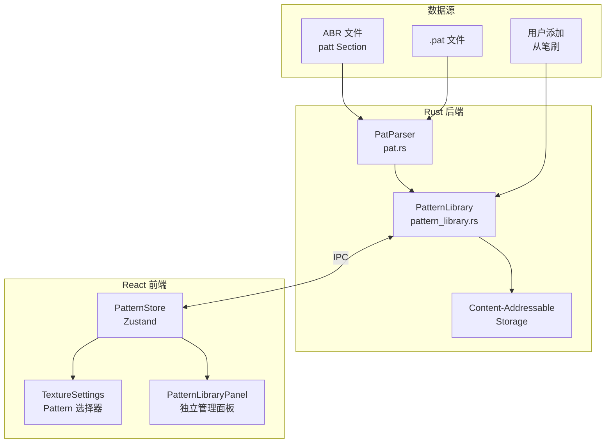

# Pattern Library 系统设计文档

> **状态**: Draft v1.0
> **日期**: 2026-01-30
> **依赖**: [06_abr_texture.md](file:///f:/CodeProjects/PaintBoard/docs/design/brush-system/06_abr_texture.md)
> **背景**: [2026-01-30-pat-file-decoding.md](file:///f:/CodeProjects/PaintBoard/docs/postmortem/2026-01-30-pat-file-decoding.md)

## 1. 需求概述

### 1.1 当前状态

- ✅ ABR 文件中的 `patt` Section 已能解析并提取嵌入的 Pattern
- ✅ `.pat` 文件的解码逻辑已通过 `decode_pat_file.rs` 验证（支持 RGB/Grayscale/Indexed）
- ✅ 笔刷设置 UI 的 Texture Tab 已实现（`TextureSettings.tsx`）
- ⚠️ 目前只有自带 Pattern 的笔刷才能显示纹理缩略图
- ❌ 没有统一的 Pattern Library 管理机制
- ❌ 不支持独立的 `.pat` 文件导入

### 1.2 核心目标

1. **Pattern Library** — 建立统一的图案资源管理系统
2. **.pat 文件导入** — 支持从外部导入 Photoshop Pattern 文件
3. **UI 集成** — 在笔刷 Texture Tab 和独立面板中管理 Pattern

### 1.3 参考设计

本设计参考 Photoshop 的 Pattern 管理模式：

```carousel

<!-- slide -->

<!-- slide -->

<!-- slide -->

```

---

## 2. 架构设计

### 2.1 系统架构概览



### 2.2 数据模型

#### 后端 (Rust)

```rust
// src-tauri/src/pattern/types.rs

/// Pattern 元数据
#[derive(Debug, Clone, Serialize, Deserialize)]
pub struct PatternResource {
    /// 唯一标识（内容 Hash 或 UUID）
    pub id: String,

    /// 显示名称
    pub name: String,

    /// 内容 Hash (SHA-256)，用于去重
    pub content_hash: String,

    /// 图像尺寸
    pub width: u32,
    pub height: u32,

    /// 颜色模式
    pub mode: PatternMode,

    /// 来源（ABR 文件路径、.pat 路径、或 "user-added"）
    pub source: String,

    /// 分组（可选）
    pub group: Option<String>,
}

#[derive(Debug, Clone, Copy, Serialize, Deserialize)]
pub enum PatternMode {
    Grayscale,
    RGB,
    Indexed,
}
```

#### 前端 (TypeScript)

```typescript
// src/stores/pattern.ts

export interface PatternItem {
  id: string;
  name: string;
  width: number;
  height: number;
  group?: string;
  thumbnailUrl: string; // http://project.localhost/pattern/{id}
}

export interface PatternGroup {
  name: string;
  expanded: boolean;
  patterns: PatternItem[];
}

export interface PatternLibraryState {
  // 所有 Pattern（扁平列表）
  patterns: PatternItem[];

  // 按分组组织
  groups: PatternGroup[];

  // 当前选中的 Pattern ID
  selectedPatternId: string | null;

  // 搜索过滤
  searchQuery: string;

  // Actions
  loadPatterns: () => Promise<void>;
  importPatFile: (path: string) => Promise<void>;
  addPatternFromBrush: (brushId: string) => Promise<void>;
  deletePattern: (id: string) => Promise<void>;
  selectPattern: (id: string) => void;
  setSearchQuery: (query: string) => void;
}
```

### 2.3 存储方案

采用 **Content-Addressable Storage (CAS)** 避免重复存储：

```
AppData/
└── patterns/
    ├── index.json           # Pattern 索引文件
    ├── a1/
    │   └── b2c3d4e5...png   # 实际图像文件 (按 Hash 前缀分目录)
    └── f6/
        └── 789abc...png
```

**去重逻辑**:

1. 计算 Pattern 原始像素数据的 SHA-256 Hash
2. 如果 Hash 已存在，仅更新索引增加别名引用
3. 不存在则写入新文件

---

## 3. 模块实现

### 3.1 Rust 后端模块

#### 3.1.1 .pat 文件解析器

将 `decode_pat_file.rs` 的逻辑封装到正式模块：

| 文件                                     | 说明                 |
| ---------------------------------------- | -------------------- |
| [NEW] `src-tauri/src/pattern/mod.rs`     | 模块入口             |
| [NEW] `src-tauri/src/pattern/types.rs`   | 类型定义             |
| [NEW] `src-tauri/src/pattern/pat.rs`     | .pat 文件解析器      |
| [NEW] `src-tauri/src/pattern/library.rs` | Pattern Library 管理 |
| [MODIFY] `src-tauri/src/lib.rs`          | 注册 pattern 模块    |

#### 3.1.2 IPC 命令

```rust
// src-tauri/src/commands.rs

/// 获取所有 Pattern 列表
#[tauri::command]
pub async fn get_patterns() -> Result<Vec<PatternResource>, String>

/// 导入 .pat 文件
#[tauri::command]
pub async fn import_pat_file(path: String) -> Result<ImportResult, String>

/// 从笔刷添加 Pattern 到 Library
#[tauri::command]
pub async fn add_brush_pattern_to_library(brush_id: String) -> Result<PatternResource, String>

/// 删除 Pattern
#[tauri::command]
pub async fn delete_pattern(id: String) -> Result<(), String>

/// 重命名 Pattern
#[tauri::command]
pub async fn rename_pattern(id: String, new_name: String) -> Result<(), String>

/// 移动 Pattern 到其他分组
#[tauri::command]
pub async fn move_pattern_to_group(id: String, group_name: String) -> Result<(), String>

/// 重命名分组
#[tauri::command]
pub async fn rename_group(old_name: String, new_name: String) -> Result<(), String>
```

### 3.2 前端模块

#### 3.2.1 PatternStore

| 文件                          | 说明             |
| ----------------------------- | ---------------- |
| [NEW] `src/stores/pattern.ts` | Pattern 状态管理 |

#### 3.2.2 UI 组件

| 文件                                                              | 说明                |
| ----------------------------------------------------------------- | ------------------- |
| [MODIFY] `src/components/BrushPanel/settings/TextureSettings.tsx` | 添加 Pattern 选择器 |
| [NEW] `src/components/BrushPanel/settings/PatternPicker.tsx`      | Pattern 下拉选择器  |
| [NEW] `src/components/PatternLibrary/PatternLibraryPanel.tsx`     | 独立管理面板        |
| [NEW] `src/components/PatternLibrary/PatternGrid.tsx`             | Pattern 缩略图网格  |
| [MODIFY] `src/components/Menu/MenuContent.tsx`                    | 添加菜单入口        |

---

## 4. UI 设计

### 4.1 BrushSettings > Texture Tab 中的 Pattern 选择器

在现有 `TextureSettings.tsx` 的 Pattern 缩略图区域添加交互：

```
┌────────────────────────────────────────────────────┐
│ ☑ TEXTURE                         ┌──────┬─┬─┐    │
│                                   │ 🖼️   │▼│+│    │
│                                   └──────┴─┴─┘    │
│ Scale ━━━━━━━━━━━━━━━━━━━━━━━━━━━━━━━━●━━━  81%  │
│ ...                                               │
└────────────────────────────────────────────────────┘
        │                             │  │
        │                             │  └─ [+] 添加当前笔刷 Pattern 到 Library
        │                             └─ [▼] 展开 Pattern Library 下拉
        └─ [🖼️] 当前 Pattern 缩略图（hover 显示大图）
```

**交互逻辑**:

- **缩略图**: 显示当前笔刷的 Pattern（来自 ABR 或用户选择）
- **▼ 按钮**: 展开 Pattern 选择下拉面板（类似 Photoshop）
- **+ 按钮**: 将当前笔刷自带的 Pattern 添加到 Library

### 4.2 Pattern 选择下拉面板

点击 ▼ 按钮展开：

```
┌──────────────────────────────────────┐
│ 🔍 Search Patterns...                │
├──────────────────────────────────────┤
│ ▶ Trees                              │
│ ▶ Grass                              │
│ ▼ Water                              │
│   ┌──┐ ┌──┐ ┌──┐ ┌──┐ ┌──┐ ┌──┐    │
│   │  │ │  │ │✓ │ │  │ │  │ │  │    │
│   └──┘ └──┘ └──┘ └──┘ └──┘ └──┘    │
│   ┌──┐ ┌──┐                          │
│   │  │ │  │                          │
│   └──┘ └──┘                          │
└──────────────────────────────────────┘
```

### 4.3 独立 Pattern Library 面板

基础样式复用 brush settings 面板。 遵守项目ui规范。

通过 **Settings > Panels > Pattern Library** 打开：

```
┌──────────────────────────────────────────┐
│ Pattern Library                    ≡  ×  │
├──────────────────────────────────────────┤
│ 🔍 Search Patterns...                    │
│ ━━━━━━━━━━━━━━━━━━━━━━━━━━━━━━━━━━━━━━━ │
│ ▶ Trees                                  │
│ ▶ Grass                                  │
│ ▼ Water (14)                             │
│ ┌────┐ ┌────┐ ┌────┐ ┌────┐ ┌────┐     │
│ │    │ │    │ │    │ │    │ │    │     │
│ └────┘ └────┘ └────┘ └────┘ └────┘     │
│ ...                                      │
├──────────────────────────────────────────┤
│  📂   ➕   🗑️                             │
│ Import Add Delete                        │
└──────────────────────────────────────────┘
```

**工具栏按钮**:

- **📂 Import**: 导入 .pat 文件（打开文件选择对话框）
- **➕ Add**: 添加（Placeholder，未来可扩展为创建新 Pattern）
- **🗑️ Delete**: 删除选中的 Pattern

---

## 5. 任务分解

### Phase 1: 后端基础设施

- [ ] 创建 `src-tauri/src/pattern/` 模块结构
- [ ] 移植 `decode_pat_file.rs` 逻辑到 `pat.rs`
- [ ] 实现 `PatternLibrary` 管理类
- [ ] 实现 CAS 存储逻辑
- [ ] 添加 IPC 命令 (`get_patterns`, `import_pat_file`, `delete_pattern`)

### Phase 2: 前端状态管理

- [ ] 创建 `src/stores/pattern.ts` Zustand store
- [ ] 实现与后端的 IPC 交互

### Phase 3: Texture Tab UI 增强

- [ ] 创建 `PatternPicker.tsx` 组件
- [ ] 修改 `TextureSettings.tsx` 集成 Pattern 选择器
- [ ] 实现 "添加到 Library" 功能

### Phase 4: 独立 Pattern Library 面板

- [ ] 创建 `PatternLibraryPanel.tsx`
- [ ] 创建 `PatternGrid.tsx` 缩略图网格
- [ ] 添加菜单入口 (Settings > Panels > Pattern Library)
- [ ] 实现搜索、分组、删除功能

### Phase 5: 验证与打磨

- [ ] 单元测试：.pat 解析器
- [ ] 集成测试：导入 → 显示 → 选择 → 应用
- [ ] 手动验证：各种格式的 .pat 文件

---

## 6. 设计决策

> [!NOTE]
> 以下设计决策已确认：

1. **Pattern 分组来源** ✅
   - 从 .pat 文件导入时，**自动以文件名作为分组**
   - 分组名称支持用户后续修改

2. **Pattern 编辑功能** ✅
   - 支持重命名 Pattern
   - 支持移动 Pattern 到其他分组
   - 支持重命名分组

3. **Pattern 导出**
   - 不需要，可在后续版本实现我们自己的格式

4. **缩略图尺寸** ✅
   - 选择器下拉：48x48
   - Library 面板：64x64
   - 后续可根据使用体验调整

---

## 7. 验证计划

### 7.1 自动化测试

```bash
# 运行 pattern 模块单元测试
cd src-tauri
cargo test pattern::

# 前端测试
pnpm test
```

### 7.2 手动验证

1. **导入 .pat 文件**
   - 打开 Settings > Panels > Pattern Library
   - 点击 Import 按钮
   - 选择 `abr/test_patterns.pat`
   - 验证：13 个 Pattern 正确显示缩略图

2. **在笔刷 Texture Tab 中选择 Pattern**
   - 打开 Brush Panel > Texture Tab
   - 点击 ▼ 展开 Pattern 选择器
   - 选择一个 Pattern
   - 验证：缩略图更新，笔刷效果改变

3. **添加笔刷 Pattern 到 Library**
   - 选择一个有自带 Pattern 的笔刷
   - 在 Texture Tab 点击 + 按钮
   - 验证：Pattern 出现在 Library 中
