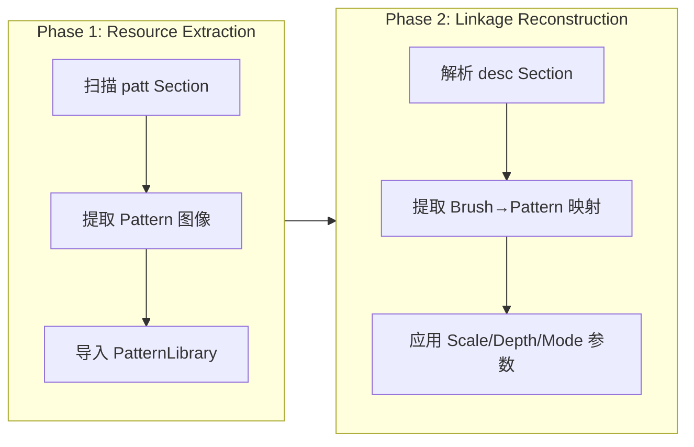

# ABR 纹理与图案系统设计 (Revised)

> 基于 Review 意见 + Postmortem 发现的修正版设计 (v2.1)
> 核心策略转变：从"尝试从 ABR 提取"转变为"构建统一的 Pattern 库与链接机制"
>
> **Related**: [postmortem/2026-01-27-abr-structure-discovery.md](file:///f:/CodeProjects/PaintBoard/docs/postmortem/2026-01-27-abr-structure-discovery.md)”

## 1. 核心风险与对策

### 1.1 ABR 格式现状认知

ABR 文件格式存在**两种存储架构**：

1.  **自包含式 (Self-Contained)**：老式或简单导出的 ABR，每个笔刷的 `8BIM` 块内部嵌入了 `Txtr` 参数和可能的图案数据。
2.  **分离式 (Separated Storage)**：较新/大型的 ABR 文件（常见于 Tool Presets 导出），资源分布在文件的不同顶级 Section 中。

> [!IMPORTANT]
> **Postmortem 发现** (2026-01-27)：对 23MB 样本文件 (`liuyang_paintbrushes.abr`) 的分析揭示了分离式存储的具体结构：
>
> | Section | Size   | 内容                                          |
> | ------- | ------ | --------------------------------------------- |
> | `samp`  | 4.8MB  | 71 个笔刷头图像 (Tip Images Only)             |
> | `patt`  | 19.0MB | **全局纹理图案库** - 所有笔刷共享的 Patterns  |
> | `desc`  | 150KB  | **全局描述符** - Brush → Pattern 映射与参数表 |
>
> 当前解析器只读取了 `samp`，导致纹理信息完全丢失。

### 1.2 引用式纹理的额外风险

即使是自包含式 ABR，也可能存在**引用式纹理**：

- ABR 仅包含 `Txtr` 参数和一个指向外部图案的 `UUID/Name`。
- **绝大多数** 真实世界的 ABR 使用这种引用模式。

### 1.3 设计准则

系统必须具备**容错性**。当 ABR 仅包含引用时，不能让功能失效，而应提供"缺失资源占位符"并允许用户通过导入 `.pat` 文件来补充资源。

**关键修正 (Based on Review)**:
纹理必须是**Canvas Space (画布空间)**的，意味着纹理是"铺在纸上"的，而不是贴在笔刷也就是Dab上的，也不是贴在屏幕上的。笔刷Dab移动时，是作为一个"窗口"去透视底下的纹理。

### 1.4 两阶段实现策略

根据 Postmortem 的 "Solution Strategy"，采用**渐进式实现**：



**Phase 1 (Immediate)**: 优先提取 `patt` Section 中的纹理资源，让用户可以手动使用这些 Pattern。
**Phase 2 (Future)**: 解析 `desc` Section，自动重建 Brush → Pattern 链接关系。

> [!TIP]
> Phase 1 完成后，即使 Phase 2 未实现，用户也可以手动为笔刷设置已导入的纹理。

## 2. 架构设计：Pattern Library

不再是简单的 ABR 解析器扩展，而是建立一个独立的**图案资源库 (Pattern Library)**。

### 2.1 数据模型

```rust
// src-tauri/src/brush/pattern_library.rs

pub struct PatternResource {
    /// 内容哈希 (SHA-256)，用于去重存储
    pub content_hash: String,

    /// 原始名称 (来自 .pat 或 ABR)
    pub name: String,

    /// 已知的 UUID/ID 列表 (一个图案可能有多个 ID 指向它)
    pub known_ids: Vec<String>,

    /// 图像元数据
    pub width: u32,
    pub height: u32,
    pub mode: PatternMode,
}

pub struct PatternLibrary {
    /// 内存索引：PatternID (UUID/Name) -> ContentHash
    pub id_map: HashMap<String, String>,

    /// 内存索引：ContentHash -> PatternResource
    pub resources: HashMap<String, PatternResource>,
}
```

### 2.2 存储方案 (Content-Addressable Storage)

为了避免重复存储（不同的笔刷包可能包含相同的噪点图），采用内容寻址存储。

- **存储路径**: `App_Data/patterns/{first_2_chars}/{rest_of_hash}.png`
  - 例如: `App_Data/patterns/a1/b2c3d4...png`
- **去重逻辑**: 导入新图案时，先计算 Raw RGBA 数据的 SHA-256。如果 Hash 已存在，仅更新 `id_map` 增加新的引用 ID，不写入文件。

## 3. 解析器实现方案 (Refactored)

鉴于 ABR 文件可能采用"分离式存储"结构（即笔刷头、纹理、描述符分别存储在不同的顶级 Section 中），解析器必须采用**分块状态机 (Section-Based State Machine)** 策略，而非线性的流式解析。

### 3.1 解析流程 (Multi-Pass Strategy)

**Phase 1: Top-Level Scan (全文件扫描)**
遍历 ABR 文件的顶级 Section，不依赖顺序假设。

1.  **`samp` (Samples) Section**:
    - 提取所有笔刷头图片 (Tip Images)。
    - 生成基础的 `AbrBrush` 对象列表 (只有形状，无参数)。
    - 记录 `BrushIndex`。
2.  **`patt` (Patterns) Section**:
    - 提取所有内置纹理图案。
    - 计算 ContentHash，存入 `PatternLibrary`。
    - 记录 `PatternName` / `PatternUUID` 以便后续链接。
3.  **`desc` (Descriptor) Section**:
    - 这是至关重要的**全局映射表**。
    - 解析 Photoshop Action Descriptor 结构。
    - 提取 `BrushIndex` -> `TextureSettings` (UUID, Scale, Depth, Mode) 的映射关系。

**Phase 2: Reconstruction (链接重组)**
在内存中将分散的数据组装为完整的笔刷。

1.  遍历 `raw_brushes`。
2.  根据索引在 `desc` 映射表中查找对应的 `TextureSettings`。
3.  如果存在设置：
    - 注入参数 (Scale, Depth等)。
    - 解析 `PatternUUID`。
    - **Link**: 在 `PatternLibrary` (包含刚刚加载的 `patt` 数据) 中查找资源。如果找到，直接关联；如果未找到，标记为 `Missing` (引用式)。

### 3.2 数据结构设计

```rust
pub struct AbrParseContext {
    // 阶段 1：解析出的裸笔刷
    pub raw_brushes: Vec<AbrBrush>,

    // 阶段 1：解析出的内部纹理资源 (ID -> Data)
    pub internal_patterns: HashMap<String, PatternResource>,

    // 阶段 1：全局配置映射 (Brush Index -> Settings)
    pub texture_mappings: HashMap<usize, BrushTextureSettings>,
}
```

### 3.3 Global Descriptor 解析细节

ABR 的 `desc` 块通常是一个巨大的 Action Descriptor (150KB+)。

- **目标**: 找到 Key 为 `'Txtr'` 的节点。
- **回溯**: 确定该节点属于哪个 `brushHandle` 或数组索引。
- **容错**: 如果没有 `desc` 块 (老版本 ABR)，则退回至“尝试在 Brush Block 内部查找 Txtr”的兼容模式。

### 3.4 PAT 解析器 (外部资源支持)

为了弥补 ABR 数据的缺失，必须支持标准 `.pat` 文件导入。

**在 `src-tauri/src/format/pat_parser.rs`**:
支持 Adobe Photoshop Pattern File Format。

- **Header**: Version, Mode, Width, Height, Name.
- **Compression**: 解码 PackBits (RLE) 压缩的数据。
- **Color Conversion**: 将 CMYK / Grayscale / Indexed 转换为标准 RGBA8。

## 4. 渲染管线 (Shader & CPU)

复刻 Photoshop 的 Texturize 逻辑。核心在于 **Alpha 合成**：Texture 修改 Shape 的 Alpha，而不是直接叠加颜色。

### 4.1 数据准备

- **Texture Data**: CPU 端将 Pattern 图片上传至 GPU TextureArray 或利用 Bindless Texture。
- **Uniforms**:
  - `u_texture_scale`: 缩放比例
  - `u_texture_depth`: 深度（对比度/强度）
  - `u_texture_mode`: 混合模式 (Multiply, Subtract等)
  - `u_pattern_size`: 纹理原始尺寸
  - `u_canvas_offset`: 画布偏移量 (用于对齐 Canvas Space)
  - `u_invert`: 是否反相

### 4.2 Fragment Shader 逻辑 (GPU)

```glsl
// Coordinates Logic: Canvas Space
// 纹理必须相对于"纸张"固定。
// gl_FragCoord 是屏幕坐标，必须加上画布偏移量才能得到绝对画布坐标。
vec2 canvas_pos = gl_FragCoord.xy + u_canvas_offset;

// 调整 Tiling & Scale
// Ps Scale 是相对于 Pattern 原始尺寸
// 使用 modulus 运算实现平铺 (Tiling)
vec2 pattern_uv = canvas_pos / (u_pattern_size * u_scale / 100.0);

// Sample Texture
// 既然是 Pattern，通常需要 Wrap/Repeat 模式
float tex_value = socket_sample_pattern(pattern_uv).r; // 假设单通道或取亮度
if (u_invert) tex_value = 1.0 - tex_value;

// Depth Calculation
// Depth 越低，纹理越不可见（100% Depth = Full Texture Effect）
// Depth 同时也受压感控制 (Depth Jitter)
float dynamic_depth = u_depth * u_pressure_depth_control;

// Blending (Texture as a Mask/Modifier)
float influence = 1.0;

if (u_mode == TEXTURE_MODE_MULTIPLY) {
    // 模拟正片叠底：mix(1.0, tex_value, depth)
    // depth=0 -> 1.0 (无变化); depth=1 -> tex_value (完全应用纹理)
    influence = mix(1.0, tex_value, dynamic_depth);

} else if (u_mode == TEXTURE_MODE_SUBTRACT) {
    // 模拟减去：mix(1.0, 1.0 - tex_value, depth)
    // 纹理越亮，influence 越小(扣除越多)
    influence = mix(1.0, 1.0 - tex_value, dynamic_depth);

} else if (u_mode == TEXTURE_MODE_HEIGHT) {
    // 模拟高度图 (v2)
    influence = mix(0.5, tex_value, dynamic_depth) * 2.0;
}

// Final Alpha Modulation
// 纹理只影响 Alpha，不直接影响颜色
final_alpha *= influence;
```

### 4.3 CPU 渲染实现

在 TypeScript CPU 引擎中 (`src/utils/`)，必须手动计算坐标映射和混合。

> [!NOTE]
> PaintBoard 的 CPU 笔刷引擎完全在 TypeScript 前端实现，参见 `src/utils/strokeBuffer.ts` 和 `src/utils/maskCache.ts`.

```typescript
// src/utils/patternRenderConfig.ts

interface PatternRenderConfig {
  textureData: Uint8Array; // Grayscale Data
  texW: number;
  texH: number;
  scale: number;
  depth: number; // 0.0 - 1.0
  invert: boolean;
  mode: TextureMode;
}

enum TextureMode {
  Multiply,
  Subtract,
  Height,
}
```

```typescript
// src/utils/strokeBuffer.ts (Pattern Texture Logic)

function applyPatternTexture(
  dabBuffer: Uint8ClampedArray,
  brushTip: Float32Array, // Mask values 0.0-1.0
  width: number,
  height: number,
  canvasPosX: number, // Dab 在画布上的绝对坐标 X
  canvasPosY: number, // Dab 在画布上的绝对坐标 Y
  config: PatternRenderConfig
): void {
  // 0. Safety Check: If no texture data (e.g. missing resource), fallback to normal rendering
  if (!config.textureData || config.textureData.length === 0) {
    for (let y = 0; y < height; y++) {
      for (let x = 0; x < width; x++) {
        const i = y * width + x;
        const tipAlpha = brushTip[i] ?? 0;
        if (tipAlpha > 0) {
          dabBuffer[i * 4 + 3] = Math.round(tipAlpha * 255);
        }
      }
    }
    return;
  }

  for (let y = 0; y < height; y++) {
    const globalY = canvasPosY + y;

    for (let x = 0; x < width; x++) {
      const i = y * width + x;
      const tipAlpha = brushTip[i] ?? 0;

      // 1. Skip invisible pixels
      if (tipAlpha <= 0.001) {
        dabBuffer[i * 4 + 3] = 0;
        continue;
      }

      // 2. Calculate Pattern Coordinates (Canvas Space)
      // Tiling: Use modulo to handle negative coordinates correctly
      const u = Math.floor((canvasPosX + x) / config.scale);
      const v = Math.floor(globalY / config.scale);

      // rem_euclid equivalent for negative-safe modulo
      const texU = ((u % config.texW) + config.texW) % config.texW;
      const texV = ((v % config.texH) + config.texH) % config.texH;

      // 3. Sample Texture (Nearest Neighbor for performance)
      let texVal = (config.textureData[texV * config.texW + texU] ?? 0) / 255;
      if (config.invert) texVal = 1.0 - texVal;

      // 4. Blending
      // Influence = 1.0 (No Effect) -> Target (Full Effect) based on Depth
      let influence = 1.0;

      switch (config.mode) {
        case TextureMode.Multiply:
          // mix(1.0, texVal, depth)
          influence = 1.0 * (1.0 - config.depth) + texVal * config.depth;
          break;
        case TextureMode.Subtract:
          // mix(1.0, 1.0 - texVal, depth)
          influence = 1.0 * (1.0 - config.depth) + (1.0 - texVal) * config.depth;
          break;
        default:
          break;
      }

      // 5. Apply to Alpha
      const finalAlpha = tipAlpha * influence;
      dabBuffer[i * 4 + 3] = Math.round(finalAlpha * 255);

      // Note: RGB channels usually set by composition step or initialized before
    }
  }
}
```

## 5. 任务清单 (Revised Task List)

### Phase 1: ABR Texture 资源导入 (Immediate - 基于 Postmortem)

> [!NOTE]
> 此阶段目标：让用户导入 ABR 时，自动提取内嵌的 Pattern 资源到 Pattern Library。

- [ ] **Infra**: 实现 `PatternLibrary` 结构与 `CAS` 存储逻辑 (Hash计算, 文件读写)。
- [ ] **Parser**: 在 `AbrParser` 中添加 `patt` Section 扫描逻辑。
- [ ] **Parser**: 实现 `PatParser` 解析 `patt` Section 中的图案数据。
- [ ] **Integration**: ABR 导入流程调用 `PatternLibrary.import()` 注册提取的 Patterns。
- [ ] **UI**: 在导入完成提示中显示 "Extracted N patterns"。

### Phase 2: Pattern 外部导入支持

- [ ] **Parser**: 实现独立 `.pat` 文件解析器 (支持 RLE, Mode 转换)。
- [ ] **UI**: 添加 "Import Patterns..." 菜单项。
- [ ] **UI**: Pattern Library 面板 (预览、搜索、删除)。

### Phase 3: Brush-Pattern 链接重建 (High Complexity)

- [ ] **Parser**: 升级 `AbrParser` 为 Multi-Pass 架构 (Top-level Scanner)。
- [ ] **Parser**: 实现 `desc` 块解析器，提取 Brush-Texture 映射关系 (Key: `Txtr`)。
- [ ] **Parser**: 实现 `AbrParseContext` 并完成 `samp` / `patt` / `desc` 的重组。
- [ ] **Compat**: 保留对旧版"嵌入式 Txtr"结构的兼容支持。

### Phase 4: 渲染实现

- [ ] **Shader**: `BrushShader` 增加 Pattern Uniforms (包含 `u_canvas_offset`)。
- [ ] **Shader**: 实现 `Texturize` 核心算法 (Canvas Space UV + Depth Mix)。
- [ ] **CPU**: 实现 TypeScript CPU 端 `strokeBuffer.ts` 中的纹理采样逻辑 (`applyPatternTexture`)。
- [ ] **UI**: 笔刷设置面板增加 "Texture" 选项卡 (预览图 + 参数滑块)。

## 6. 验证计划

### Phase 1 验证

1.  **Unit Test**: 构造含 `patt` Section 的测试 ABR 文件，验证 Pattern 提取。
2.  **Integration Test**: 导入 `liuyang_paintbrushes.abr`，断言 PatternLibrary 新增 N 个 Patterns。

### Phase 2+ 验证

1.  **Unit Test**: 构造极简的 `.pat` 文件进行解析测试。
2.  **Integration Test**: 导入一个已知只含引用的 ABR，断言其 Pattern 状态为 Missing。
3.  **Integration Test**: 手动导入对应的 `.pat`，断言 ABR 笔刷自动恢复关联。
