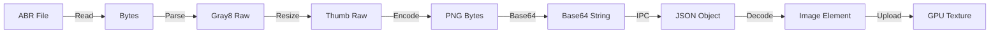

# ABR 笔刷加载极致优化方案 (Zero-Encoding & Streaming)

## 1. 核心理念

基于 `docs/design/review.md` 的架构评审反馈，以及 `docs/design/file-io-optimization.md` 中已落地的文件 IO 优化基础设施，制定本方案。

**核心目标**：

1.  **流式反馈 (Streaming)**: 消除“等待所有笔刷解析完成”的卡顿感，实现点击导入即刻可见。
2.  **零编码 (Zero-Encoding)**: 彻底抛弃由后端进行 PNG/Base64 编码的低效流程，建立从磁盘到 GPU 的二进制高速公路。
3.  **复用基础设施**: 利用已在 Layer Cache 中验证过的 `project://` 自定义协议和 LZ4 压缩技术。

## 2. 架构设计

### 2.1 数据流对比

**❌ 旧方案 (串行 + Base64)**:



**✅ 新方案 (流式 + 自定义协议 + LZ4)**:

```mermaid
graph LR
    Disk[ABR File] -->|Read| RAM[Bytes]
    RAM -->|Parse (Rayon)| Gray[Gray8 Raw]
    Gray -->|Cache| Store[BrushCache (Memory)]

    subgraph "Streaming / Events"
        Store -.->|Metadata Event| Frontend[UI List]
    end

    subgraph "Custom Protocol (project://)"
        Frontend -->|Request Thumb| Protocol
        Protocol -->|LZ4 Compress| LZ4[LZ4 Bytes]
        LZ4 -->|Response| Frontend
        Frontend -->|LZ4 Decompress| Raw[Raw Bytes]
        Raw -->|Direct Upload| GPU
    end
```

### 2.2 模块设计

#### 2.2.1 后端 (Rust)

1.  **BrushCache (内存仓库)**:
    - 仿照 `src-tauri/src/file/layer_cache.rs` 实现 `src-tauri/src/brush/cache.rs`。
    - 使用 `DashMap` 或 `RwLock<HashMap>` 存储笔刷的**原始灰度数据 (Vec<u8>)**。
    - key: `brush_id` (UUID), value: `{ width, height, data }`。

2.  **Protocol Extension (协议扩展)**:
    - 修改 `src-tauri/src/lib.rs` 中的 `project` 协议处理器。
    - 新增路由支持：
      - `project://brush/{id}`: 获取原始高分辨率笔刷数据 (LZ4 压缩)。
      - `project://brush-thumb/{id}`: 获取缩略图数据 (LZ4 压缩 或 PNG，视大小而定，建议统一 LZ4)。

3.  **Command Optimization (命令优化)**:
    - 修改 `import_abr_file` 为异步流式。
    - **Step 1**: 并行解析 ABR。
    - **Step 2**: 在内存中 Downsample 生成缩略图 (64x64)。
    - **Step 3**:存入 `BrushCache`。
    - **Step 4**: 通过 `window.emit("brush-loaded", metadata)` 逐个通知前端，包含 ID 和 基础元数据，**不包含** 图像数据。

#### 2.2.2 前端 (TypeScript)

1.  **Brush Manager**:
    - 监听 `brush-loaded` 事件，实时更新 UI 列表。
    - UI 列表使用 `<Canvas>` 或 `` 显示缩略图。

2.  **GPU Loader**:
    - 仅当笔刷被**选中**或需要渲染时：
    - `fetch("project://brush/{id}")` 获取 ArrayBuffer。
    - 使用 LZ4 WASM/JS 解压得到 Raw Gray8。
    - 直接调用 `device.queue.writeTexture` 上传 `r8unorm` 格式纹理。

3.  **Cursor (光标)**:
    - 移除后端的 Marching Squares 计算。
    - 方案 A: 前端 Canvas 读取缩略图像素生成简易轮廓。
    - 方案 B: 选中笔刷时，利用已获取的 Raw Data 在 GPU Compute Shader 或 WASM 中通过并行算法生成高精度轮廓。

## 3. 复用点 (Reuse Strategy)

利用已在 `file-io-optimization.md` 中落地的成果：

1.  **LZ4 Compression**:
    - 复用 `lz4_flex` 依赖。
    - 复用 `lib.rs` 中的 `build_rgba_lz4_response` helper 函数（设置 Headers: `X-Image-Width`, `Content-Type: image/x-rgba-lz4`）。

2.  **Custom Protocol**:
    - 复用 `lib.rs` 中注册的 `project://` scheme。
    - 只需在 `match path` 逻辑中增加 `/brush/` 分支。

3.  **Global Cache Pattern**:
    - 复用 `layer_cache.rs` 的单例模式代码结构 (`once_cell` / `lazy_static` / `RwLock`)。

## 4. 实施路线图

### Phase 1: 基础设施 (后端)

1.  创建 `src-tauri/src/brush/cache.rs`。
2.  在 `lib.rs` 中集成 BrushCache 和 Protocol 路由。
3.  确保 LZ4 响应头正确设置。

### Phase 2: 改造 Import 流程

1.  重写 `import_abr_file`。
2.  移除所有 PNG 编码逻辑。
3.  接入 `rayon` 并行处理。
4.  实现 `emit` 事件通知。

### Phase 3: 前端适配

1.  引入 LZ4 解压库 (如果尚未引入)。
2.  修改 Brush Panel，支持流式接收列表。
3.  实现 `loadBrushFromProtocol` 逻辑。

## 5. 预期收益

- **交互**: 0ms 等待感（流式加载）。
- **内存**: 降低 50%+ (去除 Base64 和 中间态对象)。
- **速度**: ABR 加载吞吐量提升 10x (并行 + 无 PNG 编码)。
