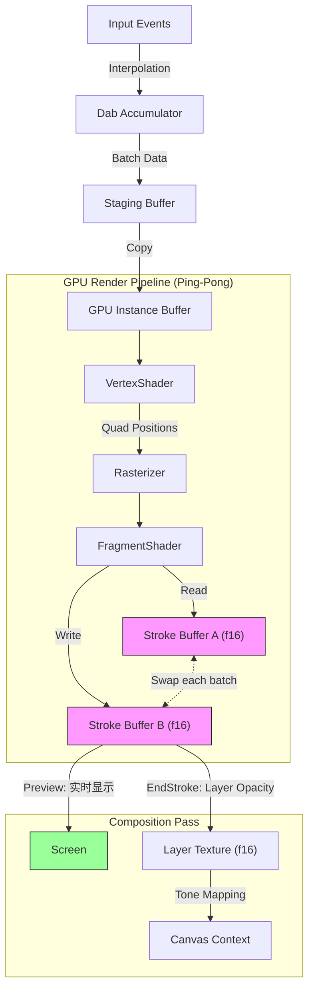

# GPU 渲染策略研究：WebGPU Render Pipeline

## 背景

当前软笔刷性能优化已达到 JS + Canvas 2D 的极限。大尺寸笔刷（500px+）仍有明显瓶颈。需要探索 GPU 加速方案以突破性能天花板。

> [!IMPORTANT]
> 本文档基于 [外部 Review 反馈](file:///f:/CodeProjects/PaintBoard/docs/design/review.md) 进行了重大修订，从 Compute Shader 方案改为 **Render Pipeline + Instancing** 方案。

## 核心约束

### WYSIWYG 原则（所见即所得）

> [!CAUTION]
> 基于 [opacity-softness-hybrid-strategy.md](file:///f:/CodeProjects/PaintBoard/docs/postmortem/opacity-softness-hybrid-strategy.md) 的惨痛教训：
> **Preview（绘画中）与 EndStroke（合成后）必须完全一致，否则会产生跳变！**

| 阶段           | 要求                                            |
| -------------- | ----------------------------------------------- |
| Preview Pass   | 实时渲染 Stroke Buffer 当前状态到屏幕           |
| Composite Pass | EndStroke 时 Stroke Buffer 混合到 Layer Texture |
| **关键约束**   | 两个 Pass 必须使用 **完全相同的混合参数和公式** |

---

## 方案：WebGPU Render Pipeline + Instancing

### 为什么不用 Compute Shader？

原方案使用 Compute Shader 存在严重问题（详见 [Review 反馈](file:///f:/CodeProjects/PaintBoard/docs/design/review.md)）：

| 问题           | 后果                                           |
| -------------- | ---------------------------------------------- |
| 全屏计算浪费   | 即使只画 500px 圆，也遍历整个 4K 画布          |
| Draw Call 开销 | 快速运笔时每帧 10-50 个 Dab，逐个提交效率低    |
| 手写像素剔除   | `if (dist > radius) return` 不如硬件光栅化高效 |

**改进方案**：使用 Render Pipeline (Vertex + Fragment Shader) + GPU Instancing

### Tauri 支持情况

| 平台    | WebView             | WebGPU 支持 | 状态                |
| ------- | ------------------- | ----------- | ------------------- |
| Windows | WebView2 (Chromium) | ✅ 已支持   | Stable channel 可用 |
| macOS   | WKWebView           | ✅ 已支持   | Safari 17+          |
| Linux   | WebKitGTK           | ⚠️ 有限     | 依赖发行版版本      |

> [!NOTE]
> WebGPU 代码运行在 WebView 的 JavaScript 环境中，而非 Rust 后端。Rust 后端 wgpu 仅用于原生窗口绘制，与 HTML 覆盖层交互复杂，不推荐。

---

### 架构设计

> [!WARNING]
> **关键约束**：WebGPU 严禁在同一 RenderPass 中同时读取和写入同一纹理（Read/Write Hazard）。
> 必须使用 **Ping-Pong Buffer（双缓冲）** 机制解决此问题。



### 关键设计决策

| 决策       | 选择                  | 理由                                                    |
| ---------- | --------------------- | ------------------------------------------------------- |
| 纹理格式   | `rgba16float`         | 避免低 Flow 叠加时的色带 (Banding)                      |
| 渲染范式   | Render Pipeline       | 利用硬件光栅化自动剔除，比 Compute Shader 高效          |
| 批量处理   | GPU Instancing        | 一次提交多个 Dab，减少 Draw Call 开销                   |
| 混合模式   | Alpha Darken (自定义) | 与现有 `StrokeAccumulator` 一致，限制累积上限           |
| **双缓冲** | **Ping-Pong Buffer**  | **必须**：解决 WebGPU 读写冲突，避免 Feedback Loop 错误 |
| 剪裁优化   | Scissor Test          | 计算 Dab 批次包围盒，减少无效 Fragment Shader 执行      |
| 笔刷扩展   | Texture Atlas (预留)  | 为未来形状笔刷 (ABR) 预留纹理采样路径                   |

### Ping-Pong Buffer 机制

由于 Alpha Darken 混合需要**读取目标纹理的当前值**，无法使用原生 Blend State，必须使用双缓冲：

```typescript
// 双缓冲机制
let strokeBufferA = device.createTexture({ format: 'rgba16float', ... });
let strokeBufferB = device.createTexture({ format: 'rgba16float', ... });
let currentSource = strokeBufferA;  // 读取源
let currentDest = strokeBufferB;    // 写入目标

function flushDabBatch(dabs: DabData[]) {
  // 1. 先将 Source 拷贝到 Dest（保留未覆盖区域）
  const encoder = device.createCommandEncoder();
  encoder.copyTextureToTexture(
    { texture: currentSource },
    { texture: currentDest },
    [canvasWidth, canvasHeight]
  );

  // 2. 计算包围盒用于 Scissor Test
  const bbox = computeBoundingBox(dabs);

  // 3. 在 Dest 上绘制新 Dab（Shader 读取 Source）
  const pass = encoder.beginRenderPass({
    colorAttachments: [{
      view: currentDest.createView(),
      loadOp: 'load',  // 保留拷贝的内容
      storeOp: 'store',
    }],
  });

  pass.setScissorRect(bbox.x, bbox.y, bbox.width, bbox.height);
  pass.setPipeline(brushPipeline);
  pass.setBindGroup(0, createBindGroup(currentSource));  // 绑定 Source 用于读取
  pass.draw(6, dabs.length);
  pass.end();

  device.queue.submit([encoder.finish()]);

  // 4. 交换角色
  [currentSource, currentDest] = [currentDest, currentSource];
}
```

> [!NOTE]
> **性能说明**：`copyTextureToTexture` 是 GPU 内部操作，速度极快。
> 配合 Scissor Test 只处理脏区域，开销可控。

---

### Shader 设计 (WGSL)

#### Vertex Shader - 处理 Instancing

```wgsl
struct DabInstance {
    @location(0) dab_pos: vec2<f32>,      // Dab 中心位置
    @location(1) dab_size: f32,           // Dab 半径
    @location(2) dab_color: vec4<f32>,    // RGBA (A = dabOpacity * flow)
    @location(3) hardness: f32,           // 硬度 0-1
};

struct VertexOutput {
    @builtin(position) position: vec4<f32>,
    @location(0) local_uv: vec2<f32>,     // -1 to 1 (Quad 内坐标)
    @location(1) color: vec4<f32>,
    @location(2) hardness: f32,
};

struct Uniforms {
    canvas_size: vec2<f32>,               // 画布尺寸
};

@group(0) @binding(0) var<uniform> uniforms: Uniforms;

@vertex
fn vs_main(
    @builtin(vertex_index) vertexIdx: u32,
    @builtin(instance_index) instanceIdx: u32,
    instance: DabInstance
) -> VertexOutput {
    // Quad 顶点 (两个三角形)
    var quad_positions = array<vec2<f32>, 6>(
        vec2<f32>(-1.0, -1.0), vec2<f32>(1.0, -1.0), vec2<f32>(-1.0, 1.0),
        vec2<f32>(-1.0, 1.0), vec2<f32>(1.0, -1.0), vec2<f32>(1.0, 1.0)
    );

    let local_pos = quad_positions[vertexIdx];
    let world_pos = instance.dab_pos + local_pos * instance.dab_size;

    // 转换为 clip space (-1 to 1)
    let clip_pos = (world_pos / uniforms.canvas_size) * 2.0 - 1.0;

    var out: VertexOutput;
    out.position = vec4<f32>(clip_pos.x, -clip_pos.y, 0.0, 1.0);
    out.local_uv = local_pos;
    out.color = instance.dab_color;
    out.hardness = instance.hardness;
    return out;
}
```

#### Fragment Shader - Alpha Darken 混合

> [!NOTE]
> Fragment Shader 从 **Source 纹理**（上一帧状态）读取，输出到 **Dest 纹理**（RenderPass ColorAttachment）。
> 这避免了读写冲突。

```wgsl
// Source 纹理：上一帧的 Stroke Buffer（只读）
@group(0) @binding(1) var stroke_source: texture_2d<f32>;

// 可选：笔刷图集（形状笔刷扩展）
@group(0) @binding(2) var brush_atlas: texture_2d<f32>;
@group(0) @binding(3) var brush_sampler: sampler;

@fragment
fn fs_main(in: VertexOutput) -> @location(0) vec4<f32> {
    let dist = length(in.local_uv);

    // 圆形剔除
    if (dist > 1.0) { discard; }

    // 软边缘计算 (Gaussian mask)
    // 未来扩展：可从 brush_atlas 采样形状
    var mask: f32 = 1.0;
    if (in.hardness < 0.99) {
        let t = (dist - in.hardness) / (1.0 - in.hardness);
        mask = exp(-2.5 * t * t);
    }

    // Alpha Darken 混合
    let src_alpha = mask * in.color.a;
    let dab_opacity = in.color.a;  // 累积上限

    // 从 SOURCE 纹理读取（关键：不是 RenderTarget！）
    let dst = textureLoad(stroke_source, vec2<i32>(in.position.xy), 0);
    let dst_a = dst.a;

    // Alpha Darken 核心逻辑 (与 CPU 版本完全一致)
    var out_a: f32;
    if (dst_a >= dab_opacity - 0.001) {
        out_a = dst_a;  // 已达上限，不再增加
    } else {
        out_a = dst_a + (dab_opacity - dst_a) * src_alpha;
    }

    // 颜色插值
    var out_rgb: vec3<f32>;
    if (dst_a > 0.001) {
        out_rgb = dst.rgb + (in.color.rgb - dst.rgb) * src_alpha;
    } else {
        out_rgb = in.color.rgb;
    }

    return vec4<f32>(out_rgb, out_a);
}
```

---

### 实现步骤

#### 1. 初始化 WebGPU

```typescript
async function initWebGPU(): Promise<GPUDevice | null> {
  if (!navigator.gpu) {
    console.warn('WebGPU not supported, falling back to Canvas 2D');
    return null;
  }
  const adapter = await navigator.gpu.requestAdapter();
  if (!adapter) return null;

  // 请求 float16 支持
  return await adapter.requestDevice({
    requiredFeatures: ['float32-filterable'], // 如需要
  });
}
```

#### 2. 创建 Stroke Buffer (rgba16float)

```typescript
const strokeTexture = device.createTexture({
  size: [width, height],
  format: 'rgba16float', // 关键：16位浮点精度
  usage:
    GPUTextureUsage.RENDER_ATTACHMENT | GPUTextureUsage.TEXTURE_BINDING | GPUTextureUsage.COPY_SRC,
});
```

#### 3. 批量提交 Dabs (Instancing)

```typescript
interface DabData {
  x: number;
  y: number;
  size: number;
  r: number;
  g: number;
  b: number;
  a: number;
  hardness: number;
}

function flushDabBatch(dabs: DabData[]) {
  // 打包为 Instance Buffer
  const instanceData = new Float32Array(dabs.length * 8);
  dabs.forEach((dab, i) => {
    const offset = i * 8;
    instanceData[offset + 0] = dab.x;
    instanceData[offset + 1] = dab.y;
    instanceData[offset + 2] = dab.size;
    instanceData[offset + 3] = dab.r;
    instanceData[offset + 4] = dab.g;
    instanceData[offset + 5] = dab.b;
    instanceData[offset + 6] = dab.a;
    instanceData[offset + 7] = dab.hardness;
  });

  device.queue.writeBuffer(instanceBuffer, 0, instanceData);

  // 一次 Draw Call 绘制所有 Dabs
  const encoder = device.createCommandEncoder();
  const pass = encoder.beginRenderPass({
    colorAttachments: [
      {
        view: strokeTexture.createView(),
        loadOp: 'load',
        storeOp: 'store',
      },
    ],
  });

  pass.setPipeline(brushPipeline);
  pass.setBindGroup(0, bindGroup);
  pass.draw(6, dabs.length); // 6 vertices per quad, N instances
  pass.end();

  device.queue.submit([encoder.finish()]);
}
```

#### 4. Preview 与 Composite (WYSIWYG)

```typescript
// Preview Pass - 每帧渲染 Stroke Buffer 到屏幕
function renderPreview() {
  // 使用相同的混合参数！
  compositeToScreen(strokeTexture, layerTextures, {
    strokeOpacity: 1.0, // Stroke Buffer 已包含 opacity
  });
}

// Composite Pass - EndStroke 时合成到 Layer
function endStroke(layerTexture: GPUTexture) {
  // 使用相同的混合参数！
  compositeToLayer(strokeTexture, layerTexture, {
    opacity: 1.0, // Stroke Buffer 已包含 opacity
  });

  // 清空 Stroke Buffer
  clearTexture(strokeTexture);
}
```

---

### 与现有架构的对应关系

| 现有组件            | GPU 版本                | 说明                      |
| ------------------- | ----------------------- | ------------------------- |
| `StrokeAccumulator` | Stroke Buffer (Texture) | 功能相同，换成 GPU 纹理   |
| `stampDab()`        | Fragment Shader         | Alpha Darken 逻辑移到 GPU |
| `endStroke()`       | Composite Pass          | 合成到 Layer Texture      |
| `previewStroke()`   | Preview Pass            | **必须**与 Composite 一致 |

---

## 方案二：Rust Makepad 原生渲染

### 概述

Makepad 是一个 Rust 原生 UI 框架，完全使用 GPU 渲染，内置 shader 语言。

### Makepad 核心特性

- **GPU 优先渲染**：所有 UI 元素都通过 GPU 绘制
- **内置 Shader 语言**：类似 Rust 的 DSL，可编写自定义渲染逻辑
- **跨平台**：macOS, Windows, Linux, WASM
- **实时热重载**：DSL 代码可实时更新

**参考来源**：

- [Makepad GitHub](https://github.com/makepad/makepad)
- [HackerNews: Makepad 1.0](https://ycombinator.com)
- [YouTube: Building a Code Editor in Makepad](https://youtube.com)

### 架构对比

```
当前架构 (Tauri + React)          Makepad 架构
─────────────────────────         ─────────────────────────
┌─────────────────────┐           ┌─────────────────────┐
│    React UI         │           │    Makepad DSL UI   │
│  (HTML/CSS/JS)      │           │    (Rust DSL)       │
├─────────────────────┤           ├─────────────────────┤
│    Canvas 2D        │           │    Custom Widget    │
│  (JS 像素操作)       │           │  (GPU Shader)       │
├─────────────────────┤           ├─────────────────────┤
│    WebView          │           │    wgpu/Metal/DX    │
│  (浏览器渲染)        │           │  (原生 GPU)          │
├─────────────────────┤           ├─────────────────────┤
│    Tauri (Rust)     │           │    Makepad Runtime  │
└─────────────────────┘           └─────────────────────┘
```

### 自定义画布 Widget 示例

```rust
// Makepad 风格的自定义画布 widget
use makepad_widgets::*;

live_design! {
    CanvasWidget = {{CanvasWidget}} {
        draw_bg: {
            fn pixel(self) -> vec4 {
                // 从纹理采样当前画布内容
                let canvas_color = sample2d(self.canvas_texture, self.pos);
                return canvas_color;
            }
        }
    }
}

#[derive(Live, Widget)]
pub struct CanvasWidget {
    #[live] draw_bg: DrawQuad,
    #[rust] canvas_texture: Texture,
    #[rust] brush_engine: BrushEngine,
}

impl Widget for CanvasWidget {
    fn handle_event(&mut self, cx: &mut Cx, event: &Event) {
        match event {
            Event::PointerDown(e) | Event::PointerMove(e) => {
                if e.is_primary {
                    self.brush_engine.stamp_dab(e.position, e.pressure);
                    self.redraw(cx);
                }
            }
            _ => {}
        }
    }

    fn draw(&mut self, cx: &mut Cx2d) {
        self.draw_bg.draw_abs(cx, self.area());
    }
}

// 笔刷引擎 - 直接操作 GPU 纹理
pub struct BrushEngine {
    canvas_texture: Texture,
    brush_shader: Shader,
}

impl BrushEngine {
    pub fn stamp_dab(&mut self, pos: Vec2, pressure: f32) {
        // 调用 compute shader 进行混合
        // Makepad 的 shader 系统直接操作 GPU
    }
}
```

### 迁移成本评估

| 组件       | 当前实现        | Makepad 需要       | 工作量 |
| ---------- | --------------- | ------------------ | ------ |
| 工具栏 UI  | React + lucide  | Makepad DSL        | 高     |
| 颜色选择器 | React 组件      | Makepad Widget     | 高     |
| 图层面板   | React + Zustand | Makepad + 状态管理 | 高     |
| 画布渲染   | Canvas 2D       | GPU Shader         | 中     |
| 笔刷引擎   | TypeScript      | Rust (可复用后端)  | 低     |
| 数位板输入 | Rust WinTab     | Rust WinTab (保留) | 无     |

**总工作量估计**：相当于重写 80% 的前端代码

### 优缺点分析

| 优点                      | 缺点               |
| ------------------------- | ------------------ |
| 原生性能，无 WebView 开销 | 完全重写 UI        |
| 统一 Rust 技术栈          | Makepad 生态不成熟 |
| 内置 Shader 支持          | 学习曲线陡峭       |
| 更小的二进制体积          | 文档和示例较少     |

### 风险评估

| 风险       | 等级 | 说明                             |
| ---------- | ---- | -------------------------------- |
| 生态成熟度 | 高   | Makepad 1.0 刚发布，API 可能变更 |
| 重写工作量 | 高   | 需要重做所有 UI 组件             |
| 维护负担   | 中   | 依赖单一框架                     |
| 学习成本   | 中   | DSL 和 Shader 语言               |

---

## 方案对比

| 维度           | WebGPU Render Pipeline      | Makepad 原生       |
| -------------- | --------------------------- | ------------------ |
| **改动范围**   | 增量（仅画布渲染）          | 全面重写           |
| **实现复杂度** | 中等                        | 高                 |
| **预计工期**   | 2-3 周                      | 2-3 个月           |
| **性能上限**   | 高（GPU 渲染 + Instancing） | 极高（原生 GPU）   |
| **维护成本**   | 低                          | 中                 |
| **风险等级**   | 低                          | 高                 |
| **技术债务**   | 增加少量                    | 清理现有，引入新的 |

---

## 性能度量方案 (Profiling)

为了可视化各项优化措施带来的性能差异，需要建立完整的度量体系。

### 核心指标

| 指标               | 定义                                 | 目标值                 |
| ------------------ | ------------------------------------ | ---------------------- |
| **Input Latency**  | 从 PointerMove 事件 → 像素更新到屏幕 | < 12ms                 |
| **Dab Throughput** | 每秒可处理的 Dab 数量                | > 5000 dabs/s          |
| **Frame Time**     | 单帧渲染耗时                         | < 8ms (120fps capable) |
| **GPU Memory**     | 显存占用                             | < 500MB @ 4K canvas    |

### 度量架构

```typescript
// src/gpu/profiler.ts

interface FrameMetrics {
  frameId: number;
  inputEventTime: DOMHighResTimeStamp;
  dabCount: number;
  gpuTime: number; // GPU 执行时间 (Timestamp Query)
  cpuTime: number; // CPU 端准备时间
  compositeTime: number; // 合成到屏幕时间
  totalLatency: number; // 端到端延迟
}

class GPUPerformanceProfiler {
  private metrics: FrameMetrics[] = [];
  private timestampQuerySet: GPUQuerySet | null = null;

  // 初始化 GPU Timestamp Query
  async init(device: GPUDevice) {
    if (device.features.has('timestamp-query')) {
      this.timestampQuerySet = device.createQuerySet({
        type: 'timestamp',
        count: 2, // start + end
      });
    }
  }

  // 包装 Render Pass 添加计时
  wrapRenderPass(encoder: GPUCommandEncoder, pass: GPURenderPassDescriptor) {
    return encoder.beginRenderPass({
      ...pass,
      timestampWrites: this.timestampQuerySet
        ? {
            querySet: this.timestampQuerySet,
            beginningOfPassWriteIndex: 0,
            endOfPassWriteIndex: 1,
          }
        : undefined,
    });
  }

  // 记录指标
  recordFrame(metrics: Partial<FrameMetrics>) {
    this.metrics.push({
      frameId: this.metrics.length,
      ...metrics,
    } as FrameMetrics);

    // 保留最近 1000 帧
    if (this.metrics.length > 1000) {
      this.metrics.shift();
    }
  }

  // 获取统计摘要
  getSummary() {
    const recent = this.metrics.slice(-100);
    return {
      avgLatency: avg(recent.map((m) => m.totalLatency)),
      p95Latency: percentile(
        recent.map((m) => m.totalLatency),
        95
      ),
      avgDabCount: avg(recent.map((m) => m.dabCount)),
      avgGpuTime: avg(recent.map((m) => m.gpuTime)),
    };
  }
}
```

### 可视化 Overlay (开发模式)

```tsx
// src/components/PerformanceOverlay.tsx

function PerformanceOverlay({ profiler }: { profiler: GPUPerformanceProfiler }) {
  const [stats, setStats] = useState(null);

  useEffect(() => {
    const interval = setInterval(() => {
      setStats(profiler.getSummary());
    }, 500);
    return () => clearInterval(interval);
  }, [profiler]);

  if (!stats) return null;

  return (
    <div className="perf-overlay">
      <div>
        Latency: {stats.avgLatency.toFixed(1)}ms (p95: {stats.p95Latency.toFixed(1)}ms)
      </div>
      <div>Dabs/frame: {stats.avgDabCount.toFixed(1)}</div>
      <div>GPU: {stats.avgGpuTime.toFixed(2)}ms</div>
      <LatencyGraph data={profiler.getRecentLatencies()} />
    </div>
  );
}
```

### A/B 对比测试

```typescript
// src/gpu/benchmark.ts

interface BenchmarkResult {
  renderer: 'canvas2d' | 'webgpu';
  brushSize: number;
  hardness: number;
  avgLatency: number;
  p95Latency: number;
  maxDabsPerFrame: number;
}

async function runBenchmark(): Promise<BenchmarkResult[]> {
  const results: BenchmarkResult[] = [];
  const testCases = [
    { size: 100, hardness: 1.0 }, // 小硬笔刷
    { size: 100, hardness: 0.0 }, // 小软笔刷
    { size: 500, hardness: 1.0 }, // 大硬笔刷
    { size: 500, hardness: 0.0 }, // 大软笔刷 (最耗性能)
  ];

  for (const renderer of ['canvas2d', 'webgpu'] as const) {
    for (const tc of testCases) {
      // 模拟快速绘画 1000 个点
      const metrics = await simulateStroke(renderer, tc, 1000);
      results.push({
        renderer,
        brushSize: tc.size,
        hardness: tc.hardness,
        ...computeStats(metrics),
      });
    }
  }

  return results;
}

// 输出对比表格
function printBenchmarkTable(results: BenchmarkResult[]) {
  console.table(results);

  // 计算加速比
  for (const size of [100, 500]) {
    const canvas2d = results.find((r) => r.renderer === 'canvas2d' && r.brushSize === size);
    const webgpu = results.find((r) => r.renderer === 'webgpu' && r.brushSize === size);
    if (canvas2d && webgpu) {
      console.log(
        `Size ${size}: WebGPU is ${(canvas2d.avgLatency / webgpu.avgLatency).toFixed(1)}x faster`
      );
    }
  }
}
```

### 性能回归测试 (CI 集成)

```yaml
# .github/workflows/perf-test.yml
name: Performance Regression Test

on:
  pull_request:
    paths:
      - 'src/gpu/**'
      - 'src/utils/strokeBuffer.ts'

jobs:
  benchmark:
    runs-on: windows-latest
    steps:
      - uses: aspect-build/chromium-headless-action@v1
        with:
          flags: '--enable-unsafe-webgpu'

      - run: pnpm run benchmark

      - name: Compare with baseline
        run: |
          # 如果延迟增加超过 20%，标记警告
          node scripts/compare-perf.js baseline.json current.json
```

---

## 建议

### 短期策略（推荐）：WebGPU Render Pipeline

1. **保留现有架构**，仅替换画布渲染层
2. **渐进式采用**：先实现软笔刷 GPU 渲染，验证效果
3. **运行时降级**：不支持 WebGPU 时回退到 Canvas 2D
4. **预计工期**：2-3 周核心功能

### 长期策略（可选）：评估 Makepad

1. **持续观察** Makepad 生态发展
2. 等 **Makepad 2.0** 或更稳定版本
3. 如果 WebGPU 方案遇到不可逾越的限制，再考虑迁移

---

## 下一步行动

### Phase 1: 基础设施 (1 周)

1. [ ] 创建 `src/gpu/` 目录结构
2. [ ] 实现 WebGPU 设备初始化和检测
3. [ ] 实现性能度量 Profiler (Timestamp Query)
4. [ ] 创建 PerformanceOverlay 组件

### Phase 2: 核心渲染 (1 周)

1. [ ] 编写 `brush.wgsl` (Vertex + Fragment Shader)
2. [ ] **实现 Ping-Pong Buffer 双缓冲机制**（解决读写冲突）
3. [ ] 实现 GPU Instancing 批量提交
4. [ ] 创建 Stroke Buffer (rgba16float) × 2
5. [ ] 实现 Scissor Test 包围盒优化
6. [ ] 确保 WYSIWYG (Preview = Composite)

### Phase 3: 集成验证 (1 周)

1. [ ] 集成到现有 `useBrushRenderer`
2. [ ] 添加运行时降级逻辑
3. [ ] 运行 A/B 性能对比测试
4. [ ] 验证无跳变 (WYSIWYG 约束)
5. [ ] 监控显存占用（4K 双缓冲约 268MB）

---

## 参考资料

### WebGPU

- [WebGPU Fundamentals](https://webgpufundamentals.org)
- [Chrome WebGPU Samples](https://chrome.com)
- [WebGPU Best Practices](https://toji.dev/webgpu-best-practices/)

### Makepad

- [Makepad GitHub](https://github.com/makepad/makepad)
- [Makepad YouTube](https://youtube.com)

### Tauri + GPU

- [Tauri v2 wgpu Example](https://github.com)
- [Reddit: wgpu with Tauri](https://reddit.com)

### 内部文档

- [Opacity Softness Hybrid Strategy](file:///f:/CodeProjects/PaintBoard/docs/postmortem/opacity-softness-hybrid-strategy.md) - WYSIWYG 约束的由来
- [Review Feedback](file:///f:/CodeProjects/PaintBoard/docs/design/review.md) - 外部 Review 反馈
