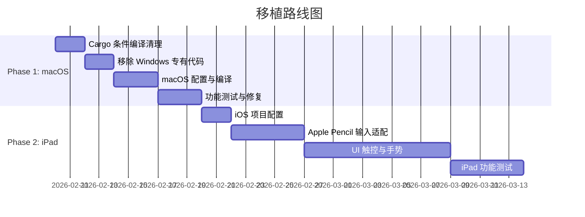

# PaintBoard 跨平台移植可行性评估报告

> 评估日期：2026-02-03
> 目标平台：macOS Desktop, iPadOS (Apple Pencil)

---

## 执行摘要

| 维度 | macOS | iPad |
|------|-------|------|
| **整体可行性** | ✅ 高 | ⚠️ 中等 |
| **技术风险** | 低 | 中 |
| **预估工作量** | 2-3 周 | 4-6 周 |

**结论**：架构设计良好，核心渲染和 UI 可直接复用。主要工作集中在输入层适配和平台特定代码清理。

---

## 1. 框架层：Tauri 2.x

### 1.1 支持情况

| 平台 | 官方支持 | 成熟度 |
|------|---------|--------|
| macOS Desktop | ✅ 官方支持 | 生产就绪 |
| iOS/iPadOS | ✅ 官方支持 (2.0+) | Beta → 稳定 |

### 1.2 当前配置分析

```json
// tauri.conf.json
"bundle": {
  "targets": ["msi", "nsis"]  // ❌ 仅 Windows 格式
}
```

**需要改动**：
- 添加 `dmg`, `app` (macOS)
- 添加 `ios` 目标
- 新增 `tauri.ios.conf.json` 配置文件

### 1.3 开发环境要求

| 需求 | 说明 |
|------|------|
| macOS 主机 | **必须** - iOS/macOS 开发仅限 macOS |
| Xcode | 完整安装 (非 Command Line Tools) |
| Cocoapods | `brew install cocoapods` |
| iOS Rust Targets | `rustup target add aarch64-apple-ios aarch64-apple-ios-sim` |

---

## 2. 渲染层：WebGPU / Compute Shader

### 2.1 兼容性矩阵

| 平台 | WebGPU 状态 | Compute Shader |
|------|------------|----------------|
| macOS Safari 26+ | ✅ 默认启用 | ✅ 支持 |
| iOS/iPadOS 18.2+ | ✅ 默认启用 | ✅ 支持 |
| iOS 17.4-18.1 | ⚠️ 需手动开启 Feature Flag | ⚠️ 需手动开启 |
| 更早版本 | ❌ 不支持 | ❌ 不支持 |

### 2.2 Shader 兼容性分析

当前 `computeBrush.wgsl` 使用的特性：

| 特性 | Safari 支持 | 风险 |
|------|------------|------|
| `@compute @workgroup_size(8,8)` | ✅ | 低 |
| `var<workgroup>` shared memory | ✅ | 低 |
| `texture_storage_2d<rgba32float>` | ⚠️ 可能需 fallback | 中 |
| `textureLoad` / `textureStore` | ✅ | 低 |

### 2.3 建议方案

1. **保持 Canvas2D Fallback** - 已有 `shouldUseGPU()` 检测机制
2. **验证 `rgba32float`** - 若不支持，fallback 到 `rgba8unorm`
3. **检查 Device Limits** - iPad 可能有更低的 workgroup/buffer 限制

---

## 3. 输入层：数位板 / Apple Pencil

### 3.1 当前架构

```
┌─────────────────────────────────────────────┐
│           TabletBackend (trait)              │
├──────────────────┬──────────────────────────┤
│ WinTabBackend    │ PointerEventBackend      │
│ (Windows Only)   │ (Cross-platform Fallback)│
└──────────────────┴──────────────────────────┘
```

**优势**：抽象层设计良好，便于扩展

### 3.2 平台输入方案

| 平台 | 推荐方案 | 备注 |
|------|---------|------|
| **macOS** | PointerEvent API | 通过 WebView 已支持 |
| **macOS 高级** | octotablet (需社区贡献) | 官方标注"Help Needed" |
| **iPad** | PointerEvent API | Safari 支持 pressure/tilt |

### 3.3 PointerEvent API 在 Safari 上的支持

| 属性 | macOS Safari | iOS Safari | 说明 |
|------|-------------|------------|------|
| `pressure` | ✅ | ✅ | 0.0-1.0，Apple Pencil 完整支持 |
| `tiltX/tiltY` | ✅ | ✅ | 倾斜角度 |
| `twist` | ⚠️ 部分 | ⚠️ 部分 | Apple Pencil 2 支持 |

### 3.4 需要的改动

| 改动 | 优先级 | 工作量 |
|------|--------|--------|
| 移除 `#[cfg(target_os = "windows")]` 硬编码 | 高 | 1-2 天 |
| 条件编译 `wintab_lite` / `wintab_backend` | 高 | 1 天 |
| 实现 macOS 输入后端 (可选) | 低 | 自愿贡献 |
| 验证 iPad PointerEvent 压感 | 中 | 1-2 天 |

---

## 4. Rust 依赖层

### 4.1 依赖兼容性矩阵

| Crate | Windows | macOS | iOS | 说明 |
|-------|---------|-------|-----|------|
| `tauri` | ✅ | ✅ | ✅ | 框架核心 |
| `wintab_lite` | ✅ | ❌ | ❌ | **需条件编译** |
| `octotablet` | ✅ | ⚠️ 不完整 | ⚠️ 不完整 | 可选 |
| `windows` crate | ✅ | ❌ | ❌ | **已有 `#[cfg]`** |
| `image` | ✅ | ✅ | ✅ | 无问题 |
| `psd` | ✅ | ✅ | ✅ | 无问题 |
| `webp` | ✅ | ✅ | ✅ | 无问题 |
| `zip`, `tiff`, `lz4_flex` | ✅ | ✅ | ✅ | 无问题 |

### 4.2 需要的 Cargo.toml 改动

```toml
# 现有（仅 Windows）
[target.'cfg(windows)'.dependencies]
windows = { version = "0.56", features = [...] }

# 需要添加
[target.'cfg(target_os = "windows")'.dependencies]
wintab_lite = { version = "1.0.1", features = ["libloading"] }
```

---

## 5. UI 层：React 组件

### 5.1 兼容性评估

| 组件 | 桌面适配 | 触控适配 | 说明 |
|------|---------|---------|------|
| Canvas 画布 | ✅ | ✅ | PointerEvent 统一处理 |
| 工具栏 | ✅ | ⚠️ 需调整 | 触摸目标可能太小 |
| 图层面板 | ✅ | ⚠️ 需调整 | 拖拽手势冲突 |
| 颜色选择器 | ✅ | ✅ | react-colorful 已支持触控 |
| 快捷键 | ✅ | ❌ 不适用 | iPad 需手势替代 |

### 5.2 iPad 特定改动

| 改动 | 优先级 | 工作量 |
|------|--------|--------|
| 增大触摸目标 (min 44px) | 高 | 2-3 天 |
| 手势替代快捷键 | 中 | 3-5 天 |
| 响应式布局 | 中 | 2-3 天 |
| Split View 支持 | 低 | 1-2 天 |

---

## 6. 风险评估

### 6.1 高风险

| 风险 | 影响 | 缓解措施 |
|------|------|---------|
| WebGPU `rgba32float` 不支持 | GPU 笔刷失效 | Fallback 到 Canvas2D |
| Apple Pencil 压感延迟 | 用户体验下降 | 优化 PointerEvent 处理 |

### 6.2 中风险

| 风险 | 影响 | 缓解措施 |
|------|------|---------|
| iOS < 18.2 不支持 WebGPU | 需要 fallback | 显示系统要求提示 |
| iPad 内存限制 | 大画布 OOM | 限制最大画布尺寸 |

### 6.3 低风险

| 风险 | 影响 | 缓解措施 |
|------|------|---------|
| macOS 数位板兼容性 | 部分设备可能不识别 | PointerEvent 通用支持 |

---

## 7. 工作量估算

### 7.1 macOS Desktop (2-3 周)

| 任务 | 人天 |
|------|------|
| Cargo.toml 条件编译清理 | 2 |
| 移除 Windows 专有代码 | 2 |
| tauri.conf.json macOS 配置 | 1 |
| 编译测试 & 修复 | 3 |
| macOS 功能测试 | 2 |
| **合计** | **10** |

### 7.2 iPad (4-6 周)

| 任务 | 人天 |
|------|------|
| macOS 阶段所有工作 | 10 |
| iOS 项目配置 | 2 |
| PointerEvent Apple Pencil 适配 | 3 |
| UI 触控适配 | 8 |
| 手势系统实现 | 5 |
| iPad 功能测试 | 5 |
| **合计** | **33** |

---

## 8. 建议方案

### 8.1 分阶段实施



### 8.2 优先级建议

1. **先做 macOS** - 风险最低，可验证架构跨平台能力
2. **iPad 放第二阶段** - 需要更多 UI 改动和触控适配
3. **octotablet macOS 支持** - 作为可选优化，不阻塞主线

---

## 9. 结论

| 问题 | 回答 |
|------|------|
| **移植可行吗？** | ✅ 完全可行 |
| **架构需要大改吗？** | ❌ 不需要，设计良好 |
| **GPU 笔刷能用吗？** | ✅ Safari 26+ / iOS 18.2+ 支持 |
| **最大挑战是什么？** | iPad 触控 UI 适配 |
| **建议开始吗？** | ✅ 建议分阶段实施 |
