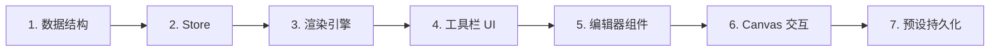

# 渐变填充工具设计文档

复刻 Photoshop 渐变工具，支持 5 种渐变形状、多停靠点编辑、透明度独立控制、预设管理，交互为实时预览拖拽。

---

## 功能概览

| 功能 | 说明 |
|------|------|
| 渐变形状 | 线性、径向、角度、对称、菱形 |
| 停靠点 | 颜色停靠点 + 透明度停靠点（独立轨道） |
| 混合模式 | 复用 `BlendMode`（16 种） |
| 不透明度 | 0-100% |
| 反转/抖动 | 开关控制 |
| 预设管理 | 保存/加载/删除用户渐变 |
| 应用范围 | 有选区 → 填选区；无选区 → 填整个图层 |
| 交互 | 拖拽定义起终点，实时预览 |

---

## 工具栏设计参考

基于提供的 Photoshop 截图：


---

## 数据结构

### GradientStop（颜色停靠点）

```typescript
interface ColorStop {
  id: string;
  position: number;   // 0-1
  color: string;      // hex
}

interface OpacityStop {
  id: string;
  position: number;   // 0-1
  opacity: number;    // 0-1
}

interface GradientPreset {
  id: string;
  name: string;
  colorStops: ColorStop[];
  opacityStops: OpacityStop[];
  smoothness: number; // 0-100
}
```

### GradientToolSettings

```typescript
type GradientShape = 'linear' | 'radial' | 'angle' | 'reflected' | 'diamond';

interface GradientToolSettings {
  activePresetId: string | null;
  customGradient: GradientPreset;  // 当前编辑中的渐变
  shape: GradientShape;
  blendMode: BlendMode;
  opacity: number;        // 0-1
  reverse: boolean;
  dither: boolean;        // 抖动
  transparency: boolean;  // 是否应用透明度停靠点
}
```

---

## Proposed Changes

### 1. 状态管理 (stores/)

#### [NEW] [gradient.ts](file:///f:/CodeProjects/PaintBoard/src/stores/gradient.ts)

新建渐变工具专用 store：
- `GradientToolSettings` 状态
- 预设列表管理（CRUD）
- 持久化用户预设

#### [MODIFY] [tool.ts](file:///f:/CodeProjects/PaintBoard/src/stores/tool.ts)

- 扩展 `ToolType`：添加 `'gradient'`

---

### 2. 工具栏 UI (components/)

#### [MODIFY] [LeftToolbar.tsx](file:///f:/CodeProjects/PaintBoard/src/components/SidePanel/LeftToolbar.tsx)

- 添加渐变工具按钮，使用 `PaintBucket` 图标

#### [NEW] [GradientToolbar.tsx](file:///f:/CodeProjects/PaintBoard/src/components/Toolbar/GradientToolbar.tsx)

渐变工具选项面板：
- 渐变预览条（点击打开编辑器）
- 5 个形状按钮
- 混合模式下拉
- 不透明度滑块
- 反转/抖动/透明度开关

#### [MODIFY] [Toolbar/index.tsx](file:///f:/CodeProjects/PaintBoard/src/components/Toolbar/index.tsx)

- 添加 `currentTool === 'gradient'` 分支渲染 `GradientToolbar`

---

### 3. 渐变编辑器 (components/)

#### [NEW] [GradientEditor/](file:///f:/CodeProjects/PaintBoard/src/components/GradientEditor)

渐变编辑器面板（模态/悬浮）：
- `index.tsx` - 主组件
- `GradientBar.tsx` - 渐变条预览 + 停靠点拖拽
- `StopEditor.tsx` - 单个停靠点颜色/透明度编辑
- `PresetGrid.tsx` - 预设网格选择
- `GradientEditor.css` - 样式

核心交互：
- 颜色停靠点轨道（下方）
- 透明度停靠点轨道（上方）
- 拖拽调整位置
- 双击添加/删除停靠点
- 点击停靠点编辑颜色/透明度

---

### 4. 渐变渲染引擎 (utils/)

#### [NEW] [gradientRenderer.ts](file:///f:/CodeProjects/PaintBoard/src/utils/gradientRenderer.ts)

核心渲染逻辑：
- `sampleGradient(t: number, preset: GradientPreset): RGBA` - 采样渐变颜色
- `renderLinearGradient(ctx, start, end, preset)` - 线性渐变
- `renderRadialGradient(ctx, center, radius, preset)` - 径向渐变
- `renderAngleGradient(ctx, center, preset)` - 角度渐变
- `renderReflectedGradient(ctx, start, end, preset)` - 对称渐变
- `renderDiamondGradient(ctx, center, size, preset)` - 菱形渐变
- `applyDither(imageData)` - 抖动算法

性能考虑：
- 预览阶段使用低分辨率，确认后全分辨率渲染
- 考虑 WebGPU 加速（后续优化）

---

### 5. Canvas 交互 (hooks/)

#### [NEW] [useGradientTool.ts](file:///f:/CodeProjects/PaintBoard/src/hooks/useGradientTool.ts)

交互 hook：
- `onPointerDown` - 记录起点
- `onPointerMove` - 更新终点，触发预览渲染
- `onPointerUp` - 提交渐变到图层
- Shift 约束 45°角

---

### 6. 预设存储

预设保存路径：`AppData/Roaming/com.paintboard/gradients.json`

默认预设：
- 前景色到背景色
- 前景色到透明
- 黑白渐变
- 彩虹渐变

---

## 实施顺序



---

## Verification Plan

### 单元测试

1. **渐变采样测试** (`gradientRenderer.test.ts`)
   ```bash
   pnpm test -- gradientRenderer
   ```
   - 验证 `sampleGradient` 在 0/0.5/1 位置返回正确颜色
   - 验证透明度停靠点正确应用

2. **Store 测试** (`gradient.test.ts`)
   ```bash
   pnpm test -- gradient
   ```
   - 验证预设 CRUD 操作
   - 验证状态持久化

### 手动验证

1. **工具切换**
   - 按 G 键或点击工具栏，确认切换到渐变工具
   - 确认顶部工具栏显示渐变选项

2. **渐变绘制**
   - 在画布上拖拽，确认实时预览
   - 按住 Shift 拖拽，确认角度约束
   - 松开鼠标，确认渐变应用到图层

3. **渐变编辑器**
   - 点击渐变预览条，确认编辑器打开
   - 拖拽停靠点，确认位置更新
   - 双击添加/删除停靠点

4. **选区支持**
   - Ctrl+A 全选后绘制渐变，确认填充整个画布
   - 绘制矩形选区后绘制渐变，确认只填充选区内

---

## User Review Required

> [!IMPORTANT]
> **工具栏图标**：用户指定使用 `PaintBucket`，这与 Photoshop 的渐变图标（矩形渐变条）不同。确认是否接受？

> [!NOTE]
> **GPU 加速**：第一版使用 Canvas 2D API，后续可考虑 WebGPU 优化。这符合项目 CPU/GPU 双引擎策略。
