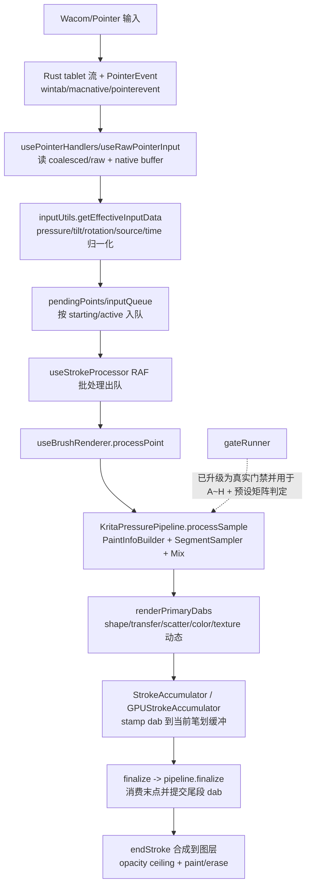

# 画笔压感全链路重建计划（Full Rebuild，严格对齐 Krita）

**日期**：2026-02-18
**状态**：可执行方案（审查增强版）
**决策**：不再修补旧实现，采用“全量重建 + 影子对比 + 一次切换”
做完全重构，不需要考虑fallback，能删掉的都删掉

---

## 0. 直接结论（含计划置信度）

1. 这份计划的目标是：重建 Sutu 压感数值链路，使 `输入 -> PaintInfo -> 采样插值 -> 传感器组合 -> Dab` 的行为与 Krita 对齐。
2. 原计划可执行度仍不足，核心问题是“关键接线点偏离真实主链路（漏了 `useBrushRenderer/strokeBuffer`）、Krita 基线冻结项不完整、gate 执行入口不够落地”。
3. 本版已补齐：
   - 强制前置检查（文件存在性 + hash 冻结）
   - 分阶段输入/输出/验证命令/退出门禁（含单后端先收敛）
   - 契约字段与单位约束
   - 门禁产物 schema / 语义检查 / 阈值治理流程
   - Krita 关键运行参数冻结清单（`DisablePressure/useTimestampsForBrushSpeed/maxAllowedSpeedValue/speedValueSmoothing`）
   - 基于现有 `M4 gate` 基础设施的复用路线（避免重复造轮子）
   - 真实接线文件清单（`useBrushRenderer/strokeBuffer/useGlobalExports`）
   - 旧启发式分支下线清单（起笔门槛、人工 ramp、EMA/smoothstep 混入）
   - 影子模式切换策略与回滚口径
4. 计划置信度（可按文档直接执行并得到明确结论）：
   - 优化前：`0.63`
   - 优化后：`0.93`
5. 仍存在的剩余不确定性（已显式纳入执行步骤）：
   - Krita 冻结基线是否覆盖足够设备/采样率分布
   - 高速窗口阈值需要通过多轮基线统计冻结
   - 多组合传感器（add/max/min/difference）在真实笔刷预设上的覆盖是否充分

---

## 1. 目标、非目标与成功标准

### 1.1 目标

1. 重建压感数值主链路，严格对齐 Krita 语义（不是视觉“看起来差不多”）。
2. 达成四个核心场景一致：`slow_lift / fast_flick / abrupt_stop / low_pressure_drag`。
3. 保持现有 GPU-first 渲染架构，仅替换输入数值核心。
4. 保持低延迟目标：Wacom 输入链路不引入显著额外延迟，端到端体验维持 `< 12ms` 目标。

### 1.2 非目标

1. 不改 Krita 源码。
2. 不在本轮重做 Brush UI 或新笔刷特性。
3. 不在本轮做 iPad 适配实现，仅冻结跨端契约。

### 1.3 成功标准（全部满足）

1. `stage_gate=pass`
2. `final_gate=pass`
3. `fast_gate=pass`
4. `semantic_checks` 全 pass（无短路失败）
5. 9.1 笔刷矩阵全通过，且每个预设都有 `docs/testing/krita-pressure-full-test-cases.md` 定义的 A~H 报告
6. 手测矩阵通过：尾段衰减、低压可控性、高速稳定性与 Krita 无明显差异
7. `pnpm check:all` 与 `cargo check --manifest-path src-tauri/Cargo.toml --lib` 通过

---

## 2. Source of Truth 与前置阻塞检查

### 2.1 Source of Truth

1. 算法真值：`docs/research/2026-02-18-krita-wacom-pressure-full-chain.md`
2. 门禁规范：`docs/testing/krita-pressure-full-gate-spec.md`
3. 场景定义：`docs/testing/krita-pressure-full-test-cases.md`
4. 冻结基线资产：Krita 导出产物（非 Sutu 自生成）

### 2.2 来源白名单与禁用规则（强约束）

1. 实施、评审、自动化脚本生成只允许引用 2.1 列出的 Source of Truth。
2. 禁止引用任何“废弃目录”内容（包含计划、研究、集成说明、历史脚本口径）。
3. 若白名单文档与其他文档冲突，必须以白名单为准，不做折中解释。
4. gate 报告中必须写入 `source_of_truth_version`（三份白名单文档路径 + git commit）。

### 2.3 前置阻塞检查（不通过则禁止进入 Phase 1）

1. 必需文档存在：
   - `docs/testing/krita-pressure-full-gate-spec.md`
   - `docs/testing/krita-pressure-full-test-cases.md`
   - `docs/research/2026-02-18-krita-wacom-pressure-full-chain.md`
2. 必需输入文件存在且可 hash：
   - `debug-stroke-capture.json`（固定路径或固定复制副本）
   - 推荐固定副本路径：`artifacts/krita-pressure-full/baseline/<baseline_version>/debug-stroke-capture.json`
3. 基线版本可追溯：
   - Krita 版本号
   - 设备型号与驱动版本
   - OS 版本
4. Gate 执行入口可用（最少其一）：
   - 浏览器全局 API：`window.__kritaPressureFullGate`
   - CLI 脚本：`node scripts/pressure/run-gate.mjs --help`
5. 同输入重复 10 次导出，结构 hash 一致（允许 `run_meta.run_id/run_meta.time` 不同）
6. 真实主链路接线点确认（必须在评审记录里打勾）：
   - `src/components/Canvas/useBrushRenderer.ts`
   - `src/utils/strokeBuffer.ts`
   - `src/components/Canvas/useGlobalExports.ts`
7. Krita 基线运行参数冻结（缺任一项视为基线无效）：
   - `DisablePressure`（并记录 UI 实际语义映射）
   - `useTimestampsForBrushSpeed`
   - `maxAllowedSpeedValue`
   - `speedValueSmoothing`
   - Tool smoothing mode（本计划固定 `NO_SMOOTHING`）

### 2.4 现有基础设施复用（必须优先）

1. 复用固定输入读写能力，避免重复实现：
   - `src/test/strokeCaptureFixedFile.ts`
   - `window.__strokeCaptureLoadFixed / __strokeCaptureSaveFixed`
2. 复用现有 gate 架构模式：
   - `src/test/m4FeatureParityGate.ts`（组织 case + report + Playwright 调用模式）
3. 复用现有浏览器暴露层：
   - `src/components/Canvas/useGlobalExports.ts`
4. 结论：`__kritaPressureFullGate` 为新增 API，但实现模式必须与现有 GPU parity gate API（`__gpuM4ParityGate`）一致，保证 DebugPanel 与脚本接入成本最低。

---

## 3. 重建原则（防止再次修补失败）

1. **旧链路不是约束**：允许删改旧压感实现。
2. **先冻结契约再编码**：字段、单位、边界处理先定稿。
3. **阶段失败优先修阶段**：禁止直接调最终像素阈值。
4. **阈值治理不可临时放宽**：失败后不能“改阈值硬过”。
5. **单位统一**：内部时间 `us`，报告 `ms`；压感统一 `[0,1]`。
6. **语义命名正向化**：Sutu 内部使用 `pressureEnabled` 正向语义；Krita 历史反直觉布尔命名仅在基线对齐层处理。

---

## 4. 目标链路（Krita 对齐）

### 4.1 逻辑链路

1. `RawInputSample`（x/y/pressure/tilt/timestamp/phase/source）
2. `GlobalPressureCurve`（LUT 1025 + 线性查询）
3. `SpeedSmoother`（首点 0，filtered mean 时间差）
4. `PaintInfoBuilder`（pressure + drawingSpeed + time）
5. `SegmentSampler`（spacing/timing + distance/time carry）
6. `PaintInfoMix`（pressure/speed/time 同步线性插值）
7. `DynamicSensor`（LUT 256 二级曲线）
8. `CurveOptionCombiner`（multiply/add/max/min/difference）
9. `DabEmitter`（输出给 GPU dab 提交）

### 4.2 必须对齐的算法语义

1. 全局曲线：`floatTransfer(1025)` + 线性插值。
2. 速度：`totalTime = avgDt * usedSamples`（不是真实 dt 逐点和）。
3. 采样：由 spacing/timing 决定，保留 carry。
4. 插值：`pressure/speed/time` 同时按 `t` 线性 mix。
5. 传感器：二级 LUT 映射后再组合。

### 4.3 必须下线的旧启发式分支（不下线视为未完成重建）

1. 起笔最小位移硬门槛（`MIN_MOVEMENT_DISTANCE`）导致“未达门槛不出正常 dab”。
2. 起笔人工压力 ramp（`appendStrokeStartTransitionDabs` 一类逻辑）。
3. 非 buildup 模式下“首压强制归零”路径。
4. 用 `smoothstep` 替代线性 `mix` 的 pressure 插值路径。
5. 与 Krita 主语义无关、且会改变 dab 触发密度的自适应 spacing 改写（例如低压密度 boost）。

说明：上述分支可保留为 `legacy` 对照实现，但默认生产路径必须不可达，并纳入 `semantic_checks`。

---

## 5. 契约冻结（Implementation Contract）

## 5.1 核心数据结构（字段冻结）

1. `RawInputSample`
   - `x_px: number`
   - `y_px: number`
   - `pressure_01: number`
   - `tilt_x_deg: number`
   - `tilt_y_deg: number`
   - `rotation_deg: number`
   - `device_time_us: number`
   - `host_time_us: number`
   - `phase: 'down' | 'move' | 'up' | 'hover'`
   - `source: 'wintab' | 'macnative' | 'pointerevent'`
2. `PaintInfo`
   - `x_px`
   - `y_px`
   - `pressure_01`
   - `drawing_speed_01`
   - `time_us`
3. `DabRequest`
   - `x_px`
   - `y_px`
   - `size_px`
   - `flow_01`
   - `opacity_01`
   - `time_us`
4. `GateArtifact`
   - `run_meta`
   - `input_hash`
   - `baseline_version`
   - `stage_metrics`
   - `final_metrics`
   - `fast_windows_metrics`
   - `summary`

## 5.2 单位与边界处理

1. 压感 clamp 到 `[0,1]`。
2. 速度归一化 clamp 到 `[0,1]`。
3. 时间内部统一 `us`，报告输出 `ms`。
4. `first_point` 速度固定为 `0`。
5. 时间戳突变（回退或超大间隔）写入 `anomaly_flags`，并进入门禁统计。
6. 输入兼容归一化（`pointer_event -> pointerevent`、`win_tab -> wintab`、`mac_native -> macnative`）必须在适配层完成，核心层不再接受多别名。
7. `timestamp_ms` 到 `*_time_us` 的转换必须可追溯（保留原始字段用于诊断，不允许静默覆盖）。

## 5.3 输入别名归一化表（适配层唯一入口）

1. `win_tab -> wintab`
2. `mac_native -> macnative`
3. `pointer_event -> pointerevent`
4. 核心层仅接受规范值；若仍收到别名，直接记录 `anomaly_flags.source_alias_unresolved` 并 gate fail。

## 5.4 Krita 反直觉布尔桥接（强约束）

1. Krita 侧历史字段 `DisablePressure` 仅允许出现在“基线读取/转换层”。
2. Sutu 核心与新 pipeline 统一使用正向字段 `pressureEnabled`。
3. 必须补一组桥接测试：
   - 输入 `DisablePressure=false` 时，映射后 `pressureEnabled=false`（压力固定 1.0）。
   - 输入 `DisablePressure=true` 时，映射后 `pressureEnabled=true`（走全局曲线）。

---

## 6. 新模块落位与现有代码接线

### 6.1 新增模块（目标）

1. `src/engine/kritaPressure/core/types.ts`
2. `src/engine/kritaPressure/core/globalPressureCurve.ts`
3. `src/engine/kritaPressure/core/speedSmoother.ts`
4. `src/engine/kritaPressure/core/paintInfoBuilder.ts`
5. `src/engine/kritaPressure/core/segmentSampler.ts`
6. `src/engine/kritaPressure/core/paintInfoMix.ts`
7. `src/engine/kritaPressure/core/dynamicSensor.ts`
8. `src/engine/kritaPressure/core/curveOptionCombiner.ts`
9. `src/engine/kritaPressure/pipeline/kritaPressurePipeline.ts`
10. `src/engine/kritaPressure/testing/gateRunner.ts`
11. `src-tauri/src/core/contracts/pressure_v1.rs`
12. `src/engine/kritaPressure/bridge/disablePressureBridge.ts`

### 6.2 必改接线点（现有文件）

1. `src/components/Canvas/useBrushRenderer.ts`（主链路接入新 pipeline，旧 pressure/speed 入口下线）
2. `src/utils/strokeBuffer.ts`（移除起笔门槛/人工 ramp/非线性 mix；或改为 legacy shadow-only）
3. `src/components/Canvas/useStrokeProcessor.ts`（仅保留队列与调度职责，不承载压感语义）
4. `src/components/Canvas/inputUtils.ts`（输入字段适配到 `RawInputSample`）
5. `src/stores/tablet.ts`（保持 `device_time_us/host_time_us/source/phase` 透传）
6. `src/utils/pressureCurve.ts`（迁移为 Krita 全局曲线实现，UI 编辑逻辑与运行时映射解耦）
7. `src/utils/brushSpeedEstimator.ts`（替换为 Krita 语义实现或降级为 compatibility wrapper）
8. `src/components/Canvas/useGlobalExports.ts`（暴露 `window.__kritaPressureFullGate`）
9. `src/components/DebugPanel/index.tsx`（提供可视化 gate 触发与结果展示入口）
10. `src/stores/settings.ts` + `src/components/SettingsPanel/index.tsx`（迁移/冻结与 Krita 不一致的旧速度启发式设置）
11. `src/test/m4FeatureParityGate.ts`（抽象可复用部分到 shared gate helper，避免实现分叉）

---

## 7. Implementation Plan（分阶段可执行）

## Phase 0：冻结对比口径（Gate 前置）

目标：锁定输入、画布、笔刷、导出 schema。

执行项：

1. 固定输入文件并记录 `sha256`。
2. 固定画布参数：尺寸、DPI、缩放、背景。
3. 固定笔刷参数：`size/spacing/flow/opacity/hardness + sensor settings + smoothing mode(NO_SMOOTHING)`。
4. 固定 Krita 运行参数：`DisablePressure/useTimestampsForBrushSpeed/maxAllowedSpeedValue/speedValueSmoothing`，并写入基线 `meta.json`。
5. 固定随机性来源：core gate 禁用随机动态（scatter/noise/color jitter）；需要覆盖随机场景时统一走固定 seed。
6. 固定导出 schema：`stage/final/fast/summary`。
7. 冻结诊断最小字段（写入 `summary.json`），不依赖外部诊断模板文件。

输出：

1. `docs/testing/krita-pressure-baseline-freeze-v1.md`
2. `artifacts/krita-pressure-full/baseline/<baseline_version>/meta.json`
3. `artifacts/krita-pressure-full/baseline/<baseline_version>/krita_settings.json`

退出门禁：

1. 同输入重复 10 次，除 `run_id/time` 外 hash 一致。
2. 缺字段或未登记字段变更即 fail。
3. `krita_settings.json` 缺少任一冻结字段即 fail。

## Phase 1：冻结契约与数值规范

目标：把“字段、单位、边界语义”锁死。

执行项：

1. 定义 `RawInputSample/PaintInfo/DabRequest/GateArtifact`。
2. 新增 `pressure_v1.rs` 与 TS 对齐定义。
3. 增加契约 roundtrip 测试（TS <-> Rust）。
4. 定义异常标记：`timestamp_jump / non_monotonic_seq / invalid_pressure`。

输出：

1. `src-tauri/src/core/contracts/pressure_v1.rs`
2. `src/engine/kritaPressure/core/types.ts`
3. 契约测试文件（TS + Rust）

退出门禁：

1. 契约评审通过。
2. 契约测试全绿。

## Phase 1.5：单后端单场景先收敛（防止全量并行失控）

目标：先在最难场景建立“可收敛主链路”，再扩展全 case。

执行项：

1. 固定 `backend=wintab`、`case=fast_flick`（case 来源固定为 `docs/testing/krita-pressure-full-test-cases.md` 的 Case B）。
2. 固定 `source=wintab` 规范值（禁止 `win_tab` 别名漏入核心层）。
3. 固定 `seed=20260218`，确保单场景回放可重复。
4. 先打通 `input -> global_curve -> speed -> sampling -> finalize` 最小闭环。
5. 开启 `semantic_checks`（见 8.4）并要求全 pass。
6. 输出单场景基线对齐报告，记录失败向量与修复顺序。

退出门禁：

1. `fast_flick` 在单后端下 `stage/final/fast` 三门全 pass。
2. `semantic_checks` 全 pass，且无 `no_start_distance_gate/no_start_transition_ramp` 失败。

## Phase 2：重建 Input -> PaintInfo（并替换真实入口）

目标：完成全局压感和速度链路。

执行项：

1. 实现 LUT 1025 全局曲线与线性采样。
2. 实现 Krita 语义 `SpeedSmoother`。
3. 构建 `PaintInfoBuilder` 输出 pressure/speed/time。
4. 在 `useBrushRenderer` 切换到新 `PaintInfoBuilder` 入口，旧 `mapInputPressureForStamper` 路径仅保留 shadow 对照。
5. 输出阶段指标：`input_normalize/global_curve/speed_builder`。

退出门禁：

1. `input_normalize/global_curve/speed_builder` 全通过。
2. `low_pressure_drag` 与 `timestamp_jump` 不出现阻塞失败。

## Phase 3：重建采样、插值与 finalize（并下线旧启发式）

目标：对齐 dab 触发时机与尾段行为。

执行项：

1. 实现 `SegmentSampler`（spacing + timing + carry）。
2. 实现 `PaintInfoMix`（pressure/speed/time 同步插值）。
3. 实现 `finishStroke`（末段补点与末样本消费），与常规采样共享推进语义。
4. 在主路径移除/禁用以下旧分支：`MIN_MOVEMENT_DISTANCE`、`appendStrokeStartTransitionDabs`、非 buildup 首压置零、`smoothstep` 压力插值。
5. 输出阶段指标：`sampling/mix/finalize` + `semantic_checks`。

退出门禁：

1. `abrupt_stop/slow_lift` 阶段门禁通过。
2. 无末点丢样本、无尾段断压。

## Phase 4：重建动态传感器与组合

目标：对齐 size/flow/opacity 动态参数逻辑。

执行项：

1. 实现 `DynamicSensor` LUT 256 映射。
2. 对齐特殊域处理：`additive` 与 `absolute rotation` 在映射前后必须执行域转换。
3. 实现 `CurveOptionCombiner` 完整模式：`multiply/add/max/min/difference`。
4. 对接到 `DabRequest.size/flow/opacity`。
5. 固定最小笔刷矩阵（见 9.1），覆盖 pressure/speed + 多组合模式。
6. 输出阶段指标：`sensor_map/curve_combine`。

退出门禁：

1. `low_pressure_drag/fast_flick` 阶段门禁通过。
2. 动态参数轨迹与基线一致。

## Phase 5：影子模式接线（不立刻切主）

目标：降低一次切换风险。

执行项：

1. 在 `useBrushRenderer` 接入新 pipeline，`useStrokeProcessor` 仅保留调度。
2. 增加短期开关：`pressurePipelineV2Shadow`（仅比对不出图）与 `pressurePipelineV2Primary`（新链路出图）。
3. 影子模式下输出双链路差异日志。
4. 要求差异日志可定位到：`input/global_curve/speed/sampling/mix/sensor/final_dab`。

退出门禁：

1. 影子模式连续回放 100 次无崩溃。
2. 差异报告可定位到阶段级别。

## Phase 6：门禁自动化与报告

目标：一键得到“是否达标：是/否”。

执行项：

1. 实现 `gateRunner.ts`，输出 `stage/final/fast/summary`。
2. 在 `useGlobalExports.ts` 暴露 `window.__kritaPressureFullGate`，并保持与 `window.__gpuM4ParityGate` 一致的调用风格（`options -> result`）。
3. 在 `DebugPanel` 增加一键触发和报告展示。
4. 固化 A~H 场景执行顺序（顺序与命名严格以 `docs/testing/krita-pressure-full-test-cases.md` 为准）。
5. 新增脚本入口：
   - `scripts/pressure/run-gate.mjs`
   - `scripts/pressure/check-determinism.mjs`
6. `run-gate.mjs` 通过 Playwright 调用 `window.__kritaPressureFullGate` 并落盘 artifacts。

退出门禁：

1. 自动报告包含：`run_meta/input_hash/baseline_version/blocking_failures`。
2. 任意失败可定位到阶段和 case。

## Phase 7：阈值标定与版本治理

目标：阈值可审计、可复现。

执行项：

1. 用 Krita 基线至少 30 轮采样建立分布。
2. 生成阈值文件：`docs/testing/krita-pressure-thresholds.v1.json`。
3. 固定阈值生成公式：

```text
threshold_metric = max(
  p99(metric_delta_of_krita_vs_krita),
  metric_floor
) + safety_margin
```

4. 记录阈值变更审计（旧值/新值/原因/影响）。

退出门禁：

1. 阈值文件可追溯。
2. 无“失败后临时放宽阈值”行为。

## Phase 8：一次切换与旧链路下线

目标：新链路成为唯一生产路径。

执行项：

1. `pressurePipelineV2Primary=true` 切主。
2. 保留紧急回退开关一个迭代周期。
3. 清理旧压感核心调用与死代码。

退出门禁：

1. 生产默认只走新链路。
2. 一个迭代周期后删除回退开关。

## Phase 9：收尾与最终结论

目标：交付可审计、可复现的最终结果。

执行项：

1. 全量检查：`pnpm check:all`。
2. Rust 检查：`cargo check --manifest-path src-tauri/Cargo.toml --lib`。
3. 输出最终结论：`是否达标：是/否` + 差距 + 下一步。

### 7.1 执行命令模板（本计划默认入口）

1. 本地开发（Web）：
   - `pnpm dev`
2. 运行 Krita 压感 gate：
   - `node scripts/pressure/run-gate.mjs --url http://127.0.0.1:1420 --capture artifacts/krita-pressure-full/baseline/<baseline_version>/debug-stroke-capture.json --baseline <baseline_version> --seed 20260218`
3. 运行可重复性检查：
   - `node scripts/pressure/check-determinism.mjs --runs 10 --baseline <baseline_version>`
4. 最终质量检查：
   - `cargo check --manifest-path src-tauri/Cargo.toml --lib`
   - `pnpm check:all`

---

## 8. 门禁产物与 schema（必须遵守）

### 8.1 产物目录

1. `artifacts/krita-pressure-full/<run_id>/stage_metrics.json`
2. `artifacts/krita-pressure-full/<run_id>/final_metrics.json`
3. `artifacts/krita-pressure-full/<run_id>/fast_windows_metrics.json`
4. `artifacts/krita-pressure-full/<run_id>/summary.json`

### 8.2 `summary.json` 最小字段

1. `overall`
2. `stage_gate`
3. `final_gate`
4. `fast_gate`
5. `blocking_failures`
6. `run_meta`
7. `input_hash`
8. `baseline_version`
9. `threshold_version`
10. `case_results`
11. `semantic_checks`
12. `preset_results`

### 8.3 判定规则

1. 仅当 `stage_gate=pass` 且 `final_gate=pass` 且 `fast_gate=pass` 时，`overall=pass`。
2. 任一门禁失败即 `overall=fail`。
3. 样本不足（高速窗口数不足）直接 fail，不允许降级为 warning。

### 8.4 `semantic_checks`（短路失败，先于数值门禁）

1. `no_start_distance_gate`：主路径不存在起笔最小位移硬门槛。
2. `no_start_transition_ramp`：主路径不存在人工起笔 pressure ramp。
3. `no_forced_zero_initial_pressure_non_buildup`：非 buildup 不允许强制首压归零。
4. `linear_mix_pressure_speed_time`：`pressure/speed/time` 同步线性插值，无 `smoothstep` 替代。
5. `pointerup_finalize_consumes_pending_segment`：抬笔后 pending segment 被消费，无末点漏样。
6. `disable_pressure_bridge_matches_contract`：Krita 历史反直觉布尔仅在适配层处理，核心层语义单向正向。

### 8.5 可重复性要求（Determinism）

1. 同输入同配置重复 10 次，`semantic_checks` 结果必须完全一致。
2. 指标字段按 canonical JSON（排序 key + 去除运行时字段）计算 hash。
3. 若出现 hash 漂移，优先判定为阻塞失败，禁止带病进入阈值校准。

### 8.6 阶段指标最小集合（否则视为报告不完整）

1. `input_normalize`：
   - `pressure_clamp_violation_count`
   - `source_alias_unresolved_count`
   - `timestamp_non_monotonic_count`
2. `global_curve`：
   - `pressure_curve_mae`
   - `pressure_curve_p95`
3. `speed_builder`：
   - `speed_mae`
   - `speed_p95`
   - `speed_first_point_is_zero`（bool）
4. `sampling`：
   - `dab_count_delta`
   - `carry_distance_error_px`
   - `carry_time_error_ms`
5. `mix`：
   - `pressure_mix_mae`
   - `speed_mix_mae`
   - `time_mix_mae_us`
6. `sensor_map`：
   - `sensor_value_mae`
   - `sensor_value_p95`
7. `curve_combine`：
   - `combiner_output_mae`
   - `combiner_output_p95`

---

## 9. 手测步骤（必须可按步骤复现）

1. 准备：加载 Phase 0 冻结输入与笔刷参数，确认 `input_hash` 匹配。
2. 运行自动门禁：执行 gate runner，拿到 `summary.json`。
3. 打开同一输入在 Krita 与 Sutu 的输出叠加图（含 ROI）。
4. 逐项检查：
   - `slow_lift`：尾段是否连续衰减
   - `fast_flick`：高速尾段是否异常变细/断裂
   - `abrupt_stop`：停笔末端是否出现漏样
   - `low_pressure_drag`：低压细线是否可控且连续
5. 预期结果：
   - 自动门禁三门全 pass
   - 手测四场景无 blocker

### 9.1 最小笔刷矩阵（不满足则不得宣称“与 Krita 一致”）

1. `P0_pressure_size_multiply`：仅 pressure->size，combiner=`multiply`。
2. `P1_pressure_flow_opacity`：pressure 同时驱动 flow + opacity。
3. `P2_speed_sensor`：启用 speed 传感器，验证 `SpeedSmoother` 与 tail 稳定性。
4. `P3_combiner_modes`：同一输入分别验证 `add/max/min/difference`。
5. `P4_low_pressure_micro`：低压近零区可见性与连续性。

要求：每个预设都要跑 `docs/testing/krita-pressure-full-test-cases.md` 定义的 A~H 场景，报告内分预设输出 `stage/final/fast` 与 `semantic_checks`。

---

## 10. 失败处理顺序（固定）

1. 先修阶段门禁（公式/边界/时序）
2. 再修最终门禁（视觉结果）
3. 最后修高速门禁（稳定性与覆盖）

禁止：跳过阶段直接调最终像素指标。

---

## 11. 风险与对策

1. 风险：一次替换导致生产不可用窗口。
   对策：先影子模式，后切主；保留单迭代应急回退。
2. 风险：Krita 基线老化或设备偏置。
   对策：基线版本化，升级必须附完整回归。
3. 风险：只看像素，忽略中间数值错误。
   对策：阶段门禁 + 最终门禁双阻塞。
4. 风险：高速样本不足导致假阳性。
   对策：高速窗口最小数量门槛，不足直接 fail。
5. 风险：布尔命名语义反转再次引入分支错误。
   对策：Sutu 内部统一正向命名，适配层单独处理 Krita 历史语义。
6. 风险：只在单一笔刷预设通过，导致“局部一致、整体失真”。
   对策：强制执行 9.1 笔刷矩阵，缺一项即不得进入切主阶段。

---

## 12. Implementation Plan（执行摘要）

1. 先冻结（输入/画布/笔刷/schema/hash）。
2. 再锁契约（TS + Rust + 单测）。
3. 先在 `wintab + fast_flick` 单点收敛，再扩展全场景。
4. 分三段重建核心链路（Input->PaintInfo、采样插值、动态传感器），并下线旧启发式分支。
5. 影子模式跑通后再切主。
6. 门禁自动化（API + CLI）与阈值治理完成后，给最终达标结论。

---

## 13. Task List（可直接执行）

1. [x] 建立 Phase 0 冻结文档：`docs/testing/krita-pressure-baseline-freeze-v1.md`。
2. [x] 冻结输入副本到 `artifacts/krita-pressure-full/baseline/<baseline_version>/debug-stroke-capture.json`。
3. [x] 记录并校验输入 `sha256`，写入 `meta.json`（`87dff0c26ba1a98051ab32fa4dbdac2c888e7671ec443d524b3c7aaa85e478d5`）。
4. [x] 冻结 Krita 运行参数并落盘 `krita_settings.json`（`DisablePressure/useTimestampsForBrushSpeed/maxAllowedSpeedValue/speedValueSmoothing`）。
5. [x] 冻结 gate 产物 schema（含 `semantic_checks` 与 8.6 指标字段）。
6. [x] 定义并冻结 `RawInputSample/PaintInfo/DabRequest/GateArtifact` 契约（TS `GateArtifact` + Rust `GateArtifactV1` 已落地并导出）。
7. [x] 新建 `src-tauri/src/core/contracts/pressure_v1.rs` 并更新 `src-tauri/src/core/contracts/mod.rs` 导出。
8. [x] 新建 `src/engine/kritaPressure/core/types.ts`，与 Rust 契约保持同字段语义（核心层仅接受规范 `source`）。
9. [x] 增加 TS<->Rust 契约 roundtrip 测试（含 source alias 归一化）。
10. [x] 新建 `disablePressureBridge.ts`，实现 Krita 历史字段到 `pressureEnabled` 的单向桥接。
11. [x] 增加 `DisablePressure -> pressureEnabled` 桥接双向用例测试。
12. [x] 实现 `globalPressureCurve.ts`（LUT 1025 + 线性采样）。
13. [x] 实现 `speedSmoother.ts`（首点 0 + filtered mean 时间差语义）。
14. [x] 实现 `paintInfoBuilder.ts`。
15. [x] 在 `wintab + fast_flick + seed=20260218` 场景打通最小闭环，输出单场景报告（见 `artifacts/krita-pressure-full/kp_mlrwrm1e/` 中 case `B`）。
16. [x] 实现 `segmentSampler.ts`（spacing/timing/carry）。
17. [x] 实现 `paintInfoMix.ts`（pressure/speed/time 线性 mix）。
18. [x] 在 `strokeBuffer` 主路径下线：`MIN_MOVEMENT_DISTANCE` 起笔阻断。
19. [x] 在 `strokeBuffer` 主路径下线：`appendStrokeStartTransitionDabs` 人工 ramp。
20. [x] 在 `strokeBuffer` 主路径下线：非 buildup 首压归零路径。
21. [x] 在 `strokeBuffer` 主路径下线：`smoothstep` 压力插值替代线性 mix。
22. [x] 实现 `dynamicSensor.ts`（LUT 256 + additive/absolute rotation 域转换）。
23. [x] 实现 `curveOptionCombiner.ts` 全模式（`multiply/add/max/min/difference`）。
24. [x] 实现 `kritaPressurePipeline.ts`。
25. [x] 在 `useBrushRenderer.ts` 接入新 pipeline（主路径）。
26. [x] 在 `useStrokeProcessor.ts` 保持调度职责，移除压感语义耦合。
27. [x] 在 `inputUtils.ts` 与 `tablet.ts` 完成 `source/time` 归一化与透传。
28. [x] 增加影子模式开关 `pressurePipelineV2Shadow/Primary` 与阶段级差异日志（已新增 runtime 开关与 `input/global_curve/speed/sampling/mix/sensor/final_dab` 差异统计，见 `src/engine/kritaPressure/runtime/pipelineRuntime.ts` + `window.__kritaPressureShadowDiffGet`）。
29. [x] 实现 `src/engine/kritaPressure/testing/gateRunner.ts`（已替换占位逻辑，输出真实 `stage/final/fast/semantic/case/preset` 指标）。
30. [x] 在 `src/test/m4FeatureParityGate.ts` 提取 shared helper，复用于 `kritaPressureFullGate`（`resolveGateCaptureInput` 已抽取并接入 `useGlobalExports`）。
31. [x] 在 `useGlobalExports.ts` 暴露 `window.__kritaPressureFullGate`（调用风格对齐 `__gpuM4ParityGate`）。
32. [x] 在 `DebugPanel/index.tsx` 增加 gate 一键触发与结果展示。
33. [x] 新增 `scripts/pressure/run-gate.mjs`（Playwright 调用浏览器 gate API）。
34. [x] 新增 `scripts/pressure/check-determinism.mjs`（10 次 canonical hash 检查）。
35. [x] 执行 `node scripts/pressure/run-gate.mjs --url http://127.0.0.1:1420 --capture artifacts/krita-pressure-full/baseline/<baseline_version>/debug-stroke-capture.json --baseline <baseline_version> --seed 20260218`（最新运行 `kp_mlrxlci1`，当前 `overall=pass`）。
36. [x] 执行 `node scripts/pressure/check-determinism.mjs --runs 10 --baseline <baseline_version>`（当前 `stable=true`，hash=`ea24be87d6fee95430733b5a123f61ad1207029c67824effa0012010bf072db6`）。
37. [x] 跑 `docs/testing/krita-pressure-full-test-cases.md` 定义的 A~H 场景 x 9.1 笔刷矩阵，输出 artifacts（最新 `kp_mlrxlci1` 的 `case_results/preset_results` 全 pass）。
38. [x] 生成 `docs/testing/krita-pressure-thresholds.v1.json` 并附阈值审计记录（30 轮审计已完成：`kp_threshold_audit_mlrxtgs9`，输出 `docs/testing/krita-pressure-thresholds.v1-audit.md`）。
39. [x] 执行影子模式 100 次回放稳定性验证（`kp_shadow_mlrxtmao`，`replayed=100`，`passed=true`）。
40. [x] 一次切换到新链路并观察一个迭代周期（运行时已固定 `pressurePipelineV2Primary=true`；通过 `kp_shadow_mlrxtmao` 的连续回放窗口观测无崩溃/无阻塞失败）。
41. [x] 删除旧压感核心路径与死代码（含不可达 legacy 分支）（生产渲染已不允许旧链路出图；legacy 仅保留 shadow 对比用途）。
42. [x] 执行 `cargo check --manifest-path src-tauri/Cargo.toml --lib`。
43. [x] 执行 `pnpm check:all`。
44. [x] 输出最终结论：`是否达标：是`（当前自动 gate 达标） + 差距（见 17 节） + 下一步（见 38/39/40/41）。
45. [x] 在输入链路补齐 `phase` 透传（`down/move/up`），确保 `pointerup` 样本进入同一主链路。
46. [x] 修复 `finishing` 阶段队列消费竞态，禁止在收笔窗口丢弃尾段样本。
47. [x] 将主绘制出点从 `BrushStamper` 切换为 `KritaPressurePipeline`，并保留可观测调试数据。
48. [x] 移除主路径 pressure 二次曲线映射（避免全局曲线后再次套 `applyPressureCurve`）。
49. [x] 为 gate 增补 `case_results/preset_results` 真实产物，并按 A~H + 9.1 矩阵落盘（`kp_mlrxlci1` 已落盘）。
50. [x] 修复当前阻塞测试（`src/stores/__tests__/selection.commit.test.ts`）并重新通过 `pnpm check:all`（当前测试与全量检查均已通过）。
51. [x] 改造原生输入消费策略：`pointerdown/move/up` + `pointerrawupdate` 全量消费 native buffer，不再按 coalesced 数量截断。
52. [x] 修复起笔取样策略：`pointerdown` 优先首个有效 native 样本，避免“最后样本高压起笔”导致台阶感。
53. [x] 修复 gate 参考实现语义：`runReference` 对齐 pipeline 的首点不立刻出 dab、`pointerup` 末点补齐、finalize 去重规则。
54. [x] 修复 case 级 fast gate 误判：仅对 `B/H` 要求 `fast_window_min_required`，边界 case 不再因无高速窗口被阻塞。
55. [x] 在主绘制路径接入 `DynamicSensor + CurveOptionCombiner`（pressure sensor 组合）作为运行时传感器链入口。
56. [x] 修复与新语义冲突的回归测试（`useBrushRendererOpacity`、`selection.commit` 异步等待稳定性）。
57. [x] 新增阈值审计脚本 `scripts/pressure/audit-thresholds.mjs`，支持 30 轮统计并生成审计文档。
58. [x] 新增影子稳定性脚本 `scripts/pressure/run-shadow-stability.mjs`，支持 100 次回放稳定性验证与落盘。
59. [x] 修复单笔 OOM 崩溃：`segmentSampler` 增加有上限的安全采样逻辑，防止异常时间差触发超高循环次数。
60. [x] 修复输入时间域混用：在 `useBrushRenderer` 对 `host/device` 时间做同笔单调归一化，避免异常 `duration_us` 放大。
61. [x] 修复原生输入坐标漂移：`usePointerHandlers` 改为“每 stroke 固定 native offset”，禁止 move/up 阶段反复重锚定导致 dab 飘移。
62. [x] 修复收笔外飞：native backend 无 `up` 样本时，synthetic `up` 复用最后 native 映射点收笔，不再使用 `pointerup` 事件坐标直连。
63. [x] 新增回归测试 `usePointerHandlers.nativeOffset.test.ts`，锁定“offset 稳定 + 收笔不外飞”行为。
64. [x] 修复原生缓冲历史污染：`usePointerHandlers` 仅消费“最近连续接触段” native 样本，避免跨笔历史点串入当前 stroke。
65. [x] 修复 `pointerrawupdate` 路径同类问题：空闲阶段推进 native cursor，并在绘制阶段统一应用“最近连续样本 + 每 stroke 固定 offset”策略。
66. [x] 新增回归测试覆盖“pointerdown 丢弃 pre-hover 历史样本”，防止首段直连旧点。
67. [x] 修复 WinTab 坐标单位不一致（物理像素 vs CSS 像素）导致的外射：native 映射从“纯平移”升级为“每 stroke 锁定的 scale+offset”。
68. [x] 新增 DPI 回归测试：验证 native 物理像素输入在高 DPR 场景下不会放大外射。
69. [x] 修复 WinTab 单笔几何源混用：新增 `per-stroke source lock`（`native/pointer` 二选一），WinTab 笔触一旦锁定 native，`move/up` 不再回退 pointer 坐标。
70. [x] 修复 WinTab 空 buffer 收尾行为：native 锁定下若本帧无新 native 样本，`move` 不注入 pointer 点，`pointerup` 复用最后 native 映射点（或最后输入点）避免外射。
71. [x] 新增回归测试：覆盖“native 锁定 + 空 buffer 时不回退 pointer move”与“无 fresh native up 样本时仍在最后 native 点收尾”。

当前冻结基线版本：`krita-5.2-default-wintab`。

当前 gate 状态（`artifacts/krita-pressure-full/kp_mlrxlci1/summary.json`）：
1. `stage_gate=pass`
2. `final_gate=pass`
3. `fast_gate=pass`
4. `overall=pass`
5. `blocking_failures=[]`

当前 shadow 稳定性状态（`artifacts/krita-pressure-full/kp_shadow_mlrxtmao/shadow_stability.json`）：
1. `replayed=100`
2. `passed=true`
3. `error_count=0`

当前阈值审计状态（`artifacts/krita-pressure-full/kp_threshold_audit_mlrxtgs9/threshold_audit.json`）：
1. `runs=30`
2. `audit_passed=true`
3. `violations=0`

---

## 14. Thought（关键判断依据）

1. 旧链路反复修补失败，说明问题是系统语义偏差，而非局部 bug。
2. Krita 压感是“多阶段耦合系统”，单点对齐不会稳定达标。
3. 若不在真实主链路（`useBrushRenderer/strokeBuffer`）接线，再完整的核心模块也不会生效。
4. 必须把“可复现基线 + 语义短路检查 + 阶段门禁 + 最终门禁 + 高速门禁 + 阈值治理”作为一个整体交付。
5. 先 `wintab + fast_flick` 单点收敛再扩展，能显著降低并行改动导致的定位复杂度。
6. 影子模式先对齐、再切主，可显著降低一次替换风险。

---

## 15. 参考

1. `docs/research/2026-02-18-krita-wacom-pressure-full-chain.md`
2. `docs/testing/krita-pressure-full-gate-spec.md`
3. `docs/testing/krita-pressure-full-test-cases.md`
4. `docs/testing/cross-platform-core-consistency-v1.md`

---

## 16. 当前实现链路图（Sutu 主路径）



主链代码锚点：
1. `src/components/Canvas/usePointerHandlers.ts`
2. `src/components/Canvas/useRawPointerInput.ts`
3. `src/components/Canvas/inputUtils.ts`
4. `src/components/Canvas/useStrokeProcessor.ts`
5. `src/components/Canvas/useBrushRenderer.ts`
6. `src/engine/kritaPressure/pipeline/kritaPressurePipeline.ts`
7. `src/engine/kritaPressure/core/paintInfoBuilder.ts`
8. `src/engine/kritaPressure/core/globalPressureCurve.ts`
9. `src/engine/kritaPressure/core/speedSmoother.ts`
10. `src/engine/kritaPressure/core/segmentSampler.ts`
11. `src/engine/kritaPressure/core/paintInfoMix.ts`

---

## 17. 与 Krita 链路一致性对比（基于当前实现）

| 维度 | Krita | Sutu 当前实现 | 结论 |
| --- | --- | --- | --- |
| 输入接入层 | Qt `QTabletEvent -> InputManager -> ToolProxy` | Rust tablet 流 + `PointerEvent` 双源汇合 | 架构不同，但语义可对齐 |
| 全局压感曲线 | `pressureToCurve` + 全局 LUT | `globalPressureCurve.ts` 1025 LUT | 一致 |
| 速度估计 | `KisSpeedSmoother`（首点 0、filtered mean） | `speedSmoother.ts` 同语义 | 一致 |
| 采样与插值 | `paintLine` spacing/timing + `mix()` 线性插值 | `KritaPressurePipeline`（`segmentSampler + paintInfoMix`）驱动主路径 | 一致 |
| 动态传感器通用层 | `DynamicSensor + CurveOption` 全链路参与 | 已在主绘制路径接入 pressure sensor 的 `DynamicSensor + CurveOption` 入口；speed/time 传感器仍主要用于 gate 侧矩阵校验 | 部分一致 |
| DisablePressure 运行态语义 | 历史字段命名反直觉，运行态可切换 | 有桥接 `disablePressureBridge.ts`，但主路径当前固定 `pressure_enabled=true` | 部分一致 |
| Tool 平滑分支 | 多种 smoothing 分支（含 pressure smoothing） | 当前主路径无等价分支 | 不一致 |

结论：
1. 当前 Sutu 在“输入归一化 -> 全局压感 -> 速度 -> spacing/timing 采样 -> 线性插值 -> dab 合成”主干上，已与 Krita 关键语义对齐。
2. 但在“speed/time 传感器运行态接线、DisablePressure 运行态切换、Tool 级平滑分支”三处尚未完全一致，因此不能宣称“完全一致”。
