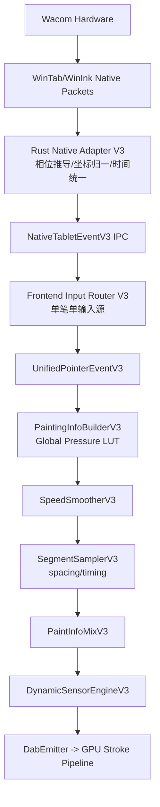
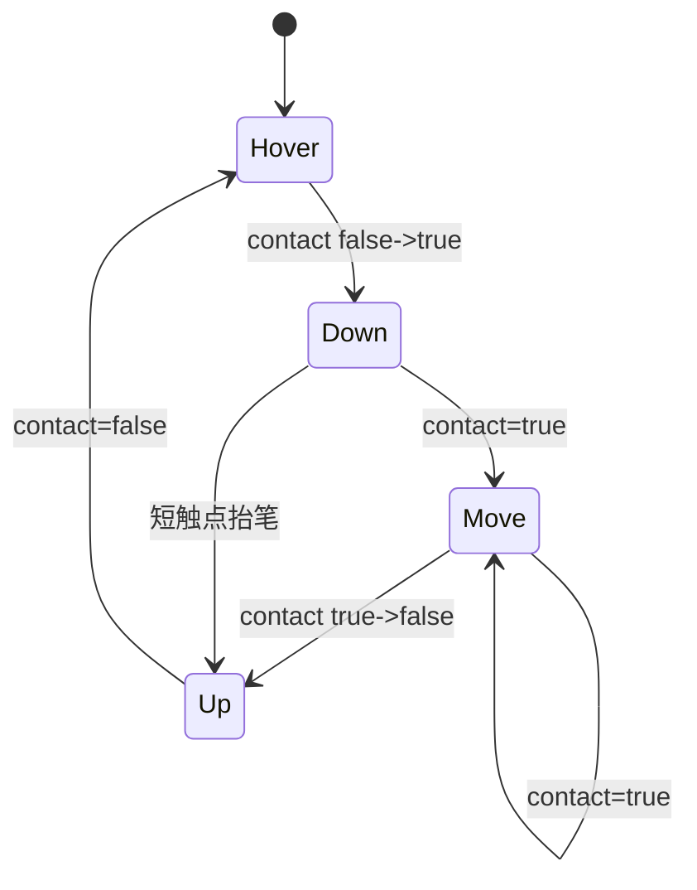
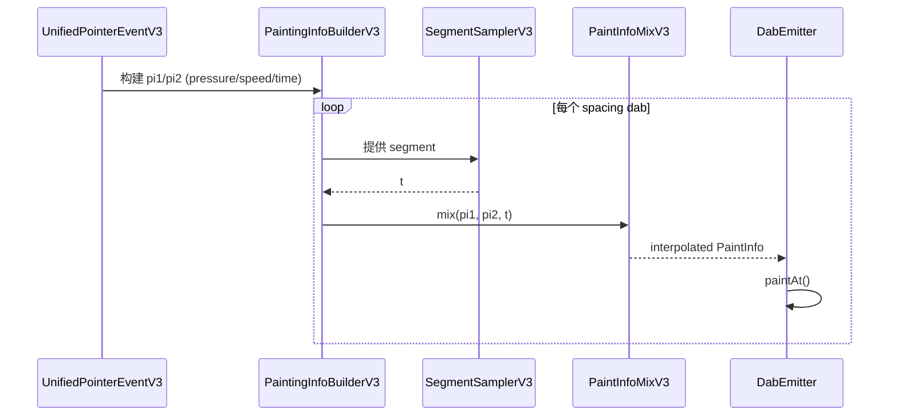
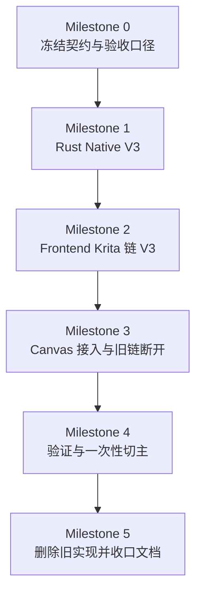

# PaintBoard WinTab 全量重构对齐 Krita 方案（无止血 / 无运行时 fallback）

**日期**：2026-02-19  
**适用范围**：Windows 桌面数位板主链（WinTab/WinInk）  
**目标读者**：美术、产品、测试、前端、Rust 后端

---

## 0. 直接结论

这次不做“在现有链路上修补”，改为**完整重建 Krita 等价输入链**，并一次性切主：

1. **单笔单输入源**：一笔只来自一个原生后端（WinTab 或 WinInk），不再把 PointerEvent 和 Native 混在同一笔里。
2. **单一统一事件对象**：先把底层输入统一成 `KoPointerEvent` 等价语义，再进入笔刷算法。
3. **算法链按 Krita 分层重建**：`Builder -> SpeedSmoother -> paintLine+mix -> DynamicSensor`。
4. **无运行时 fallback**：新链路上线后，旧链路只保留 Git 回退能力，不保留运行时自动降级。

---

## 1. 硬约束（本方案必须满足）

1. Windows 绘画主链不消费浏览器 `PointerEvent` 几何数据（UI 光标事件除外）。
2. 不允许“native 只给 pressure，geometry 用 pointer”的拼接模式。
3. 不允许在 Rust emitter 或其他旁路偷偷改写 pressure。
4. 每个输入样本必须带完整相位：`hover/down/move/up`。
5. 每个输入样本必须有单调 `host_time_us`，用于全链路时序一致性。
6. 旧实现不做“局部复活”，而是作为整体可回退版本存在（Git 级别）。

---

## 2. Krita 等价目标（对齐清单）

## 2.1 等价目标

| Krita 层 | Krita 行为 | PaintBoard 重构目标 |
| --- | --- | --- |
| 输入入口 | Qt 抽象 `QTabletEvent` | Rust 统一 `NativeTabletEventV3` |
| 统一事件 | `KoPointerEvent` | `UnifiedPointerEventV3`（字段语义对齐） |
| 信息构建 | `KisPaintingInformationBuilder` | `PaintingInfoBuilderV3` |
| 压力归一 | 全局压感曲线 LUT + 插值 | `GlobalPressureCurveLutV3` |
| 速度平滑 | filtered mean + 历史距离窗口 | `SpeedSmootherV3` |
| 采样发射 | `paintLine` spacing/timing | `SegmentSamplerV3` |
| 参数插值 | `mix(t)` 对 pressure/speed/time | `PaintInfoMixV3` |
| 动态组合 | sensor curve + combiner | `DynamicSensorEngineV3` |

## 2.2 非目标

1. 不追求 Qt 或 C++ API 形式一致。
2. 不在本轮重做 GPU 渲染架构。
3. 不追求每个像素和 Krita 位级一致；追求事件语义与算法行为一致。

---

## 3. 目标架构（从零搭建，不混入旧融合逻辑）



要点：

1. `PointerEvent` 不进入绘画主链，只用于 UI 交互层（比如 hover UI）。
2. 一笔的几何、压力、时间、相位全部来自同一原生流。
3. 算法链分层固定，禁止跨层写“捷径逻辑”。

---

## 4. 数据契约（冻结后才能开工）

## 4.1 Rust 出口：`NativeTabletEventV3`

```text
NativeTabletEventV3 {
  seq: u64
  stroke_id: u64
  pointer_id: u32
  device_id: String
  source: "wintab" | "winink"
  phase: "hover" | "down" | "move" | "up"
  x_px: f32
  y_px: f32
  pressure_0_1: f32
  tilt_x_deg: f32
  tilt_y_deg: f32
  rotation_deg: f32
  host_time_us: u64
  device_time_us: Option<u64>
}
```

## 4.2 前端统一对象：`UnifiedPointerEventV3`

```text
UnifiedPointerEventV3 {
  stroke_id, pointer_id, phase
  pos: { x, y }
  sensors: { pressure, tiltX, tiltY, rotation }
  time: { hostUs, deviceUs? }
  source
}
```

约束：

1. `host_time_us` 必须单调递增（同 `stroke_id` 内）。
2. `up` 必须作为显式样本进入采样链，不允许在外层“隐式结束”。
3. 压感范围统一 `0..1`，越界直接 clamp 并计数。

---

## 5. 关键算法（Krita 等价实现细节）

## 5.1 相位状态机（WinTab 原生）

`contact/proximity/status` 推导相位，不再只看 `pressure > 0`。



推导规则：

1. `contact` 优先看 WinTab 状态位，压力只作辅助。
2. `Down/Up` 为边沿事件，只发一次。
3. 每支笔维护独立状态机，不跨笔共享状态。

## 5.2 坐标归一化（统一画布像素域）

```text
x_px = (raw_x - tablet_min_x) / (tablet_max_x - tablet_min_x) * canvas_width_px
y_px = (raw_y - tablet_min_y) / (tablet_max_y - tablet_min_y) * canvas_height_px
```

补充：

1. 在 Rust 侧统一 DPI/缩放/映射方向，前端不再二次猜测。
2. 坐标归一化参数随设备上下文冻结，笔触中途不切换。

## 5.3 全局压感曲线 LUT（Builder）

与 Krita 一致：预采样 LUT（建议 1025），运行时线性插值。

```text
pos = clamp(p,0,1) * (N-1)
lo = floor(pos), hi = ceil(pos)
t = pos - lo
out = LUT[lo] + t * (LUT[hi] - LUT[lo])
```

## 5.4 速度平滑（SpeedSmootherV3）

核心逻辑：

1. 首点速度固定 0。
2. `timeDiff` 走 filtered mean。
3. 用累计距离 / 累计时间估算局部速度。
4. 速度归一化输出 `0..1` 给动态传感器。

## 5.5 `paintLine + mix` 采样链



关键约束：

1. `up` 样本必须参与最后一段 `mix`，保证收笔尾段连续变细。
2. 禁止在采样外层“提前结束笔触”。

---

## 6. 模块重构方案（新建 + 替换 + 删除）

## 6.1 Rust（`src-tauri/src/input/`）

新增：

1. `src-tauri/src/input/krita_v3/mod.rs`
2. `src-tauri/src/input/krita_v3/types.rs`
3. `src-tauri/src/input/krita_v3/phase_machine.rs`
4. `src-tauri/src/input/krita_v3/coordinate_mapper.rs`
5. `src-tauri/src/input/krita_v3/timebase.rs`
6. `src-tauri/src/input/krita_v3/wintab_adapter.rs`
7. `src-tauri/src/input/krita_v3/winink_adapter.rs`（可与 WinTab 同期或次期）

替换：

1. `src-tauri/src/input/backend.rs`：从 `InputSampleV2` 升级到 `NativeTabletEventV3`。
2. `src-tauri/src/commands.rs`：移除 `pressure_smoother` 及相关路径。
3. `src-tauri/src/input/mod.rs`：导出新 V3 模块，旧处理器不再进入主链。

删除（切主后）：

1. `src-tauri/src/input/processor.rs`（含 `PressureSmoother` 旧逻辑）。
2. Windows 桌面绘画路径中的 `pointer_backend` 入口绑定。

## 6.2 Frontend（`src/engine` + `src/components/Canvas`）

新增：

1. `src/engine/kritaParityInput/contracts.ts`
2. `src/engine/kritaParityInput/inputRouterV3.ts`
3. `src/engine/kritaParityInput/strokeStateMachineV3.ts`
4. `src/engine/kritaParityInput/paintingInfoBuilderV3.ts`
5. `src/engine/kritaParityInput/speedSmootherV3.ts`
6. `src/engine/kritaParityInput/segmentSamplerV3.ts`
7. `src/engine/kritaParityInput/paintInfoMixV3.ts`
8. `src/engine/kritaParityInput/dynamicSensorEngineV3.ts`
9. `src/engine/kritaParityInput/dabEmitterV3.ts`

替换：

1. `src/components/Canvas/usePointerHandlers.ts`：不再做 native/pointer 索引融合。
2. `src/components/Canvas/useRawPointerInput.ts`：从绘画主链移出。
3. `src/components/Canvas/useStrokeProcessor.ts`：改接 `UnifiedPointerEventV3` 与 V3 采样链。

删除（切主后）：

1. 旧 `nativeStartIndex + eventIndex` 配对逻辑。
2. 旧输入融合遗留分支（包含“首点补丁式”逻辑）。

---

## 7. 实施路径（一次性切主，不做运行时兜底）

## 7.1 里程碑



## 7.2 每个里程碑的完成定义

1. **M0**：字段、单位、相位、时间域、验收指标全部冻结。
2. **M1**：Rust 发出的每个样本都含完整 `phase + pos + pressure + host_time_us`。
3. **M2**：前端可用一条 V3 链完整产出 dabs，不依赖旧 hook 兜底。
4. **M3**：Canvas 主链仅接 V3 输入；旧融合路径全部断开。
5. **M4**：自动门禁 + 美术手测全通过。
6. **M5**：旧模块删除、测试更新、文档归档完成。

---

## 8. 验收标准（以 Krita 体验对齐为核心）

## 8.1 自动指标（Blocking）

1. `phase_transition_error_count = 0`
2. `host_time_non_monotonic_count = 0`
3. `stroke_tail_drop_count = 0`
4. `first_dab_pressure_spike_rate` 低于阈值
5. `tail_terminal_width_delta` 进入阈值
6. `pressure_clamp_rate` 低于阈值

## 8.2 美术手测（Blocking）

1. 慢抬笔 20 条：尾部连续变细，无钝截断。
2. 快甩笔 20 条：末端不断裂、不过冲。
3. 低压轻拖 20 条：无明显台阶锯齿。
4. 点按-抬笔 20 次：起笔无大头突刺。

记录模板（每次失败都记录）：

1. 笔刷 preset
2. 动作类型
3. 失败截图/录屏时间点
4. 输入源（WinTab/WinInk）
5. 指标快照

---

## 9. 对你这个目标最关键的工程决策

1. **不混源**：单笔不允许 Pointer + Native 拼接。
2. **不补丁**：不在旧 hook 上叠加更多 if/patch。
3. **不兜底**：生产路径不留自动 fallback；失败就 Git 回退到重构前主线。
4. **先契约后代码**：字段/单位/时序冻结前，不进入大规模实现。

---

## 10. 执行清单（按顺序）

1. 冻结 `NativeTabletEventV3` 与 `UnifiedPointerEventV3` 契约文档。
2. 完成 Rust `phase_machine + coordinate_mapper + timebase`。
3. 替换 `commands.rs` 事件发射主链，移除 pressure smoothing。
4. 建立前端 `kritaParityInput` 新目录并实现 Builder/Smoother/Sampler/Mix。
5. 重写 Canvas 输入接入，只接 V3 统一事件。
6. 新增 V3 单测与回放测试（首点、尾段、快甩、低压）。
7. 一次性切主，删除旧融合路径。
8. 执行全量检查并产出对齐报告。

---

## 11. 验证命令

1. `cargo check --manifest-path src-tauri/Cargo.toml --lib`
2. `pnpm check:all`
3. `pnpm test -- src/components/Canvas/__tests__/usePointerHandlers.test.ts`
4. `pnpm test -- src/components/Canvas/__tests__/useRawPointerInput.test.ts`
5. `pnpm test -- src/engine/kritaPressure/__tests__/pipeline.test.ts`

---

## Implementation Plan（中文）

1. 以 Krita 分层为模板，新建 V3 输入与笔刷信息链，不复用旧融合逻辑。  
2. 在 Rust 端先完成相位、坐标、时间统一，再把完整样本送到前端。  
3. 前端仅消费 `UnifiedPointerEventV3`，按 `Builder -> Smoother -> Sampler -> Mix` 产出 dabs。  
4. 完成门禁后一次性切主，删除旧链，不保留运行时 fallback。  

## Task List（中文）

1. [ ] 冻结 V3 契约：字段、单位、相位、时间域。  
2. [ ] 新建 `src-tauri/src/input/krita_v3/types.rs`。  
3. [ ] 新建 `src-tauri/src/input/krita_v3/phase_machine.rs`。  
4. [ ] 新建 `src-tauri/src/input/krita_v3/coordinate_mapper.rs`。  
5. [ ] 新建 `src-tauri/src/input/krita_v3/timebase.rs`。  
6. [ ] 新建 `src-tauri/src/input/krita_v3/wintab_adapter.rs`。  
7. [ ] 改 `src-tauri/src/input/backend.rs` 升级到 V3 事件。  
8. [ ] 改 `src-tauri/src/commands.rs` 移除 pressure smoothing 与旧发射分支。  
9. [ ] 新建 `src/engine/kritaParityInput/contracts.ts`。  
10. [ ] 新建 `src/engine/kritaParityInput/paintingInfoBuilderV3.ts`。  
11. [ ] 新建 `src/engine/kritaParityInput/speedSmootherV3.ts`。  
12. [ ] 新建 `src/engine/kritaParityInput/segmentSamplerV3.ts`。  
13. [ ] 新建 `src/engine/kritaParityInput/paintInfoMixV3.ts`。  
14. [ ] 新建 `src/engine/kritaParityInput/dynamicSensorEngineV3.ts`。  
15. [ ] 改 `src/components/Canvas/usePointerHandlers.ts` 仅接 V3 主链。  
16. [ ] 改 `src/components/Canvas/useRawPointerInput.ts` 从绘画主链剥离。  
17. [ ] 改 `src/components/Canvas/useStrokeProcessor.ts` 接入 V3 采样链。  
18. [ ] 新增 V3 门禁测试与回放测试。  
19. [ ] 删除旧融合与旧平滑逻辑（切主后）。  
20. [ ] 跑 `cargo check` 与 `pnpm check:all` 并出验收报告。  

## Thought（中文）

1. 你的目标本质是“输入语义完全一致”，不是“在现有偏差上调参”。  
2. 只要保留混源与旁路改写，WinTab 与 Pointer 的体验差会反复出现。  
3. 一次性重构成本更高，但能避免持续返工，长期总成本更低。  
