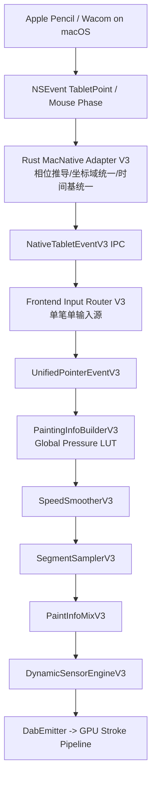
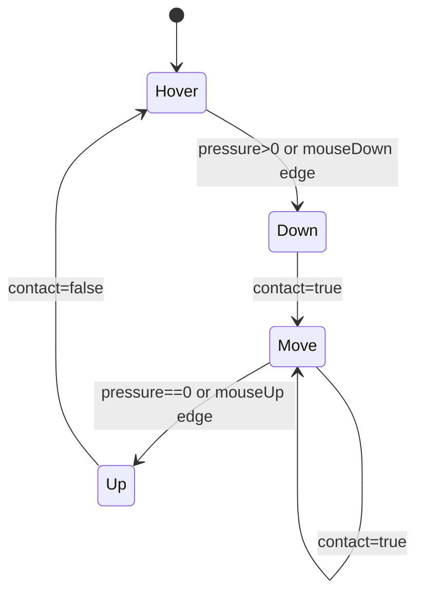
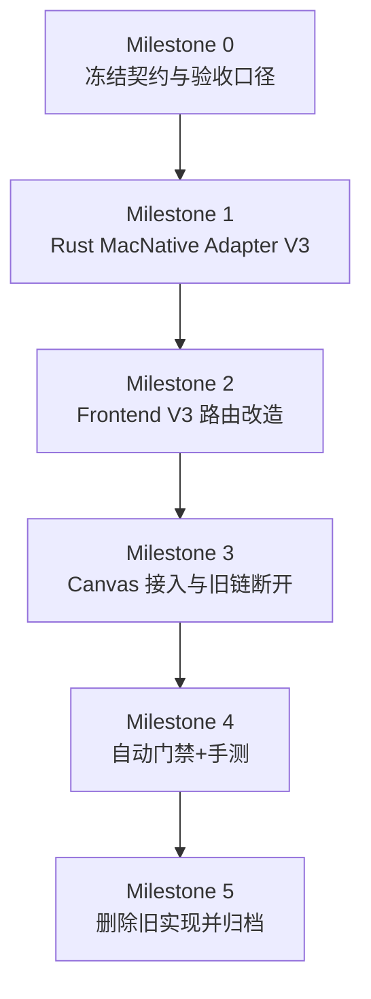

# PaintBoard MacNative 全量重构对齐 Krita 方案（无止血 / 无运行时 fallback）

**日期**：2026-02-20  
**适用范围**：macOS 桌面数位板主链（MacNative），PointerEvent 作为独立手动后端  
**目标读者**：美术、产品、测试、前端、Rust 后端  
参考：

1. `docs/done/2026-02-19-wintab-align-krita-execution-plan.md`
2. `docs/postmortem/2026-02-18-native-input-coordinate-regression-pointer-geometry-rollback.md`
3. `docs/done/2026-02-18-krita-pressure-full-rebuild-plan.md`
4. `docs/postmortem/2026-02-19-wintab-dropped-strokes-dom-gating-and-native-pump.md`
5. `docs/postmortem/2026-02-19-wintab-cross-stroke-seed-contamination.md`
6. `docs/postmortem/2026-02-20-wintab-backend-switch-seq-rewind-stall.md`
7. `docs/postmortem/2026-02-20-wintab-scribbles2-cursor-hardware-path-lag.md`
8. `docs/postmortem/2026-02-18-wintab-input-fusion-v3-no-improvement-rollback.md`
9. `docs/postmortem/2026-02-08-wintab-pressure-drop-stopgap.md`

---

## 执行状态（2026-02-20）

1. 当前为“待执行计划”，未切主。
2. 现状：`pointerevent` 可绘制，`macnative` 存在“可启动但无法稳定出笔”风险。
3. 目标：以 WinTab V3 方案为模板，建立 MacNative 等价主链并一次性切主。

---

## 0. 直接结论

MacNative 需要单独重构，不能假设“WinTab 方案自动覆盖 macOS”。

1. 继续在现有链路上打补丁，无法系统解决坐标域、相位与事件接线不一致问题。
2. 推荐采用与 WinTab 一致的 V3 思路：`单笔单输入源 + 统一事件契约 + Krita 等价算法链 + 一次性切主`。
3. 保持“无运行时 fallback”原则：生产路径不做自动降级；失败使用 Git 回退。

### 0.1 方案选型（对齐讨论）

1. 方案 A（推荐）：MacNative 完整 V3 重构并切主。  
   效果/用途：长期稳定，WinTab/MacNative 维护模型一致，后续 iPad 共享契约成本更低。  
   代价：一次性改动面大，需要阶段化门禁。
2. 方案 B：在现有 MacNative 链路上做小修（坐标修正 + 条件回退）。  
   效果/用途：短期止血快。  
   代价：与 WinTab 路径进一步分叉，后续返工概率高。
3. 方案 C：macOS 暂时强制 PointerEvent，延后 MacNative。  
   效果/用途：最快恢复可用性。  
   代价：放弃原生低延迟链路，不满足本阶段目标。

结论：执行方案 A。

---

## 1. 硬约束（本方案必须满足）

1. macOS 处于 MacNative 模式时，绘画主链不消费浏览器 `PointerEvent` 几何/压感数据（UI 光标事件除外）。
2. 不允许“native 只给 pressure，geometry 用 pointer”拼接模式。
3. 不允许在 Rust emitter 或前端旁路改写 pressure。
4. V3 主链固定启用压感，不实现运行时“关闭压感”模式。
5. 每个输入样本必须带完整相位：`hover/down/move/up`。
6. 每个输入样本必须有单调 `host_time_us`，用于全链路时序一致性。
7. `x_px/y_px` 必须是冻结后的统一坐标域（禁止前端启发式猜测坐标语义）。
8. 每支笔/每次接触必须有稳定 `stroke_id`，禁止跨笔串线。
9. 旧实现不做“局部复活”，只作为整体可回退版本存在（Git 级别）。
10. DOM 活跃门控不得被 hover move 刷新，禁止再次误抑制 native pump。
11. backend 切换后必须支持 `seq` 回绕自愈（buffer reset + cursor rebase）。
12. 输入队列在锁竞争或消费拥塞时不得静默丢样，必须可观测（计数/日志）。

---

## 2. Krita 等价目标（对齐清单）

### 2.1 等价目标

| Krita 层 | Krita 行为 | PaintBoard 重构目标 |
| --- | --- | --- |
| 输入入口 | Qt 抽象 `QTabletEvent` | Rust `MacNativeAdapterV3` |
| 统一事件 | `KoPointerEvent` | `NativeTabletEventV3` / `UnifiedPointerEventV3` |
| 信息构建 | `KisPaintingInformationBuilder` | `PaintingInfoBuilderV3` |
| 压力归一 | 全局曲线 LUT + 插值 | `GlobalPressureCurveLutV3` |
| 速度平滑 | filtered mean + 历史距离窗口 | `SpeedSmootherV3` |
| 采样发射 | `paintLine` spacing/timing | `SegmentSamplerV3` |
| 参数插值 | `mix(t)` 对 pressure/speed/time | `PaintInfoMixV3` |
| 动态组合 | sensor curve + combiner | `DynamicSensorEngineV3` |

### 2.2 非目标

1. 不追求 Qt/C++ API 形式一致。
2. 不在本轮重做 GPU 渲染架构。
3. 不追求像素位级一致；追求事件语义与算法行为一致。

---

## 3. 目标架构（从零搭建，不混入旧融合逻辑）



要点：

1. PointerEvent 不进入绘画主链，只用于 UI 层交互。
2. 一笔的几何、压力、时间、相位全部来自同一原生流。
3. 前端不再依赖 DOM `pointerId` 去裁剪 native 首包。
4. native pump 必须可在“无 DOM pointerdown”场景独立开笔。

---

## 4. 数据契约（冻结后才能开工）

### 4.1 Rust 出口：`NativeTabletEventV3`

```text
NativeTabletEventV3 {
  seq: u64
  stroke_id: u64
  pointer_id: u32
  device_id: String
  source: "wintab" | "pointerevent" | "macnative"
  phase: "hover" | "down" | "move" | "up"
  x_px: f32
  y_px: f32
  pressure_0_1: f32
  tilt_x_deg: f32
  tilt_y_deg: f32
  rotation_deg: f32
  host_time_us: u64
  device_time_us: Option<u64>
}
```

### 4.2 前端统一对象：`UnifiedPointerEventV3`

```text
UnifiedPointerEventV3 {
  stroke_id, pointer_id, phase
  pos: { x, y }
  sensors: { pressure, tiltX, tiltY, rotation }
  time: { hostUs, deviceUs? }
  source
}
```

约束：

1. 同 `stroke_id` 内 `host_time_us` 必须单调递增。
2. `up` 必须作为显式样本进入采样链，不允许隐式结束。
3. 压感范围统一 `0..1`，越界 clamp 并计数。
4. `x_px/y_px` 语义固定为“WebView client 像素域（top-left 原点）”。
5. `seq` 不要求跨 backend 全局单调，但读取层必须保证会话内单调可消费。

---

## 5. 关键算法（Krita 等价实现细节）

### 5.1 相位状态机（MacNative 原生）

来源：`NSEventType::TabletPoint` + 鼠标相位事件 + proximity。



推导规则：

1. 接触状态优先使用显式边沿（down/up），压力仅作辅助。
2. `Down/Up` 为边沿事件，只发一次。
3. 每支笔维护独立状态机，不跨笔共享状态。

### 5.2 坐标归一化（统一画布像素域）

目标：冻结为“WebView client 像素域，top-left 原点”。

```text
x_px = convert_to_webview_client_x(event)
y_px = convert_to_webview_client_y(event)
```

约束：

1. Rust 端完成坐标域统一，前端只做 canvas 缩放映射，不再猜测原点/方向。
2. 坐标归一化参数在一次笔触内冻结，不允许中途切换。
3. 增加 `coord_out_of_view_count` 统计，作为 Blocking 指标。

### 5.3 全局压感曲线 LUT（Builder）

与 WinTab V3 一致：LUT（建议 1025）+ 线性插值。

```text
pos = clamp(p,0,1) * (N-1)
lo = floor(pos), hi = ceil(pos)
t = pos - lo
out = LUT[lo] + t * (LUT[hi] - LUT[lo])
```

### 5.4 速度平滑（SpeedSmootherV3）

1. 首点速度固定 0。
2. 时间语义：优先 `device_time_us`，缺失时使用 `host_time_us`。
3. `timeDiff` 走 filtered mean，防止逐包抖动影响速度估计。
4. 速度归一化输出 `0..1` 给动态传感器。

### 5.5 `paintLine + mix` 采样链

1. `up` 样本必须参与最后一段 `mix`，保证收笔连续变细。
2. 禁止在采样外层提前结束笔触。
3. 不允许“native 首包缺失时自动借用 pointer down”。
4. 起笔质量必须单独门禁，不可被总体匹配率稀释。

---

## 6. 模块重构方案（新建 + 替换 + 删除）

### 6.1 Rust（`src-tauri/src/input/`）

新增：

1. `src-tauri/src/input/krita_v3/macnative_adapter.rs`
2. `src-tauri/src/input/krita_v3/coordinate_mapper_mac.rs`
3. `src-tauri/src/input/krita_v3/phase_machine_mac.rs`
4. `src-tauri/src/input/krita_v3/timebase_mac.rs`

替换：

1. `src-tauri/src/input/macos_backend.rs`：改为经 `MacNativeAdapterV3` 发包，不在后端里散落相位/坐标判定。
2. `src-tauri/src/input/backend.rs`：补齐 MacNative V3 指标字段与异常计数接口。
3. `src-tauri/src/commands.rs`：统一 emitter 诊断输出，加入 macnative 专用字段。

删除（切主后）：

1. `macos_backend.rs` 内旧启发式相位/坐标分支。
2. 依赖 DOM `pointerId` 才能启动 native stroke 的兼容路径。

### 6.2 Frontend（`src/engine` + `src/components/Canvas`）

新增：

1. `src/engine/kritaParityInput/macnativeSessionRouterV3.ts`
2. `src/engine/kritaParityInput/__tests__/macnativePipelineV3.test.ts`
3. `src/engine/kritaParityInput/__tests__/macnativeSeqRewindRecovery.test.ts`

替换：

1. `src/components/Canvas/usePointerHandlers.ts`：native 模式改为按 `stroke_id` 驱动，不依赖 DOM 首包匹配。
2. `src/components/Canvas/inputUtils.ts`：固定 `macnative` 坐标语义映射与异常计数。
3. `src/components/Canvas/useRawPointerInput.ts`：保留 pointerevent-only，不参与 native 主链。
4. `src/stores/tablet.ts`：补充 macnative 队列健康度与异常指标透传。
5. `src/components/Canvas/useCursor.ts`：增加复杂度预算门控，避免 cursor 构建挤占输入回调调度。

删除（切主后）：

1. `pointerScopedBufferedPoints` 这类依赖 DOM `pointerId` 的 native 起笔强绑定逻辑。
2. “native 读空后静默吞事件”的旧路径。
3. “高频 hover 刷新 DOM 活跃时间”路径。

---

## 7. 实施路径（一次性切主，不做运行时兜底）

### 7.1 里程碑



### 7.2 每个里程碑的完成定义

1. **M0**：字段、单位、坐标域、相位、时间域全部冻结。
2. **M1**：Rust 发出的每个样本都含完整 `phase + pos + pressure + host_time_us`。
3. **M2**：前端 V3 路由可独立消费 macnative，起笔不依赖 DOM pointer 首包。
4. **M3**：Canvas 主链仅接 V3；旧融合路径全部断开。
5. **M4**：自动门禁 + 美术手测全通过。
6. **M5**：旧模块删除、测试更新、文档归档完成。

---

## 8. 验收标准（以 Krita 体验对齐为核心）

### 8.1 自动指标（Blocking）

1. `phase_transition_error_count = 0`
2. `host_time_non_monotonic_count = 0`
3. `stroke_tail_drop_count = 0`
4. `native_down_without_seed_count = 0`
5. `native_empty_with_contact_rate <= 0.5%`
6. `coord_out_of_view_count = 0`
7. `pressure_clamp_rate` 低于阈值
8. `first_dab_pressure_error_p95` 低于阈值
9. `first_3_points_phase_consistency_rate = 100%`
10. `emit_to_frontend_recv_p95_ms` 低于阈值
11. `native_pump_suppressed_by_hover_count = 0`
12. `seq_rewind_recovery_fail_count = 0`

### 8.2 美术手测（Blocking）

1. 慢抬笔 20 条：尾部连续变细，无钝截断。
2. 快甩笔 20 条：末端不断裂、不过冲。
3. 低压轻拖 20 条：无明显台阶锯齿。
4. 点按-抬笔 20 次：起笔无大头突刺。
5. 双屏 + Retina 缩放：坐标无镜像/反向/偏移。
6. 窗口移动后继续画：坐标与压力保持稳定。

记录模板（每次失败都记录）：

1. 笔刷 preset
2. 动作类型
3. 失败截图/录屏时间点
4. 输入源（MacNative/PointerEvent）
5. 指标快照

---

## 9. 对你这个目标最关键的工程决策

1. **不混源**：单笔不允许 Pointer + MacNative 拼接。
2. **不补丁**：不在现有 hook 上叠加条件分支止血。
3. **不兜底**：生产路径不留自动 fallback；失败走 Git 回退。
4. **先契约后代码**：字段/单位/时序冻结前，不进入大规模实现。
5. **同构维护**：MacNative 与 WinTab 共享同一 V3 分层模型。
6. **主线程预算**：cursor/调试路径必须纳入输入延迟预算，不得抢占输入主链调度。

---

## 10. 执行清单（按顺序）

1. 冻结 `NativeTabletEventV3` 与 `UnifiedPointerEventV3` 契约文档（mac 坐标语义单独冻结）。
2. 完成 Rust `phase_machine_mac + coordinate_mapper_mac + timebase_mac`。
3. 重构 `macos_backend.rs`，统一走 `MacNativeAdapterV3`，并补齐“无静默丢样”计数。
4. 改 `commands.rs` 输出 macnative 诊断与异常计数（含 `emit->recv` 延迟字段）。
5. 改 `usePointerHandlers.ts`：native 起笔改为 `stroke_id` 驱动，并修复 DOM hover 门控误抑制风险。
6. 改 `inputUtils.ts` 与 `tablet.ts`：补齐 `seq` 回绕恢复（buffer reset + cursor rebase）。
7. 改 `useCursor.ts`：增加 cursor 复杂度预算与 debug 旁路，防止主线程拥塞影响输入。
8. 新增 macnative V3 单测与回放测试（首点、尾段、快甩、低压、双屏缩放、seq 回绕）。
9. 一次性切主，删除旧融合路径。
10. 执行全量检查并产出对齐报告。

---

## 11. 验证命令

1. `cargo check --manifest-path src-tauri/Cargo.toml --lib`
2. `pnpm check:all`
3. `pnpm test -- src/components/Canvas/__tests__/usePointerHandlers.nativeOffset.test.ts`
4. `pnpm test -- src/components/Canvas/__tests__/useRawPointerInput.test.ts`
5. `pnpm test -- src/components/Canvas/__tests__/inputUtils.test.ts`
6. `pnpm test -- src/engine/kritaParityInput/__tests__/pipeline.test.ts`
7. `pnpm test -- src/engine/kritaParityInput/__tests__/macnativePipelineV3.test.ts`
8. `pnpm test -- src/engine/kritaParityInput/__tests__/macnativeSeqRewindRecovery.test.ts`

---

## Implementation Plan（中文）

1. 以 WinTab V3 为模板，先冻结 MacNative 契约，再分层重建适配器、路由与采样链。
2. 在 Rust 端先收口相位、坐标、时间，并落实“无静默丢样 + 可观测计数”。
3. 前端按 `Builder -> Smoother -> Sampler -> Mix -> Sensor` 消费，移除 DOM pointer 强耦合与 hover 误门控。
4. 加入 `seq` 回绕恢复、首点质量门禁与 cursor 主线程预算门禁，再执行切主。
5. 门禁通过后一次性切主，删除旧链，不保留运行时 fallback。

## Task List（中文）

1. [ ] 冻结 MacNative V3 契约：字段、单位、坐标域、相位、时间域。
2. [ ] 新建 `src-tauri/src/input/krita_v3/macnative_adapter.rs`。
3. [ ] 新建 `src-tauri/src/input/krita_v3/coordinate_mapper_mac.rs`。
4. [ ] 新建 `src-tauri/src/input/krita_v3/phase_machine_mac.rs`。
5. [ ] 新建 `src-tauri/src/input/krita_v3/timebase_mac.rs`。
6. [ ] 改 `src-tauri/src/input/macos_backend.rs` 统一接入 V3 适配器，并补齐队列无静默丢样指标。
7. [ ] 改 `src-tauri/src/commands.rs` 增补 macnative emitter 与 `emit->recv` 延迟指标。
8. [ ] 新建 `src/engine/kritaParityInput/macnativeSessionRouterV3.ts`。
9. [ ] 改 `src/components/Canvas/usePointerHandlers.ts` 去除 native 起笔 DOM 强耦合，并修复 hover 误门控。
10. [ ] 改 `src/components/Canvas/inputUtils.ts` 固化 mac 坐标语义 + 首点质量诊断。
11. [ ] 改 `src/stores/tablet.ts` 增加 `seq` 回绕恢复与异常指标透传。
12. [ ] 改 `src/components/Canvas/useCursor.ts` 增加复杂度预算门控与 debug 旁路。
13. [ ] 新增 `macnativePipelineV3` 与 `macnativeSeqRewindRecovery` 测试与回放样本。
14. [ ] 删除旧融合路径并更新文档。
15. [ ] 运行 `cargo check` + `pnpm check:all` + 关键测试集。

## Thought（中文）

1. 你当前的真实问题不是“某个参数不对”，而是 MacNative 事件语义未被完整契约化。
2. 只要继续依赖 DOM pointer 与 native 的隐式耦合，起笔丢包/坐标偏移会反复出现。
3. WinTab 复盘证明“首点质量、会话游标与主线程预算”是输入体验成败关键，必须前置为硬门禁。
4. 与 WinTab 同构重构可以把维护成本压平，并为后续跨端契约共享打基础。

---

## 12. 从 WinTab Postmortem 迁移的防回归清单

1. DOM 门控误抑制（2026-02-19 dropped-strokes）：
   1. 防线：hover move 不刷新 DOM 活跃时间；native pump 可独立开笔。
   2. 验证：`native_pump_suppressed_by_hover_count = 0`。
2. 跨笔 seed 污染（2026-02-19 cross-stroke）：
   1. 防线：seed 必须从“最新 `stroke_id` 的显式 `down`”开始，仅允许 `down/move`。
   2. 验证：`native_down_without_seed_count = 0`。
3. backend 切换 seq 回绕（2026-02-20 seq-rewind）：
   1. 防线：写侧回绕重置 + 读侧 cursor rebase + switch 后硬清理。
   2. 验证：`seq_rewind_recovery_fail_count = 0`。
4. 首点体验被均值指标掩盖（2026-02-18 fusion rollback）：
   1. 防线：首点质量单独门禁，不被总体匹配率稀释。
   2. 验证：`first_dab_pressure_error_p95`、`first_3_points_phase_consistency_rate`。
5. 主线程拥塞放大输入缺样（2026-02-20 scribbles2）：
   1. 防线：cursor 复杂度预算 + 强制 DOM cursor debug 旁路。
   2. 验证：`emit_to_frontend_recv_p95_ms` 与 `native_empty_with_contact_rate` 联合门禁。
6. 后端桥接静默丢样（2026-02-08 stopgap）：
   1. 防线：不得静默丢样，至少记录 dropped/queued/latency 分位并可导出。
   2. 验证：高压场景下 `dropped_count` 与延迟分位可观测且符合阈值。
