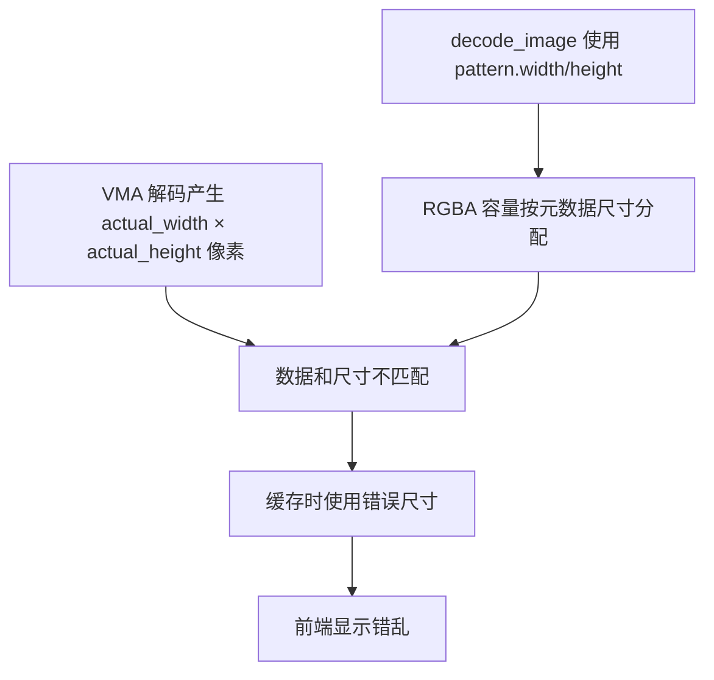

# ABR Pattern 尺寸不匹配导致图像显示错误

**日期**: 2026-01-30
**状态**: 已修复
**影响范围**: ABR 笔刷 pattern 纹理显示

## 问题描述

导入 ABR 笔刷后，pattern 纹理缩略图显示为花朵状的错误图案，宽高比也不正确。

## 根因分析

### 核心问题：VMA 实际尺寸 ≠ Pattern 元数据尺寸

ABR 文件中的 pattern 有两套尺寸信息：

1. **Pattern 元数据** (`pattern.width`, `pattern.height`) - 存储在 pattern 描述符中
2. **VMA 实际尺寸** (`actual_width`, `actual_height`) - 存储在 VMA header 的 rect 字段中

```
Pattern "ciel_07.jpg":
  - 元数据尺寸: 2048 x 1536
  - VMA 实际尺寸: 1536 x 2048 (宽高互换！)
```

### 问题链



### 次要问题：VMA 搜索范围过小

- `patt.rs` 只搜索前 **100** 字节
- `correct_decode.rs` 搜索前 **1000** 字节
- 某些 pattern 的 VMA header 在 100-1000 字节之间

## 修复方案

### 1. 添加维度感知的解码方法

```rust
// patt.rs - 新增方法
pub fn decode_image_with_dimensions(&self) -> Option<(Vec<u8>, u32, u32)> {
    // 返回 (rgba_data, actual_width, actual_height)
    let (vma_offset, actual_width, actual_height) = self.find_vma_header()?;
    // ... 使用 actual_width/height 解码和分配
    Some((rgba, actual_width as u32, actual_height as u32))
}
```

### 2. 调用方使用正确尺寸

```rust
// commands.rs
let (rgba_data, actual_width, actual_height) = pattern.decode_image_with_dimensions()?;

cache_pattern_rgba(
    pattern.id.clone(),
    rgba_data,
    actual_width,   // ← 使用 VMA 尺寸
    actual_height,  // ← 使用 VMA 尺寸
    ...
);
```

### 3. 扩展 VMA 搜索范围

```rust
for test_offset in 0..1000 {  // 从 100 扩展到 1000
```

## 经验教训

1. **不要假设元数据正确** - ABR 格式中元数据尺寸可能与实际数据尺寸不一致
2. **解码时返回实际尺寸** - 当解码可能产生不同尺寸时，API 应返回实际尺寸
3. **对比测试输出** - 通过文件大小对比快速发现解码差异

## 验证

```bash
cargo test test_decode_pattern_images -- --nocapture
# 13/13 patterns decoded successfully
```

## 相关文件

- [patt.rs](file:///f:/CodeProjects/PaintBoard/src-tauri/src/abr/patt.rs) - 添加 `decode_image_with_dimensions()`
- [commands.rs](file:///f:/CodeProjects/PaintBoard/src-tauri/src/commands.rs) - 使用正确尺寸缓存
