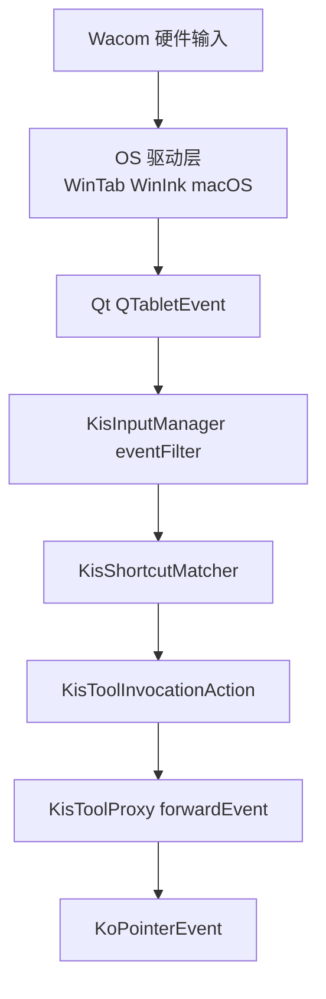
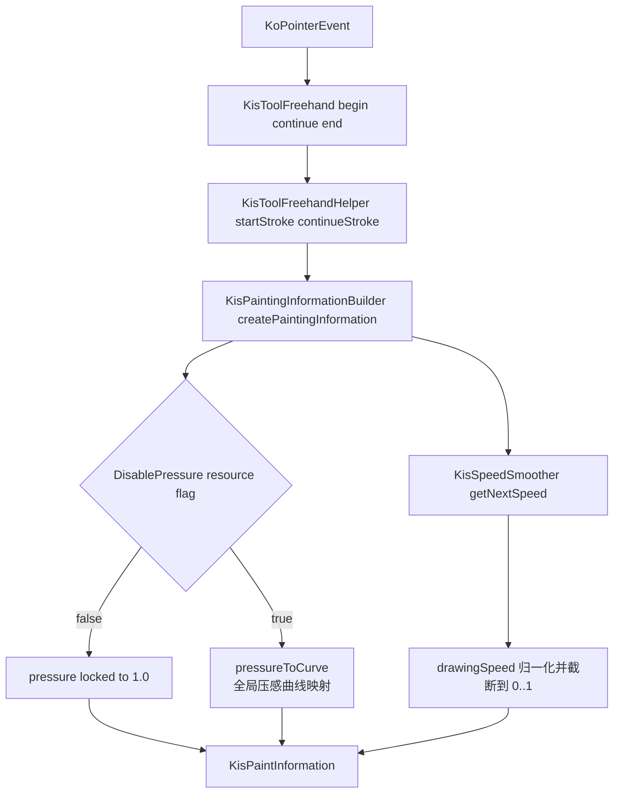
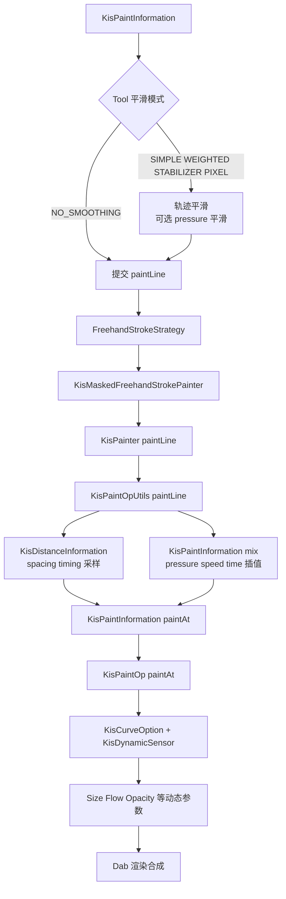

# Krita Wacom 压感输入到笔刷系统完整链路研究

**日期**: 2026-02-18
**研究对象源码**: `F:\CodeProjects\krita` `/Users/apple/CodeProjects/krita`
**目标**: 梳理从 Wacom/Tablet 输入到笔刷 size/opacity/flow 生效的完整链路，给出压感 mapping 算法与源码锚点。

**超简版一页图**: [2026-02-18-krita-wacom-pressure-one-page.md](./2026-02-18-krita-wacom-pressure-one-page.md)
**历史归档（不再维护）**:

- [krita-pressure-handling.md](../deprecated/krita-pressure-handling.md)
- [2026-02-17-krita-pressure-chain-analysis-no-trajectory-smoothing.md](../deprecated/2026-02-17-krita-pressure-chain-analysis-no-trajectory-smoothing.md)

---

## 1. 结论先行

1. Krita 当前实现里，**不直接解析 WinTab/macOS 原生包**，而是依赖 Qt 的 `QTabletEvent` 统一上送；Krita 负责选择 WinTab/Windows Ink API 和后续处理链路。
2. 压感至少经历两层映射：
   1. **全局压感曲线**（Tablet Settings 的 `Input Pressure Global Curve`）
   2. **笔刷传感器曲线**（每个动态传感器自己的 curve）
3. 速度链路与压感链路在 `KisPaintInformation` 汇合：`drawingSpeed` 既可驱动 `Speed` 传感器，也会参与部分轨迹平滑策略。
4. 压感不是直接“点到点喂给 paintAt”：中间还有 `paintLine` 的间距/时间采样和 `KisPaintInformation::mix()` 线性插值。
5. 你的图里 `? mapping` 这块，实际上应拆成 **Global Curve Mapping + Dynamic Sensor Mapping + CurveOption 组合策略** 三层。

## 1.1 你给的 Review 核验结果

1. `DisablePressure` 分支方向问题：结论正确。
   - 源码为 `!m_pressureDisabled ? 1.0 : pressureToCurve(...)`（`libs/ui/tool/kis_painting_information_builder.cpp:131`）。
   - 该问题在当前文档已按源码修正，并补了 true/false 对照说明。
2. 速度平滑器 `totalTime` 说明不够精确：结论正确。
   - `totalTime` 是按 `avgTimeDiff` 逐样本累加，不是逐事件真实时间戳差累加（`libs/ui/tool/kis_speed_smoother.cpp:120`、`libs/ui/tool/kis_speed_smoother.cpp:147`）。
   - 当前文档已补充该点。
3. `DisablePressure` 默认状态说明：结论基本正确。
   - 构造默认 `m_pressureDisabled=false`，但 UI 初始化会把 pressure 按钮设为 `checked=true`，并写入资源位。
   - 当前文档已补充“构造默认值 vs 运行态默认值”的区别。

---

## 2. 易读版 Mermaid（分三段）

## 2.1 输入事件路由（先看这一段）



这段的作用：把“硬件事件”变成 Krita 内部统一指针事件 `KoPointerEvent`。

## 2.2 画笔输入构建（压感和速度在哪处理）



这段的作用：把输入事件转成画笔计算用的 `KisPaintInformation`，并在这里完成“全局压感曲线 + 速度估计”。

## 2.3 采样、插值、传感器到最终 Dab



这段的作用：控制 dab 何时发射、每个 dab 的参数值是多少，以及如何落到最终笔迹。

---

## 3. 分层源码链路（含文件位置）

## 3.1 输入 API 选择与事件来源（WinTab/WinInk）

- Qt5 下通过 `Qt::AA_MSWindowsUseWinTabAPI` 切换 WinTab；Qt6 下通过 `QWindowsApplication::setWinTabEnabled()` 切换。
  - `krita/main.cc:588`
  - `krita/main.cc:589`
  - `krita/main.cc:605`
  - `krita/main.cc:608`
- `main.cc` 明确写了“WinTab 切换逻辑在 Qt 内部”。
  - `krita/main.cc:63`
- WinTab 映射高级设置通过环境变量影响 Qt 行为：
  - `QT_WINTAB_DESKTOP_RECT` / `QT_IGNORE_WINTAB_MAPPING`
  - `libs/ui/dialogs/KisDlgCustomTabletResolution.cpp:149`
  - `libs/ui/dialogs/KisDlgCustomTabletResolution.cpp:157`

结论: Krita 自身不在业务层直接解析厂商包，核心入口是 Qt 统一的 `QTabletEvent`。

## 3.2 InputManager 路由与兼容处理

- 事件入口：`KisInputManager::eventFilter()`
  - `libs/ui/input/kis_input_manager.cpp:201`
- Windows 下有“tablet 与 mouse 异步”相关兼容逻辑（防重复/时序异常）。
  - `libs/ui/input/kis_input_manager_p.cpp:682`
- `Use mouse events for right- and middle-clicks` workaround 在 `EventEater` 生效。
  - `libs/ui/input/kis_input_manager_p.cpp:72`
  - `libs/ui/input/kis_input_manager_p.cpp:112`
  - `libs/ui/input/kis_input_manager_p.cpp:120`
- Tablet 按压/移动/抬起分支：
  - `libs/ui/input/kis_input_manager.cpp:628`
  - `libs/ui/input/kis_input_manager.cpp:665`
  - `libs/ui/input/kis_input_manager.cpp:692`

## 3.3 Shortcut 到 Tool 调用

- 默认工具调用 action 把事件转发到 tool proxy：
  - `libs/ui/input/kis_tool_invocation_action.cpp:160`
  - `libs/ui/input/kis_tool_invocation_action.cpp:165`
  - `libs/ui/input/kis_tool_invocation_action.cpp:220`
- `KisToolProxy::forwardEvent()` 做坐标换算、事件分派和 `KoPointerEvent` 包装。
  - `libs/ui/canvas/kis_tool_proxy.cpp:118`
  - `libs/ui/canvas/kis_tool_proxy.cpp:167`

## 3.4 `KoPointerEvent` 统一输入字段

- Tablet 构造保留 Qt tablet 字段（pressure/tilt/rotation/tangentialPressure/timestamp）。
  - `libs/flake/KoPointerEvent.cpp:62`
  - `libs/flake/KoPointerEvent.cpp:66`
  - `libs/flake/KoPointerEvent.cpp:74`
- 压感读取：
  - tablet: `event->pressure()`
  - mouse fallback: `1.0`
  - `libs/flake/KoPointerEvent.cpp:306`
  - `libs/flake/KoPointerEvent.cpp:310`
  - `libs/flake/KoPointerEvent.cpp:320`
- 时间戳读取：
  - `libs/flake/KoPointerEvent.cpp:405`
  - `libs/flake/KoPointerEvent.cpp:409`

## 3.5 `KisPaintingInformationBuilder`：全局曲线 + 速度

- 每次配置刷新时预采样全局压感曲线：`floatTransfer(1025)`。
  - `libs/ui/tool/kis_painting_information_builder.cpp:26`
  - `libs/ui/tool/kis_painting_information_builder.cpp:48`
- 真正构造 `KisPaintInformation`：
  - `libs/ui/tool/kis_painting_information_builder.cpp:121`
- 压感进入点（注意命名反直觉）：
  - `libs/ui/tool/kis_painting_information_builder.cpp:131`
- `DisablePressure` 实际分支（按源码表达式）：
  - `!m_pressureDisabled ? 1.0 : pressureToCurve(event->pressure())`
  - 对应关系是：
    - `DisablePressure=false` -> `m_pressureDisabled=false` -> pressure 固定 `1.0`
    - `DisablePressure=true` -> `m_pressureDisabled=true` -> 走 `pressureToCurve()`
  - 这是命名和语义最容易误读的地方。
- 全局曲线映射：
  - `libs/ui/tool/kis_painting_information_builder.cpp:179`
  - `libs/ui/tool/kis_painting_information_builder.cpp:181`
- 速度归一化：
  - `libs/ui/tool/kis_painting_information_builder.cpp:128`
  - `libs/ui/tool/kis_painting_information_builder.cpp:137`
- 默认状态补充：
  - `m_pressureDisabled` 构造默认 `false`：`libs/ui/tool/kis_painting_information_builder.cpp:31`
  - 但 UI 初始化里 pressure 按钮默认 `checked=true`：`libs/ui/kis_paintop_box.cc:527`
  - `checked` 会写入 `DisablePressure=true`：`libs/ui/kis_paintop_box.cc:1403`
  - 所以运行态通常是“压感启用”。

## 3.6 速度平滑器 `KisSpeedSmoother`

- 首点速度固定 `0`。
  - `libs/ui/tool/kis_speed_smoother.cpp:111`
- 时间源可切换“驱动时间戳 vs 本地 timer”。
  - `libs/ui/tool/kis_speed_smoother.cpp:83`
  - `libs/ui/tool/kis_speed_smoother.cpp:103`
- 速度估计需要满足最小跟踪距离。
  - `libs/ui/tool/kis_speed_smoother.cpp:20`
  - `libs/ui/tool/kis_speed_smoother.cpp:150`
  - `libs/ui/tool/kis_speed_smoother.cpp:157`

## 3.7 Tool 轨迹平滑（可选分支）

- Freehand helper 在 `paint()` 中按 smoothing type 分支。
  - `libs/ui/tool/kis_tool_freehand_helper.cpp:472`
- Weighted smoothing 可选 pressure 平滑（会改写 `info.pressure`）。
  - `libs/ui/tool/kis_tool_freehand_helper.cpp:568`
  - `libs/ui/tool/kis_tool_freehand_helper.cpp:585`
- 平滑距离会用到 `drawingSpeed`（不是仅几何距离）。
  - `libs/ui/tool/kis_tool_freehand_helper.cpp:523`

## 3.8 到 paintop 的采样插值

- Tool 侧提交 `paintLine` job：
  - `libs/ui/tool/kis_tool_freehand_helper.cpp:994`
- Job 执行到 painter：
  - `libs/ui/tool/strokes/freehand_stroke.cpp:170`
  - `libs/ui/tool/strokes/KisMaskedFreehandStrokePainter.cpp:45`
  - `libs/image/kis_painter.cc:1151`
- `KisPaintOpUtils::paintLine()` 主循环：
  - 由 spacing/timing 求下一个 dab 位置 `t`
  - `KisPaintInformation::mix()` 插值
  - `paintAt()` 出 dab
  - `libs/image/brushengine/kis_paintop_utils.h:67`
  - `libs/image/brushengine/kis_paintop_utils.h:68`
  - `libs/image/brushengine/kis_paintop_utils.h:84`
- 插值中 pressure/time/speed 都是线性混合：
  - `libs/image/brushengine/kis_paint_information.cc:619`
  - `libs/image/brushengine/kis_paint_information.cc:635`
  - `libs/image/brushengine/kis_paint_information.cc:636`

## 3.9 传感器与笔刷参数落地（size/opacity/flow）

- 传感器创建（Pressure/Speed/...）
  - `plugins/paintops/libpaintop/KisCurveOption.cpp:40`
  - `plugins/paintops/libpaintop/KisCurveOption.cpp:51`
- Pressure/Speed 原始输入来自 `KisPaintInformation`：
  - `plugins/paintops/libpaintop/sensors/KisDynamicSensors.h:43`
  - `plugins/paintops/libpaintop/sensors/KisDynamicSensors.h:20`
- 传感器曲线映射统一入口：
  - `plugins/paintops/libpaintop/sensors/KisDynamicSensor.cpp:35`
- 多传感器合成策略（multiply/add/max/min/difference）：
  - `plugins/paintops/libpaintop/KisCurveOption.cpp:128`
  - `plugins/paintops/libpaintop/KisCurveOption.cpp:145`
- size-like 值计算与 clamp：
  - `plugins/paintops/libpaintop/KisCurveOption.cpp:78`
  - `plugins/paintops/libpaintop/KisCurveOption.cpp:85`
- `KisStandardOption::apply()`：未勾选时返回 `1.0`。
  - `plugins/paintops/libpaintop/KisStandardOptions.h:27`
  - `plugins/paintops/libpaintop/KisStandardOptions.h:29`
- 在默认 brushop 中落地到实际 dab 参数：
  - size: `plugins/paintops/defaultpaintops/brush/kis_brushop.cpp:115`
  - opacity/flow: `plugins/paintops/defaultpaintops/brush/kis_brushop.cpp:131`
  - dab 提交: `plugins/paintops/defaultpaintops/brush/kis_brushop.cpp:140`

## 3.10 你截图里 Tablet 面板参数与运行时对应

- UI 控件位置：
  - 全局压感曲线: `libs/ui/forms/wdgtabletsettings.ui:28`
  - 侧键 workaround: `libs/ui/forms/wdgtabletsettings.ui:175`
  - 使用驱动时间戳: `libs/ui/forms/wdgtabletsettings.ui:185`
  - 最大速度: `libs/ui/forms/wdgtabletsettings.ui:206`
  - 速度平滑样本: `libs/ui/forms/wdgtabletsettings.ui:219`
- Preferences 读入：
  - `libs/ui/dialogs/kis_dlg_preferences.cc:1645`
  - `libs/ui/dialogs/kis_dlg_preferences.cc:1677`
  - `libs/ui/dialogs/kis_dlg_preferences.cc:1693`
  - `libs/ui/dialogs/kis_dlg_preferences.cc:1702`
- Preferences 写回：
  - `libs/ui/dialogs/kis_dlg_preferences.cc:2854`
  - `libs/ui/dialogs/kis_dlg_preferences.cc:2869`
  - `libs/ui/dialogs/kis_dlg_preferences.cc:2881`
  - `libs/ui/dialogs/kis_dlg_preferences.cc:2882`
- 配置键定义（运行时读取）：
  - `tabletPressureCurve`: `libs/ui/kis_config.cc:1598`
  - `useRightMiddleTabletButtonWorkaround`: `libs/ui/kis_config.cc:1648`
  - `useTimestampsForBrushSpeed`: `libs/ui/tool/kis_speed_smoother.cpp:103`
  - `maxAllowedSpeedValue`: `libs/ui/tool/kis_painting_information_builder.cpp:49`
  - `speedValueSmoothing`: `libs/ui/tool/kis_speed_smoother.cpp:104`

---

## 4. 压感与 mapping 算法细节

## 4.1 全局压感曲线（Global Pressure Curve）

实现位置:

- 曲线字符串解析: `libs/image/kis_cubic_curve.cpp:190`
- 预采样 LUT: `libs/image/kis_cubic_curve.cpp:468`
- 线性查询: `libs/image/kis_cubic_curve.cpp:400`

流程:

1. Preferences 将曲线字符串写入 `tabletPressureCurve`。
   - `libs/ui/dialogs/kis_dlg_preferences.cc:2854`
   - `libs/ui/kis_config.cc:1603`
2. Builder 读取配置，生成 `1025` 个 `[0,1]` 采样点（LUT）。
3. 每个输入 pressure 通过 `interpolateLinear()` 查 LUT 得到映射值。

算法（等价伪代码）:

```text
N = transfer.size
x = clamp(p * (N-1), 0, N-1)
i = floor(x), j = ceil(x), t = x - i
if t < eps: y = transfer[i]
else if t > 1-eps: y = transfer[j]
else: y = transfer[i] + t * (transfer[j] - transfer[i])
return copysign(y, p)
```

补充: 曲线内部使用分段三次样条，`is_corner` 点会改变导数约束。

- `libs/image/kis_cubic_curve_spline.h:321`

## 4.2 速度估计与归一化（影响 Speed 传感器，也影响部分轨迹平滑）

实现位置:

- `libs/ui/tool/kis_speed_smoother.cpp:81`
- `libs/ui/tool/kis_speed_smoother.cpp:107`
- `libs/ui/tool/kis_painting_information_builder.cpp:137`

核心步骤:

1. 取时间源（驱动时间戳或本地计时器）。
2. 更新时间差滚动过滤均值（`KisFilteredRollingMean`）。
3. 反向累积历史距离，直到样本数和最小距离阈值满足。
4. `totalTime` 不是逐事件真实时间差求和，而是每个样本都累加 `avgTimeDiff`（filtered mean）。
5. `speed = totalDistance / totalTime`。
6. `drawingSpeed = min(1.0, speed / maxAllowedSpeedValue)`。

等价理解：速度估计假设采样率近似稳定，不依赖每次事件时间戳的短期抖动。

## 4.3 传感器曲线映射（第二层 mapping）

实现位置:

- `plugins/paintops/libpaintop/sensors/KisDynamicSensor.cpp:35`
- `plugins/paintops/libpaintop/sensors/KisDynamicSensor.cpp:42`

算法要点:

1. 从 `KisPaintInformation` 取原始传感器值（如 pressure/speed）。
2. 若设置了曲线，则先转换到 scaling 域（additive/absolute rotation 有特殊处理）。
3. 用 `floatTransfer(256) + interpolateLinear()` 做曲线映射。
4. 再转换回 additive/rotation 域并返回。

## 4.4 多传感器合成到 size/flow/opacity

实现位置:

- `plugins/paintops/libpaintop/KisCurveOption.cpp:102`
- `plugins/paintops/libpaintop/KisCurveOption.cpp:165`

步骤:

1. 遍历激活传感器，取 `s->parameter(info)`。
2. 普通缩放类传感器按 `curveMode` 合并（默认 multiply）。
3. additive 传感器走加法支路，absolute rotation 走偏移支路。
4. 最终 size-like 值:

```text
value = clamp(constant * offset * scaling * additiveScaling, min, max)
```

## 4.5 `paintLine` 插值对压感尾部的影响

实现位置:

- `libs/image/brushengine/kis_paintop_utils.h:67`
- `libs/image/brushengine/kis_paint_information.cc:619`

关键点:

1. dab 不是直接用事件点，而是用 spacing/timing 采样出的 `t`。
2. `pressure/speed/time` 都按 `t` 线性插值。
3. 因此“尾部手感”会同时受事件输入、曲线映射、采样间距、插值策略影响。

---

## 5. 与你给的流程图对照（修正点）

你的图方向整体是对的，但需要补 4 个关键节点：

1. `wintab/pointerevent/macnative -> speed` 之间不是直接关系，实际是
   `QTabletEvent -> KoPointerEvent -> KisPaintingInformationBuilder -> KisSpeedSmoother -> drawingSpeed`。
2. `? mapping` 不是单点，而是两层：
   - 全局压感曲线（builder）
   - 传感器曲线（dynamic sensor）
3. 轨迹平滑在 Tool 层，且可选改 pressure（`smoothPressure`）。
4. 进入 BrushSystem 前还有 `paintLine` 采样与 `mix` 插值，不是事件点直达 dab。

---

## 6. 可直接复刻到 PaintBoard 的“最小一致性内核”

1. `Global Pressure Curve`: `floatTransfer + interpolateLinear` 语义一致。
2. `Speed Smoother`: 首点 0、最小跟踪距离阈值、filtered mean 时间差。
3. `paintLine` 采样 + `mix` 插值: pressure/speed/time 一起插值。
4. `Dynamic Sensor` 二级曲线 + `CurveOption` 合成模式（至少先做 multiply）。

如果这 4 件事一致，压感视觉差异会明显收敛，再去调轨迹平滑和各 paintop 特例会更稳。
