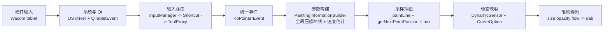

# Krita 压感链路超简版（一页图）

**日期**: 2026-02-18  
**用途**: 用最少节点说明“Wacom 输入如何变成最终笔刷 Dab”。  
**详版文档**: [2026-02-18-krita-wacom-pressure-full-chain.md](./2026-02-18-krita-wacom-pressure-full-chain.md)

---

## 一页总览

---

## 每个模块一句话

1. `硬件输入`: 数位板上报码点、压感、倾角等原始信号。  
2. `系统与 Qt`: WinTab/WinInk/macOS 驱动数据被 Qt 统一成 `QTabletEvent`。  
3. `输入路由`: Krita 把事件做过滤、快捷键匹配、工具分发。  
4. `统一事件`: 进入 `KoPointerEvent`，后续模块都用同一数据结构取 pressure/time/tilt。  
5. `参数构建`: 生成 `KisPaintInformation`，这里做全局压感曲线和 speed 归一化。  
6. `采样插值`: 按 spacing/timing 决定 dab 发射时机，并对 pressure/speed/time 做插值。  
7. `动态映射`: 传感器曲线 + 组合策略，把输入映射成 size/opacity/flow 等参数。  
8. `笔刷输出`: paintop 按参数生成并合成 dab，形成最终笔迹。  

---

## 快速对齐要点

1. 压感不是单次映射：至少有“全局曲线 + 传感器曲线”两层。  
2. 速度不仅影响 Speed 传感器，也可能影响部分平滑策略。  
3. 尾部手感常由“采样间距 + 插值 + 映射曲线”共同决定，不是单点问题。  

