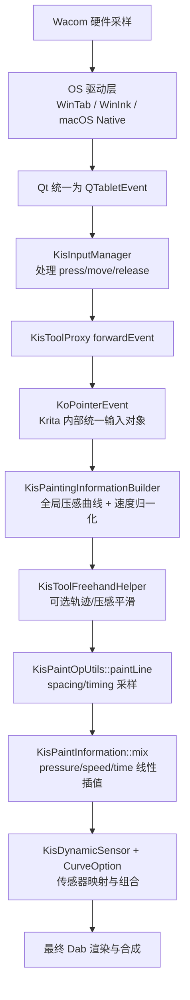
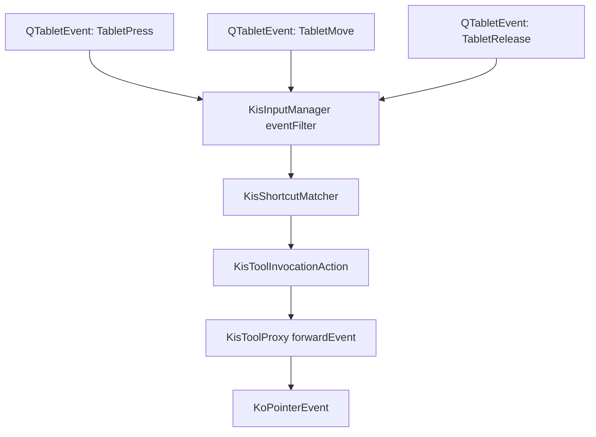
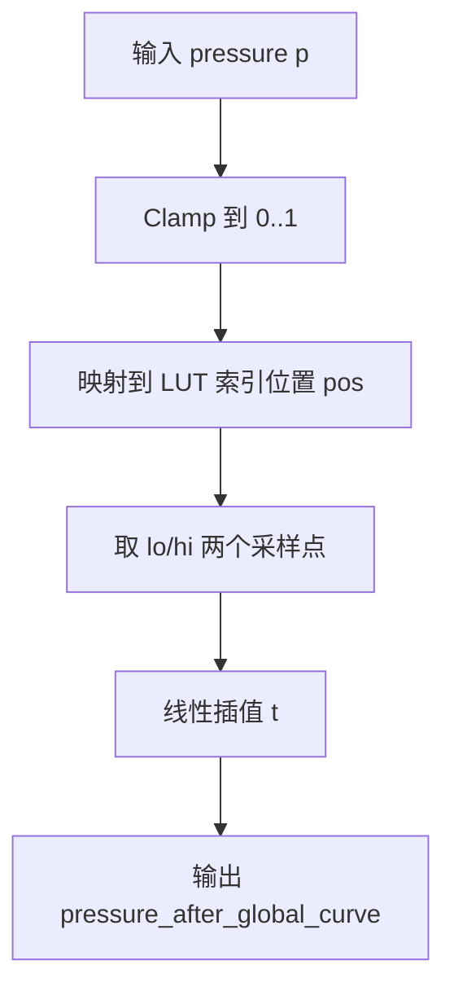
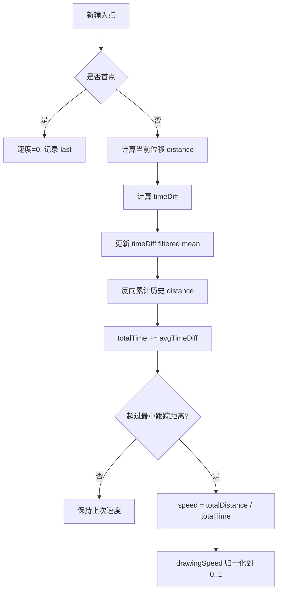
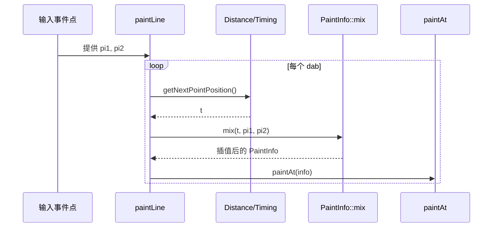
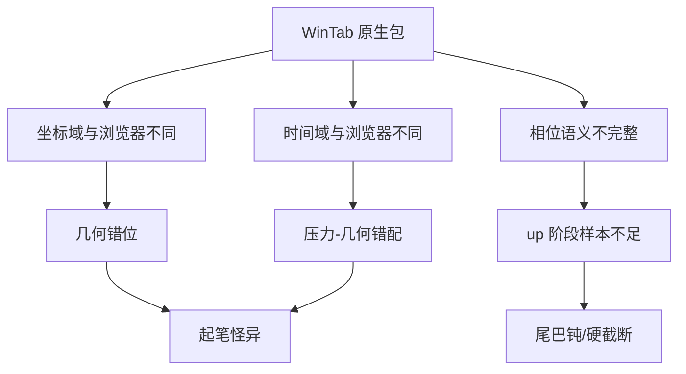

# Krita WinTab/压感链路深度分析（给美术可读版）

**日期**：2026-02-19  
**适用对象**：美术、产品、测试、工程协作成员（不要求编程背景）  
**阅读目标**：看懂 3 件事

1. Krita 为什么 WinTab 和 Pointer 体感能比较接近。
2. WinTab 与 PointerEvent 天生不一致的点到底是什么。
3. 哪些算法会直接影响“起笔大头、尾巴钝、锯齿感”。

---

## 0. 先记住这三句话

1. **Krita 的关键不是“WinTab 更高级”，而是“先统一事件语义，再进笔刷算法”。**
2. **尾巴是不是尖，不只看压感，还看相位（down/move/up）和采样插值。**
3. **同一笔刷下 WinTab 与 PointerEvent 差很多，通常先查输入统一层，不要先怪笔刷公式。**

---

## 1. 一张总图：Krita 从硬件到笔迹



通俗理解：

- 前半段在做“把各种输入设备说的话翻译成同一种语言”。
- 中段在做“把输入变成画笔能用的稳定参数”。
- 后段才是“按 spacing 发射 dab 并渲染”。

---

## 2. Krita 在 WinTab 阶段怎么处理输入

### 2.1 WinTab / WinInk 的选择不在业务层硬写

Krita 在 Windows 上会通过 Qt 的开关决定是否启用 WinTab：

- Qt5：`Qt::AA_MSWindowsUseWinTabAPI`
- Qt6：`QWindowsApplication::setWinTabEnabled()`

对应源码锚点：

- `F:\CodeProjects\krita\krita\main.cc:588`
- `F:\CodeProjects\krita\krita\main.cc:608`

关键点：

1. Krita 不在业务层自己手搓 WinTab 包解析。
2. 它把“协议差异”尽量交给 Qt 层吸收。
3. Qt 还提供 WinTab 映射相关环境变量（如桌面映射矩形）辅助坐标一致性。

对美术的意义：

- 同一支笔在 Krita 里“输入源切换后体感差异可控”，核心原因是上游已经先统一了一次。

---

### 2.2 事件路由：先转成内部统一指针事件



关键源码锚点：

- `F:\CodeProjects\krita\libs\ui\input\kis_input_manager.cpp:628`
- `F:\CodeProjects\krita\libs\ui\input\kis_input_manager.cpp:665`
- `F:\CodeProjects\krita\libs\ui\input\kis_input_manager.cpp:692`
- `F:\CodeProjects\krita\libs\ui\canvas\kis_tool_proxy.cpp:118`
- `F:\CodeProjects\krita\libs\ui\canvas\kis_tool_proxy.cpp:170`

对当前问题最相关的点：

1. Krita 的 press/move/release 是完整相位链。
2. 你的“尾巴钝”常见根因之一是 up 阶段样本进入主链不完整或时序晚了。

---

### 2.3 KoPointerEvent：统一字段容器

KoPointerEvent 会从底层事件里统一拿这些字段：

1. `pressure`
2. `xTilt / yTilt`
3. `rotation`
4. `timestamp`

源码锚点：

- 压感：`F:\CodeProjects\krita\libs\flake\KoPointerEvent.cpp:306`
- 压感（tablet 分支）：`F:\CodeProjects\krita\libs\flake\KoPointerEvent.cpp:310`
- 时间：`F:\CodeProjects\krita\libs\flake\KoPointerEvent.cpp:405`

这一步的价值：

- 不管底层是 WinTab 还是其他来源，后续模块都面对同一结构体思考问题。

---

## 3. 关键算法 1：全局压感曲线（Global Pressure Curve）

这一步可以理解成“把笔压力做一次统一校准”。

### 3.1 计算方式

Krita 在 Builder 里会：

1. 先把曲线预采样成 LUT（1025 个点）。
2. 每次来一个 pressure，都做线性插值查询。

源码锚点：

- 预采样：`F:\CodeProjects\krita\libs\ui\tool\kis_painting_information_builder.cpp:48`
- 查询入口：`F:\CodeProjects\krita\libs\ui\tool\kis_painting_information_builder.cpp:179`

### 3.2 算法伪代码（易读版）

```text
输入：pressure p (0..1), 查找表 LUT[0..N-1]
步骤：
1) pos = p * (N-1)
2) lo = floor(pos), hi = ceil(pos)
3) t = pos - lo
4) out = LUT[lo] + t * (LUT[hi] - LUT[lo])
输出：out (0..1)
```

### 3.3 Mermaid（流程图）



对手感的影响：

1. 低压段是否容易“出墨”。
2. 高压段是否容易“顶死”。
3. 不同输入后端的原始压力分布是否被拉到同一感受区间。

---

## 4. 关键算法 2：速度平滑（Speed Smoother）

这一步决定的是“速度传感器”和某些平滑策略的输入质量。

### 4.1 Krita 的核心做法

1. 首点速度固定 0。
2. 可选择时间源（驱动时间戳或本地计时）。
3. 用 `filtered mean` 平滑时间差。
4. 用累计距离 / 累计时间估算速度。

源码锚点：

- 首点 0：`F:\CodeProjects\krita\libs\ui\tool\kis_speed_smoother.cpp:111`
- 时间源选择：`F:\CodeProjects\krita\libs\ui\tool\kis_speed_smoother.cpp:83`
- filtered mean：`F:\CodeProjects\krita\libs\ui\tool\kis_speed_smoother.cpp:121`
- 核心注释（不盲信逐包时间戳）：`F:\CodeProjects\krita\libs\ui\tool\kis_speed_smoother.cpp:141`

### 4.2 Mermaid（流程图）



对手感的影响：

1. 速度噪声太大，会导致动态参数抖动。
2. 速度过慢响应，会让尾段“发钝”。

---

## 5. 关键算法 3：paintLine 采样 + mix 插值

很多人以为是“事件点直接出 dab”，Krita 不是。

### 5.1 真实逻辑

1. 先按 spacing/timing 计算下一个 dab 位置比例 `t`。
2. 再对 pressure/speed/time 一起做线性 mix。
3. 然后才 paintAt。

源码锚点：

- `paintLine` 主循环：`F:\CodeProjects\krita\libs\image\brushengine\kis_paintop_utils.h:67`
- `mix`：`F:\CodeProjects\krita\libs\image\brushengine\kis_paint_information.cc:619`

### 5.2 Mermaid（序列图）



对手感的影响：

1. 收笔是否自然变细，和“尾段 t 插值”直接相关。
2. 若 up 样本缺失或晚到，尾段会变硬、变钝。

---

## 6. 关键算法 4：动态传感器与参数组合

Krita 不是只有 pressure->size 一条线。

它会把 pressure、speed、time 等传感器经过曲线后，再按组合模式叠加到 size/flow/opacity。

常见组合模式：

1. multiply
2. add
3. max
4. min
5. difference

对应链路可参考：

- 研究锚点汇总文档：`docs/research/2026-02-18-krita-wacom-pressure-full-chain.md`

对美术的意义：

- 同样“压感不稳”，有时看起来像大小抖，有时像透明度抖，是因为落到不同通道。

---

## 7. WinTab Native 与 PointerEvent 为什么会不一致

这是你当前问题的核心背景。

### 7.1 差异总表（美术视角）

| 维度 | WinTab Native 常见情况 | PointerEvent 常见情况 | 体感风险 |
| --- | --- | --- | --- |
| 坐标单位 | 可能是设备/屏幕映射域，受驱动和映射配置影响 | 浏览器 CSS 像素域 | 起笔位置偏、轨迹外射 |
| 时间戳 | 设备时钟域 | 浏览器事件时钟域 | 配对错位、首点错压 |
| 相位 | 可能弱化为 move/hover（实现相关） | down/move/up 明确 | 尾段漏样、收笔发钝 |
| 压力噪声 | 受驱动采样/包时序影响 | 相对平稳（但频率可能较低） | 起笔锯齿、台阶感 |
| 采样频率 | 可能更高、更抖 | 浏览器合并/coalesced | “看似点多，实际错配” |

### 7.2 Mermaid（问题形成图）



---

## 8. Krita 为什么 WinTab 也能画得好

不是因为它“没有差异”，而是因为它把差异控制在了前段。

1. **输入入口统一**：Qt 统一事件对象（QTabletEvent）。
2. **内部事件统一**：KoPointerEvent 统一字段。
3. **构建阶段统一**：Builder 固定做全局压感曲线 + 速度归一。
4. **采样阶段统一**：paintLine 统一 spacing/timing 与 mix。
5. **参数阶段统一**：动态传感器和组合策略统一。
6. **最终才进 paintop**：前面每层都“把差异消耗掉一部分”。

---

## 9. 和 PaintBoard 当前实现的关键差异（与你问题直接相关）

结合当前仓库（2026-02-19）可确认：

1. WinTab 当前在 Rust 侧仍以 `pressure>0` 推断 `Move/Hover`，未形成完整 `Down/Up` 语义。
   - `src-tauri/src/input/wintab_backend.rs:441`
2. emitter 线程仍在做 pressure smoothing，会改写原始压力。
   - `src-tauri/src/commands.rs:870`
3. 前端 `usePointerHandlers/useRawPointerInput` 仍用 `nativeStartIndex + eventIndex` 做索引配对。
   - `src/components/Canvas/usePointerHandlers.ts:423`
   - `src/components/Canvas/useRawPointerInput.ts:176`

这三件事叠加，就是你看到“WinTab 起笔大头、收尾钝、锯齿感”的高概率根因集合。

---

## 10. 给美术的“现象 -> 技术原因”速查卡

| 你看到的现象 | 通常对应哪里有问题 |
| --- | --- |
| 起笔第一颗特别大 | 首点压力错配、首点相位不稳、首点时间错配 |
| 收笔不尖、像被剪断 | up 阶段样本没进入同一主链，或 finalize 没吃到尾段 |
| 线条边缘有锯齿节拍感 | 压力采样有跳变，或压力和几何不是同一时间窗口 |
| WinTab 与 PointerEvent 同笔刷差很多 | 输入统一层语义不一致（不是先查笔刷参数） |

---

## 11. 一个务实结论

如果目标是“WinTab 体感接近 PointerEvent / Krita”：

1. 先做输入统一语义（事件、时间、相位、字段权责）。
2. 再做曲线/速度/采样细调。
3. 最后做笔刷参数美术调优。

顺序反了，通常会反复返工。

---

## 12. 源码锚点清单（便于复核）

### Krita

1. WinTab 开关（Qt5）：`F:\CodeProjects\krita\krita\main.cc:588`
2. WinTab 开关（Qt6）：`F:\CodeProjects\krita\krita\main.cc:608`
3. 输入路由（press）：`F:\CodeProjects\krita\libs\ui\input\kis_input_manager.cpp:628`
4. 输入路由（move）：`F:\CodeProjects\krita\libs\ui\input\kis_input_manager.cpp:665`
5. 输入路由（release）：`F:\CodeProjects\krita\libs\ui\input\kis_input_manager.cpp:692`
6. ToolProxy 转发：`F:\CodeProjects\krita\libs\ui\canvas\kis_tool_proxy.cpp:118`
7. ToolProxy 转 KoPointerEvent：`F:\CodeProjects\krita\libs\ui\canvas\kis_tool_proxy.cpp:170`
8. KoPointerEvent pressure：`F:\CodeProjects\krita\libs\flake\KoPointerEvent.cpp:306`
9. KoPointerEvent timestamp：`F:\CodeProjects\krita\libs\flake\KoPointerEvent.cpp:405`
10. Builder 构建：`F:\CodeProjects\krita\libs\ui\tool\kis_painting_information_builder.cpp:121`
11. 全局压感曲线：`F:\CodeProjects\krita\libs\ui\tool\kis_painting_information_builder.cpp:179`
12. 速度平滑：`F:\CodeProjects\krita\libs\ui\tool\kis_speed_smoother.cpp:81`
13. paintLine 采样：`F:\CodeProjects\krita\libs\image\brushengine\kis_paintop_utils.h:67`
14. mix 线性插值：`F:\CodeProjects\krita\libs\image\brushengine\kis_paint_information.cc:619`

### PaintBoard（当前）

1. WinTab phase 推断：`src-tauri/src/input/wintab_backend.rs:441`
2. Rust 侧 pressure smoothing：`src-tauri/src/commands.rs:870`
3. 前端索引配对（handlers）：`src/components/Canvas/usePointerHandlers.ts:423`
4. 前端索引配对（raw）：`src/components/Canvas/useRawPointerInput.ts:176`
5. 输入融合回滚复盘：`docs/postmortem/2026-02-18-wintab-input-fusion-v3-no-improvement-rollback.md`

---

## Thought（中文）

1. 你当前遇到的不是“单一公式错误”，而是“输入语义层未收敛导致的链路级误差”。
2. Krita 的可借鉴价值，重点在“统一输入对象 + 分层消化差异”，而不是照抄某一个平滑参数。
3. 只要输入层没有把坐标/时间/相位统一好，后面的任何笔刷微调都会有上限。
